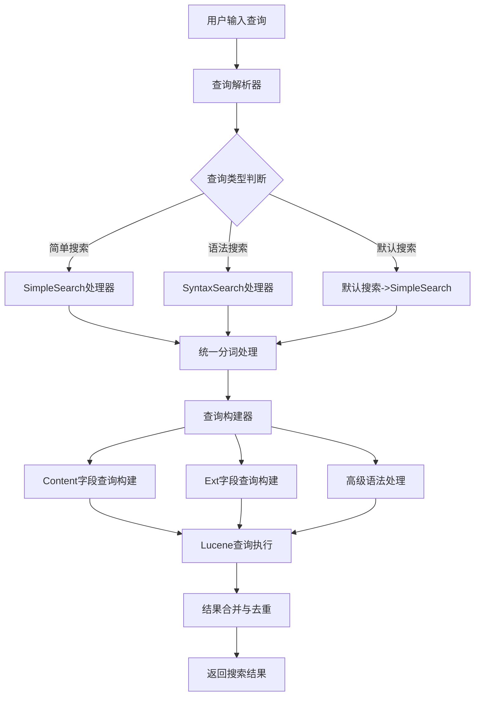
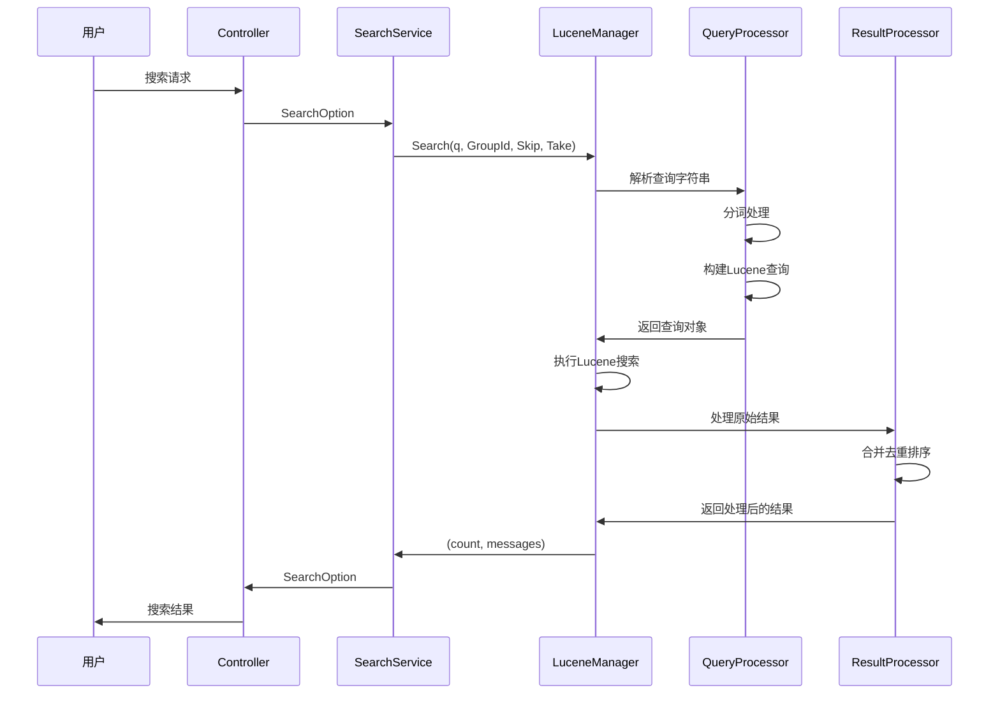

# 完全实现Ext字段和Content字段查询功能 - 设计文档

## 1. 概述

### 1.1 设计目标
本设计旨在完全实现Ext字段和Content字段的统一查询功能，解决当前实现过于简陋的问题。用户不需要关心搜索结果具体来自哪个字段，但要求无论关键词出现在Content字段还是Ext字段中都能被搜索到。

### 1.2 设计原则
- **统一性**：所有搜索方式（简单搜索、语法搜索、短语搜索）都应提供一致的搜索体验
- **完整性**：确保Ext字段和Content字段都被正确搜索，不遗漏任何可能的匹配结果
- **性能优化**：在保证功能完整性的前提下，优化搜索性能
- **向后兼容**：保持与现有查询语法的兼容性
- **可维护性**：代码结构清晰，易于扩展和维护

### 1.3 核心问题解决
1. **短语查询Ext字段处理不完善**：当前实现中短语查询只处理Content字段，Ext字段的处理存在问题
2. **字段指定搜索功能不足**：对Ext字段的指定搜索支持有限
3. **搜索性能优化**：当前Ext字段搜索遍历所有字段，性能有待优化
4. **分词处理一致性**：确保所有搜索查询都经过统一的分词处理

## 2. 架构设计

### 2.1 系统架构图



### 2.2 核心组件设计

#### 2.2.1 查询解析器（QueryParser）
- **职责**：解析用户输入的查询字符串，识别查询类型和语法结构
- **关键方法**：`ParseSimpleQuery()`, `ParseQuery()`
- **设计改进**：增强对Ext字段的解析支持，统一分词处理逻辑

#### 2.2.2 查询构建器（QueryBuilder）
- **职责**：根据解析结果构建Lucene查询对象
- **关键组件**：
  - `ContentQueryBuilder`：处理Content字段的查询构建
  - `ExtQueryBuilder`：处理Ext字段的查询构建
  - `AdvancedSyntaxProcessor`：处理高级语法（字段指定、排除词等）
- **设计改进**：实现统一的字段查询构建接口，优化Ext字段查询性能

#### 2.2.3 分词处理器（Tokenizer）
- **职责**：统一的中文分词处理
- **关键方法**：`GetKeyWords()`
- **设计改进**：增强异常处理，添加性能监控

#### 2.2.4 结果处理器（ResultProcessor）
- **职责**：处理搜索结果，包括合并、去重、排序
- **设计改进**：优化结果合并算法，提升性能

### 2.3 数据流设计



## 3. 组件和接口设计

### 3.1 LuceneManager核心方法设计

#### 3.1.1 统一查询接口
```csharp
// 统一的查询构建接口
public interface IQueryBuilder
{
    BooleanQuery BuildQuery(string query, long groupId);
    List<string> TokenizeQuery(string query);
}

// Content字段查询构建器
public class ContentQueryBuilder : IQueryBuilder
{
    public BooleanQuery BuildQuery(string query, long groupId) { /* 实现 */ }
    public List<string> TokenizeQuery(string query) { /* 实现 */ }
}

// Ext字段查询构建器
public class ExtQueryBuilder : IQueryBuilder
{
    public BooleanQuery BuildQuery(string query, long groupId) { /* 实现 */ }
    public List<string> TokenizeQuery(string query) { /* 实现 */ }
}
```

#### 3.1.2 改进的搜索方法
```csharp
// 简化后的搜索方法设计
public (int, List<Message>) SimpleSearch(string q, long GroupId, int Skip, int Take)
{
    // 1. 统一的分词处理
    var keywords = GetKeyWords(q);
    
    // 2. 构建统一查询
    var query = BuildUnifiedQuery(keywords, requireAllFields: false);
    
    // 3. 执行搜索并返回结果
    return ExecuteSearch(query, GroupId, Skip, Take);
}

public (int, List<Message>) SyntaxSearch(string q, long GroupId, int Skip, int Take)
{
    // 1. 解析复杂语法
    var parsedQuery = ParseAdvancedQuery(q);
    
    // 2. 构建高级查询
    var query = BuildAdvancedQuery(parsedQuery);
    
    // 3. 执行搜索并返回结果
    return ExecuteSearch(query, GroupId, Skip, Take);
}
```

### 3.2 关键组件设计

#### 3.2.1 统一分词处理器
```csharp
public class UnifiedTokenizer
{
    private readonly Analyzer _analyzer;
    
    public UnifiedTokenizer()
    {
        _analyzer = new SmartChineseAnalyzer(LuceneVersion.LUCENE_48);
    }
    
    public List<string> Tokenize(string text)
    {
        var keywords = new List<string>();
        try
        {
            using (var ts = _analyzer.GetTokenStream(null, text))
            {
                ts.Reset();
                var ct = ts.GetAttribute<ICharTermAttribute>();
                
                while (ts.IncrementToken())
                {
                    var keyword = ct.ToString();
                    if (!keywords.Contains(keyword))
                    {
                        keywords.Add(keyword);
                    }
                }
            }
        }
        catch (Exception ex)
        {
            // 记录错误并返回原始文本作为分词结果
            Logger.LogError(ex, "分词处理失败: {Text}", text);
            keywords.Add(text);
        }
        
        return keywords;
    }
}
```

#### 3.2.2 Ext字段查询优化器
```csharp
public class ExtFieldQueryOptimizer
{
    private readonly ConcurrentDictionary<long, string[]> _fieldCache = new();
    
    public BooleanQuery BuildOptimizedExtQuery(List<string> keywords, IndexReader reader)
    {
        var query = new BooleanQuery();
        var extFields = GetExtFields(reader);
        
        // 使用MultiFieldQuery优化性能
        foreach (var keyword in keywords)
        {
            if (!string.IsNullOrWhiteSpace(keyword))
            {
                var keywordQuery = new BooleanQuery();
                foreach (var field in extFields)
                {
                    keywordQuery.Add(new TermQuery(new Term(field, keyword)), Occur.SHOULD);
                }
                query.Add(keywordQuery, Occur.SHOULD);
            }
        }
        
        return query;
    }
    
    private string[] GetExtFields(IndexReader reader)
    {
        var groupId = GetCurrentGroupId(); // 需要实现获取当前GroupId的逻辑
        return _fieldCache.GetOrAdd(groupId, _ => 
        {
            var fields = MultiFields.GetIndexedFields(reader);
            return fields.Where(f => f.StartsWith("Ext_")).ToArray();
        });
    }
}
```

#### 3.2.3 短语查询处理器
```csharp
public class PhraseQueryProcessor
{
    public BooleanQuery BuildUnifiedPhraseQuery(List<string> terms, IndexReader reader)
    {
        var combinedQuery = new BooleanQuery();
        
        // Content字段短语查询
        var contentPhraseQuery = BuildPhraseQueryForField("Content", terms);
        combinedQuery.Add(contentPhraseQuery, Occur.SHOULD);
        
        // Ext字段短语查询
        var extFields = GetExtFields(reader);
        foreach (var field in extFields)
        {
            var extPhraseQuery = BuildPhraseQueryForField(field, terms);
            combinedQuery.Add(extPhraseQuery, Occur.SHOULD);
        }
        
        return combinedQuery;
    }
    
    private PhraseQuery BuildPhraseQueryForField(string fieldName, List<string> terms)
    {
        var phraseQuery = new PhraseQuery();
        for (int i = 0; i < terms.Count; i++)
        {
            phraseQuery.Add(new Term(fieldName, terms[i]), i);
        }
        return phraseQuery;
    }
}
```

### 3.3 字段指定搜索增强

#### 3.3.1 字段解析器
```csharp
public class FieldSpecificationParser
{
    public FieldSpec ParseFieldSpecification(string fieldSpec)
    {
        if (string.IsNullOrWhiteSpace(fieldSpec))
            return null;
            
        var parts = fieldSpec.Split(':', 2);
        if (parts.Length != 2)
            return null;
            
        var fieldName = parts[0].Trim();
        var fieldValue = parts[1].Trim();
        
        // 处理字段别名
        var actualFieldName = ResolveFieldAlias(fieldName);
        
        return new FieldSpec(actualFieldName, fieldValue);
    }
    
    private string ResolveFieldAlias(string fieldName)
    {
        // 字段别名映射
        return fieldName switch
        {
            "ocr" => "Ext_OCR_Result",
            "asr" => "Ext_ASR_Result", 
            "qr" => "Ext_QR_Result",
            "content" => "Content",
            _ => fieldName
        };
    }
}
```

## 4. 数据模型

### 4.1 查询解析结果模型
```csharp
public class ParsedQuery
{
    public List<string> Keywords { get; set; } = new();
    public List<PhraseQuery> PhraseQueries { get; set; } = new();
    public List<FieldSpec> FieldSpecifications { get; set; } = new();
    public List<string> ExcludedKeywords { get; set; } = new();
    public QueryType QueryType { get; set; }
}

public class FieldSpec
{
    public string FieldName { get; set; }
    public string FieldValue { get; set; }
    public bool IsExtField => FieldName.StartsWith("Ext_");
    
    public FieldSpec(string fieldName, string fieldValue)
    {
        FieldName = fieldName;
        FieldValue = fieldValue;
    }
}

public enum QueryType
{
    Simple,
    Syntax,
    Phrase
}
```

### 4.2 搜索结果模型
```csharp
public class SearchResult
{
    public int TotalCount { get; set; }
    public List<Message> Messages { get; set; } = new();
    public Dictionary<string, int> FieldMatchCounts { get; set; } = new();
    public TimeSpan SearchTime { get; set; }
    
    public SearchResult(int totalCount, List<Message> messages)
    {
        TotalCount = totalCount;
        Messages = messages;
        FieldMatchCounts = new Dictionary<string, int>();
        SearchTime = TimeSpan.Zero;
    }
}
```

## 5. 错误处理

### 5.1 分词处理错误处理
```csharp
public List<string> SafeTokenize(string text)
{
    try
    {
        return Tokenize(text);
    }
    catch (Exception ex)
    {
        Logger.LogError(ex, "分词处理失败，使用原始文本: {Text}", text);
        
        // 回退到简单的空格分词
        return text.Split(new[] { ' ', ',', '.', ';', '，', '。', '；' }, 
                         StringSplitOptions.RemoveEmptyEntries)
                  .Where(t => !string.IsNullOrWhiteSpace(t))
                  .Distinct()
                  .ToList();
    }
}
```

### 5.2 搜索执行错误处理
```csharp
public (int, List<Message>) SafeExecuteSearch(Query query, long groupId, int skip, int take)
{
    try
    {
        var stopwatch = Stopwatch.StartNew();
        var result = ExecuteSearch(query, groupId, skip, take);
        stopwatch.Stop();
        
        Logger.LogInformation("搜索完成，耗时: {Elapsed}ms", stopwatch.ElapsedMilliseconds);
        return result;
    }
    catch (Exception ex)
    {
        Logger.LogError(ex, "搜索执行失败: GroupId={GroupId}, Query={Query}", 
                       groupId, query.ToString());
        
        // 返回空结果，避免影响用户体验
        return (0, new List<Message>());
    }
}
```

### 5.3 索引访问错误处理
```csharp
public IndexReader SafeGetIndexReader(long groupId)
{
    try
    {
        var directory = GetFSDirectory(groupId);
        if (!DirectoryReader.IndexExists(directory))
        {
            Logger.LogWarning("索引不存在: GroupId={GroupId}", groupId);
            return null;
        }
        
        return DirectoryReader.Open(directory);
    }
    catch (Exception ex)
    {
        Logger.LogError(ex, "获取索引读取器失败: GroupId={GroupId}", groupId);
        return null;
    }
}
```

## 6. 测试策略

### 6.1 单元测试设计
```csharp
[TestClass]
public class LuceneManagerTests
{
    [TestMethod]
    public void SimpleSearch_ShouldSearchContentAndExtFields()
    {
        // Arrange
        var manager = new LuceneManager();
        var testQuery = "测试关键词";
        
        // Act
        var (count, results) = manager.SimpleSearch(testQuery, 123, 0, 10);
        
        // Assert
        Assert.IsNotNull(results);
        Assert.IsTrue(count >= 0);
        // 验证结果包含Content字段和Ext字段的匹配
    }
    
    [TestMethod]
    public void SyntaxSearch_ShouldHandlePhraseQuery()
    {
        // Arrange
        var manager = new LuceneManager();
        var phraseQuery = "\"短语查询测试\"";
        
        // Act
        var (count, results) = manager.SyntaxSearch(phraseQuery, 123, 0, 10);
        
        // Assert
        Assert.IsNotNull(results);
        // 验证短语查询在Content和Ext字段中都能工作
    }
    
    [TestMethod]
    public void Tokenizer_ShouldHandleChineseText()
    {
        // Arrange
        var tokenizer = new UnifiedTokenizer();
        var chineseText = "中文分词测试";
        
        // Act
        var tokens = tokenizer.Tokenize(chineseText);
        
        // Assert
        Assert.IsNotNull(tokens);
        Assert.IsTrue(tokens.Count > 0);
        Assert.IsTrue(tokens.Any(t => t.Length > 1)); // 验证不是单字符
    }
}
```

### 6.2 集成测试设计
```csharp
[TestClass]
public class SearchIntegrationTests
{
    [TestMethod]
    public async Task FullSearchWorkflow_ShouldReturnConsistentResults()
    {
        // Arrange
        var searchService = new SearchService();
        var searchOption = new SearchOption
        {
            Query = "集成测试查询",
            GroupId = 123,
            SearchType = SearchType.SyntaxSearch
        };
        
        // Act
        var result = await searchService.Search(searchOption);
        
        // Assert
        Assert.IsNotNull(result);
        Assert.IsTrue(result.Messages.Count >= 0);
        // 验证简单搜索和语法搜索结果的一致性
    }
}
```

### 6.3 性能测试设计
```csharp
[TestClass]
public class SearchPerformanceTests
{
    [TestMethod]
    public void ExtFieldSearch_ShouldPerformWithinAcceptableTime()
    {
        // Arrange
        var manager = new LuceneManager();
        var complexQuery = "性能测试 查询关键词 -排除词";
        
        // Act
        var stopwatch = Stopwatch.StartNew();
        var (count, results) = manager.SyntaxSearch(complexQuery, 123, 0, 20);
        stopwatch.Stop();
        
        // Assert
        Assert.IsTrue(stopwatch.ElapsedMilliseconds < 1000, 
                     "Ext字段搜索应在1秒内完成");
    }
}
```

## 7. 关键设计决策

### 7.1 统一查询构建架构
**决策**：采用统一的查询构建接口，为Content字段和Ext字段提供一致的查询处理逻辑。

**理由**：
- 减少代码重复
- 确保搜索行为的一致性
- 便于后续功能扩展

**影响**：
- 需要重构现有的查询构建逻辑
- 可能带来短期性能开销，但长期维护性更好

### 7.2 Ext字段缓存机制
**决策**：引入Ext字段缓存机制，避免每次搜索都遍历所有字段。

**理由**：
- 显著提升搜索性能
- 减少索引访问开销
- 支持大量Ext字段的场景

**影响**：
- 增加内存使用
- 需要处理缓存失效机制

### 7.3 向后兼容性保持
**决策**：保持现有API接口不变，在内部实现优化。

**理由**：
- 不影响现有调用方
- 逐步改进，降低风险
- 支持平滑升级

**影响**：
- 需要维护旧接口的兼容性
- 可能限制一些架构优化的空间

### 7.4 错误处理策略
**决策**：采用降级策略，即使部分功能失败也要保证基本搜索功能可用。

**理由**：
- 提升用户体验
- 避免因分词等问题导致搜索完全不可用
- 便于问题排查

**影响**：
- 可能掩盖一些潜在问题
- 需要完善的日志记录机制

## 8. 总结

本设计文档提出了完全实现Ext字段和Content字段查询功能的详细方案。通过统一查询构建架构、优化Ext字段搜索性能、完善短语查询处理、增强字段指定搜索功能等措施，解决了当前实现过于简陋的问题。

设计的主要特点：
1. **统一性**：所有搜索方式提供一致的搜索体验
2. **完整性**：确保Ext字段和Content字段都被正确搜索
3. **性能优化**：通过缓存机制和查询优化提升性能
4. **向后兼容**：保持与现有查询语法的兼容性
5. **可维护性**：清晰的组件划分和接口设计

该设计能够有效满足用户需求，为用户提供无缝的搜索体验，无论搜索结果来自哪个字段都能找到相关内容。