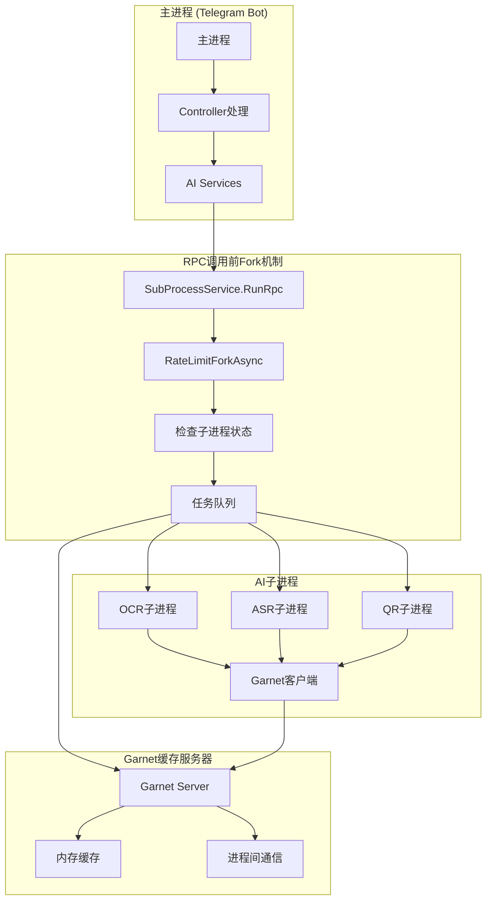
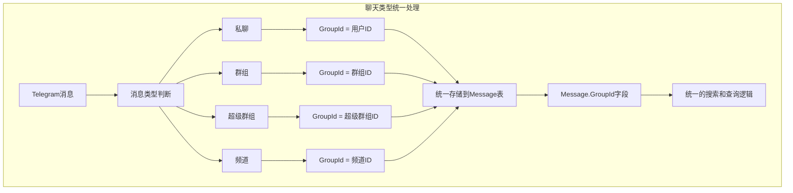
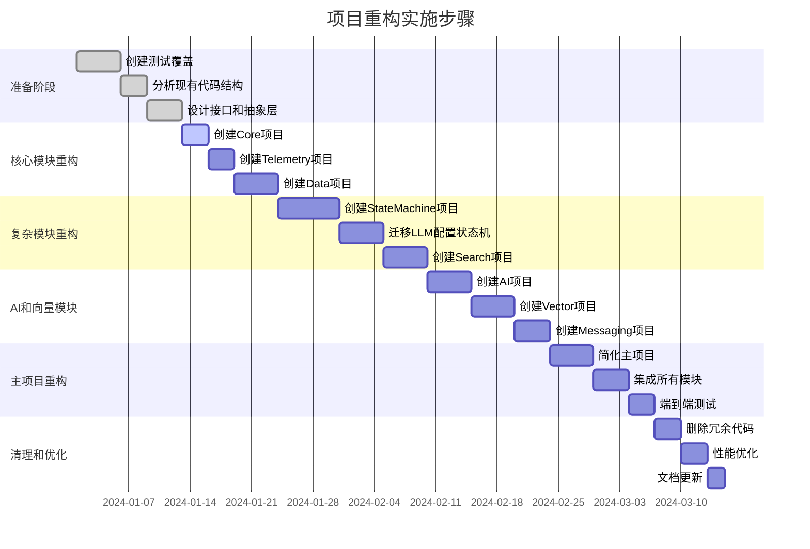

# 项目重构：模块化拆分设计文档

## 概述

本文档基于项目重构需求，详细描述TelegramSearchBot项目的模块化拆分设计方案。设计目标是将复杂、独立的模块从单体项目中拆分出来，形成清晰的模块化架构，同时确保重构过程的可控性和向后兼容性。

## 架构设计

### 整体架构图

```mermaid
graph TB
    subgraph "TelegramSearchBot 主项目"
        TGBot[TelegramSearchBot.Core]
        Controllers[Controllers/IOnUpdate]
        Executor[ControllerExecutor]
        Context[PipelineContext]
    end
    
    subgraph "核心基础设施模块"
        Core[TelegramSearchBot.Core]
        Config[Configuration]
        DI[Dependency Injection]
        Utils[Utilities]
    end
    
    subgraph "数据访问模块"
        Data[TelegramSearchBot.Data]
        Entities[EF Core Entities]
        Repositories[Repositories]
        Migrations[Migrations]
    end
    
    subgraph "搜索引擎模块"
        Search[TelegramSearchBot.Search]
        Lucene[Lucene.NET]
        Indexing[Indexing]
        Querying[Querying]
    end
    
    subgraph "向量数据库模块"
        Vector[TelegramSearchBot.Vector]
        FAISS[FAISS Integration]
        Storage[Vector Storage]
        Search[Vector Search]
    end
    
    subgraph "AI服务模块"
        AI[TelegramSearchBot.AI]
        OCR[OCR Services]
        ASR[ASR Services]
        LLM[LLM Services]
    end
    
    subgraph "消息处理模块"
        Messaging[TelegramSearchBot.Messaging]
        MediatR[MediatR Integration]
        Handlers[Message Handlers]
        Events[Event Bus]
    end
    
    subgraph "状态机模块"
        StateMachine[TelegramSearchBot.StateMachine]
        Engine[State Machine Engine]
        LLMConfig[LLM Config State Machine]
        Storage[State Storage]
    end
    
    subgraph "遥测模块"
        Telemetry[TelegramSearchBot.Telemetry]
        Logging[Logging]
        Metrics[Metrics]
        Tracing[Tracing]
    end
    
    subgraph "测试项目"
        CoreTest[Core.Tests]
        DataTest[Data.Tests]
        SearchTest[Search.Tests]
        VectorTest[Vector.Tests]
        AITest[AI.Tests]
        StateMachineTest[StateMachine.Tests]
    end
    
    %% 依赖关系
    TGBot --> Core
    TGBot --> Data
    TGBot --> Search
    TGBot --> Vector
    TGBot --> AI
    TGBot --> Messaging
    TGBot --> StateMachine
    TGBot --> Telemetry
    
    Core --> Telemetry
    Data --> Core
    Search --> Core
    Vector --> Core
    AI --> Core
    Messaging --> Core
    StateMachine --> Core
    StateMachine --> Data
    StateMachine --> Telemetry
    
    SearchTest --> Search
    VectorTest --> Vector
    AITest --> AI
    StateMachineTest --> StateMachine
```



### 模块依赖原则

1. **单向依赖** - 所有模块都依赖于Core，但不允许反向依赖
2. **分层架构** - 业务逻辑层依赖于基础设施层，不允许反向
3. **接口隔离** - 模块间通过接口通信，不直接依赖具体实现
4. **循环依赖检测** - 构建时检测并阻止循环依赖

## 组件和接口设计

### 1. TelegramSearchBot.Core (核心基础设施)

#### 项目结构
```
TelegramSearchBot.Core/
├── Attributes/
│   └── InjectableAttribute.cs        # 【重要】从原项目搬运，Service层自动DI标记
├── Interfaces/
│   ├── IConfigurationService.cs
│   ├── IServiceRegistry.cs
│   └── ITelemetryService.cs
├── Models/
│   ├── BotConfiguration.cs
│   ├── ServiceSettings.cs
│   └── AIProviderSettings.cs
├── Services/
│   ├── ConfigurationService.cs
│   ├── ServiceRegistry.cs
│   └── TelemetryService.cs
├── Extensions/
│   └── ServiceCollectionExtensions.cs  # 【重要】从原项目搬运，包含自动DI逻辑
└── TelegramSearchBot.Core.csproj
```

#### 自动依赖注入机制保留

**【重要原则】项目的实际自动依赖注入机制完全保留，包括Injectable特性（Service层）和IOnUpdate接口（Controller层）**

##### 1. 当前实际使用的依赖注入机制
项目实际使用**两种主要的自动注册机制**：

###### 机制1：IOnUpdate接口（用于Controller层）
- **作用**：Controller层的自动注册和依赖管理
- **数量**：23个Controller类实现了此接口
- **特点**：支持依赖关系管理，通过ControllerExecutor按拓扑排序执行

###### 机制2：Injectable特性（用于Service层和其他类）
- **作用**：Service层和其他通用类的自动注册
- **数量**：42个类使用了此特性
- **特点**：支持生命周期配置，灵活的接口和类注册

##### 2. Injectable特性搬运不修改
```csharp
// 【搬运不修改】从原项目直接复制InjectableAttribute.cs
// 文件位置：TelegramSearchBot.Core/Attributes/InjectableAttribute.cs
[AttributeUsage(AttributeTargets.Class, Inherited = false, AllowMultiple = false)]
public sealed class InjectableAttribute : Attribute
{
    public ServiceLifetime Lifetime { get; }
    
    public InjectableAttribute(ServiceLifetime lifetime = ServiceLifetime.Transient)
    {
        Lifetime = lifetime;
    }
}
```

##### 3. 完整自动注册逻辑搬运不修改
```csharp
// 【搬运不修改】从原项目搬运ServiceCollectionExtensions.cs
// 包含实际使用的两种主要自动注册机制
public static class ServiceCollectionExtensions
{
    // Injectable特性注册逻辑
    public static IServiceCollection AddInjectables(this IServiceCollection services, Assembly assembly)
    {
        var injectableTypes = assembly.GetTypes()
            .Where(t => t.IsClass && !t.IsAbstract && t.GetCustomAttribute<InjectableAttribute>() != null);

        foreach (var type in injectableTypes)
        {
            var attribute = type.GetCustomAttribute<InjectableAttribute>();
            var interfaces = type.GetInterfaces();

            // 注册为所有实现的接口
            foreach (var interfaceType in interfaces)
            {
                services.Add(new ServiceDescriptor(
                    interfaceType,
                    type,
                    attribute!.Lifetime));
            }

            // 始终注册类本身
            services.Add(new ServiceDescriptor(
                type,
                type,
                attribute!.Lifetime));
        }

        return services;
    }

    // 【重要】保留原有的完整服务注册流程
    public static IServiceCollection ConfigureAllServices(this IServiceCollection services)
    {
        var assembly = typeof(GeneralBootstrap).Assembly;
        return services
            .AddTelegramBotClient()
            .AddRedis()
            .AddDatabase()
            .AddHttpClients()
            .AddCoreServices()
            .AddBilibiliServices()
            .AddCommonServices()
            .AddAutoRegisteredServices()  // 包含IOnUpdate和IService扫描
            .AddInjectables(assembly);    // Injectable特性注册
    }
}
```

#### 核心接口
```csharp
// 配置服务接口
public interface IConfigurationService
{
    T GetSection<T>(string sectionName);
    void SetValue<T>(string key, T value);
    void Reload();
}

// 服务注册接口
public interface IServiceRegistry
{
    void RegisterSingleton<TInterface, TImplementation>() 
        where TImplementation : class, TInterface;
    void RegisterScoped<TInterface, TImplementation>() 
        where TImplementation : class, TInterface;
    void RegisterTransient<TInterface, TImplementation>() 
        where TImplementation : class, TInterface;
}

// 遥测服务接口
public interface ITelemetryService
{
    void LogInformation(string message, params object[] args);
    void LogWarning(string message, params object[] args);
    void LogError(string message, Exception exception);
    void LogMetric(string name, double value, Dictionary<string, string> tags = null);
}
```

### 2. TelegramSearchBot.Data (数据访问层)

#### 项目结构
```
TelegramSearchBot.Data/
├── Entities/                     # 【重要】数据库模型完全保持原样
│   ├── Message.cs                # 从原项目直接复制，不做任何修改
│   ├── User.cs                   # 从原项目直接复制，不做任何修改
│   ├── UserWithGroup.cs          # 从原项目直接复制，不做任何修改
│   ├── MessageExtension.cs       # 从原项目直接复制，不做任何修改
│   └── LLMConf.cs                # 从原项目直接复制，不做任何修改
├── Context/
│   └── DataDbContext.cs          # 从原项目迁移，保持原有配置
├── Migrations/
│   └── [Migration Files]         # 【重要】保持现有migrations，不创建新的
└── TelegramSearchBot.Data.csproj
```

#### 数据库模型迁移策略

**【重要原则】数据库模型可以搬运到新项目，但绝对不能修改任何代码**

##### 1. 实体类搬运不修改
- 所有Entity类从原项目**搬运**到Data项目
- **搬运方式**：直接复制文件，不修改任何代码
- **禁止修改**：不修改任何实体属性、关系、注解、字段
- **保持原样**：实体类代码100%保持原项目中的状态

##### 2. 实际的数据库模型结构
```csharp
// 【搬运不修改】Message实体 - 核心消息实体
// 文件位置：TelegramSearchBot.Data/Entities/Message.cs（从原项目搬运）
public class Message
{
    public long Id { get; set; }                    // 自增主键
    public DateTime DateTime { get; set; }          // 消息时间
    public long GroupId { get; set; }              // 【关键】聊天ID，统一标识群组、私聊、频道
    public long MessageId { get; set; }            // Telegram消息ID
    public long FromUserId { get; set; }           // 发送者用户ID
    public long ReplyToUserId { get; set; }        // 回复用户ID
    public long ReplyToMessageId { get; set; }     // 回复消息ID
    public string Content { get; set; }            // 消息内容
    public virtual ICollection<MessageExtension> MessageExtensions { get; set; } // 扩展字段
}

// 【搬运不修改】User实体 - 用户信息
// 文件位置：TelegramSearchBot.Data/Entities/User.cs（从原项目搬运）
public class User
{
    public long Id { get; set; }                    // 自增主键
    public long UserId { get; set; }               // Telegram用户ID
    public string FirstName { get; set; }          // 名
    public string LastName { get; set; }           // 姓
    public string Username { get; set; }           // 用户名
}

// 【搬运不修改】UserWithGroup实体 - 用户群组关系
// 文件位置：TelegramSearchBot.Data/Entities/UserWithGroup.cs（从原项目搬运）
public class UserWithGroup
{
    public long Id { get; set; }                    // 自增主键
    public long GroupId { get; set; }              // 群组ID
    public long UserId { get; set; }               // 用户ID
}

// 【搬运不修改】MessageExtension实体 - 消息扩展字段
// 文件位置：TelegramSearchBot.Data/Entities/MessageExtension.cs（从原项目搬运）
public class MessageExtension
{
    public long Id { get; set; }                    // 自增主键
    public long MessageId { get; set; }            // 关联消息ID
    public string Name { get; set; }               // 扩展字段名称
    public string Value { get; set; }              // 扩展字段值
}
```

**关键设计理念**：
- **GroupId统一标识**：使用GroupId字段统一标识所有类型的聊天（群组、私聊、频道）
- **扩展字段设计**：通过MessageExtensions表存储动态扩展字段（OCR文本、ASR文本等）
- **关系管理**：UserWithGroup表维护用户与群组的关联关系

##### 3. DbContext搬运不修改  
```csharp
// 【搬运不修改】DataDbContext - 数据库上下文
// 文件位置：TelegramSearchBot.Data/Context/DataDbContext.cs（从原项目搬运）
public class DataDbContext : DbContext
{
    public DbSet<Message> Messages { get; set; }
    public DbSet<User> Users { get; set; }
    public DbSet<UserWithGroup> UsersWithGroup { get; set; }
    public DbSet<MessageExtension> MessageExtensions { get; set; }
    public DbSet<LLMConf> LLMConfs { get; set; }

    protected override void OnModelCreating(ModelBuilder modelBuilder)
    {
        // 【搬运不修改】OnModelCreating方法完全从原项目复制
        // 包括所有配置、索引、关系、约束等都不改动
        base.OnModelCreating(modelBuilder);
    }
}
```

##### 4. 实际的数据库操作模式

**基于现有Service.Tool命名空间的搜索实现设计接口**：

```csharp
// 【基于实际代码设计】数据库查询服务接口
// 参考Service.Tool.SearchToolService的实际实现模式
public interface IDatabaseQueryService
{
    // 基于实际QueryMessageHistory方法设计
    Task<DatabaseQueryResult> QueryMessageHistoryAsync(
        long chatId,                                  // 【关键】GroupId，统一标识聊天类型
        string queryText = null,
        long? senderUserId = null,
        string senderNameHint = null,
        DateTime? startDate = null,
        DateTime? endDate = null,
        int page = 1,
        int pageSize = 10);

    // 基于实际AddToSqlite方法设计
    Task<long> AddMessageAsync(MessageOption messageOption);

    // 基于实际UserWithGroup查询逻辑设计
    Task<List<UserWithGroup>> GetUserGroupsAsync(long userId);

    // 基于实际消息扩展查询设计
    Task<List<MessageExtension>> GetMessageExtensionsAsync(long messageId);
}

// 【基于实际代码设计】数据库查询结果
// 参考Service.Tool的HistoryQueryResult实际结构
public class DatabaseQueryResult
{
    public List<Message> Messages { get; set; } = new List<Message>();
    public int TotalCount { get; set; }
    public int Page { get; set; }
    public int PageSize { get; set; }
    public int TotalPages { get; set; }
}

// 【基于实际代码设计】消息选项参数
// 参考Service.Tool的MessageOption实际结构
public class MessageOption
{
    public long ChatId { get; set; }                // 【关键】GroupId，统一标识聊天类型
    public long MessageId { get; set; }
    public long UserId { get; set; }
    public string Content { get; set; }
    public DateTime DateTime { get; set; }
    public User User { get; set; }
    public long ReplyTo { get; set; }
    public Chat Chat { get; set; }
}

// 【基于实际代码设计】聊天类型统一处理
// 参考实际项目中GroupId的使用方式
public enum ChatType
{
    Private = 1,    // 私聊：GroupId为用户ID
    Group = 2,      // 群组：GroupId为群组ID
    Supergroup = 3, // 超级群组：GroupId为超级群组ID
    Channel = 4     // 频道：GroupId为频道ID
}
```

##### 5. 实际的数据库查询实现模式
```csharp
// 【基于实际代码设计】数据库查询服务实现
// 参考Service.Tool.SearchToolService.QueryMessageHistory的实际实现
public class DatabaseQueryService : IDatabaseQueryService
{
    private readonly DataDbContext _dbContext;

    public async Task<DatabaseQueryResult> QueryMessageHistoryAsync(
        long chatId,
        string queryText = null,
        long? senderUserId = null,
        string senderNameHint = null,
        DateTime? startDate = null,
        DateTime? endDate = null,
        int page = 1,
        int pageSize = 10)
    {
        // 【基于实际代码】参数验证和限制
        if (pageSize > 50) pageSize = 50;
        if (pageSize <= 0) pageSize = 10;
        if (page <= 0) page = 1;

        int skip = (page - 1) * pageSize;
        int take = pageSize;

        // 【基于实际代码】构建查询
        var query = _dbContext.Messages.AsNoTracking()
                             .Where(m => m.GroupId == chatId);

        // 【基于实际代码】文本搜索
        if (!string.IsNullOrWhiteSpace(queryText))
        {
            query = query.Where(m => m.Content != null && m.Content.Contains(queryText));
        }

        // 【基于实际代码】发送者ID搜索
        if (senderUserId.HasValue)
        {
            query = query.Where(m => m.FromUserId == senderUserId.Value);
        }

        // 【基于实际代码】发送者姓名模糊搜索
        else if (!string.IsNullOrWhiteSpace(senderNameHint))
        {
            var lowerHint = senderNameHint.ToLowerInvariant();
            var matchingUserIds = await _dbContext.Users
                .Where(u => (u.FirstName != null && u.FirstName.ToLowerInvariant().Contains(lowerHint)) || 
                           (u.LastName != null && u.LastName.ToLowerInvariant().Contains(lowerHint)))
                .Select(u => u.Id)
                .ToListAsync();
            
            if (matchingUserIds.Any())
            {
                query = query.Where(m => matchingUserIds.Contains(m.FromUserId));
            }
        }

        // 【基于实际代码】日期范围搜索
        if (startDate.HasValue)
        {
            query = query.Where(m => m.DateTime >= startDate.Value);
        }

        if (endDate.HasValue)
        {
            query = query.Where(m => m.DateTime < endDate.Value);
        }

        // 【基于实际代码】分页和排序
        var totalCount = await query.CountAsync();
        var messages = await query
            .OrderByDescending(m => m.DateTime)
            .Skip(skip)
            .Take(take)
            .Include(m => m.MessageExtensions)
            .ToListAsync();

        return new DatabaseQueryResult
        {
            Messages = messages,
            TotalCount = totalCount,
            Page = page,
            PageSize = pageSize,
            TotalPages = (int)Math.Ceiling((double)totalCount / pageSize)
        };
    }

    public async Task<long> AddMessageAsync(MessageOption messageOption)
    {
        // 【基于实际代码】检查用户是否在群组中
        var userIsInGroup = await _dbContext.UsersWithGroup
            .AnyAsync(u => u.UserId == messageOption.UserId && 
                          u.GroupId == messageOption.ChatId);
        
        // 【基于实际代码】如果不存在，添加用户-群组关系
        if (!userIsInGroup)
        {
            await _dbContext.UsersWithGroup.AddAsync(new UserWithGroup {
                GroupId = messageOption.ChatId,
                UserId = messageOption.UserId
            });
        }
        
        // 【基于实际代码】检查并添加用户数据
        var existingUser = await _dbContext.Users
            .FirstOrDefaultAsync(u => u.UserId == messageOption.UserId);
        
        if (existingUser == null)
        {
            existingUser = new User {
                UserId = messageOption.UserId,
                FirstName = messageOption.User?.FirstName,
                LastName = messageOption.User?.LastName,
                Username = messageOption.User?.Username
            };
            await _dbContext.Users.AddAsync(existingUser);
        }
        
        // 【基于实际代码】创建消息实体并保存
        var message = new Message {
            GroupId = messageOption.ChatId,
            MessageId = messageOption.MessageId,
            FromUserId = messageOption.UserId,
            Content = messageOption.Content,
            DateTime = messageOption.DateTime,
        };
        
        await _dbContext.Messages.AddAsync(message);
        await _dbContext.SaveChangesAsync();
        
        return message.Id;
    }
}
```

### 3. TelegramSearchBot.Search (搜索引擎模块)

#### 项目结构
```
TelegramSearchBot.Search/
├── Interfaces/
│   ├── ILuceneManager.cs          # 【基于实际代码】Lucene管理接口
│   ├── ISearchService.cs           # 【基于实际代码】搜索服务接口
├── Services/
│   ├── LuceneManager.cs           # 【搬运不修改】从原项目搬运
│   └── SearchService.cs            # 【搬运不修改】从原项目搬运
├── Models/
│   ├── SearchOption.cs            # 【搬运不修改】从原项目搬运
│   ├── SearchType.cs               # 【搬运不修改】从原项目搬运
├── Analyzers/
│   └── ChineseAnalyzer.cs          # 【基于实际代码】中文分词器
├── [Lucene相关代码从原项目迁移]
└── TelegramSearchBot.Search.csproj
```

#### 实际的搜索模型结构

**【基于实际代码】SearchOption类 - 复杂的搜索选项**：
```csharp
// 【搬运不修改】SearchOption类 - 从原项目搬运
// 文件位置：TelegramSearchBot.Search/Models/SearchOption.cs
public class SearchOption
{
    public string Search { get; set; }                    // 搜索关键词
    public int MessageId { get; set; }                    // 消息ID
    public long ChatId { get; set; }                      // 【关键】聊天ID，统一标识
    public bool IsGroup { get; set; }                     // 是否为群组聊天
    public SearchType SearchType { get; set; }            // 搜索类型枚举
    public int Skip { get; set; }                         // 【关键】分页跳过数量
    public int Take { get; set; }                         // 【关键】分页获取数量
    public int Count { get; set; }                        // 搜索结果总数
    public List<long> ToDelete { get; set; }              // 待删除消息ID列表
    public bool ToDeleteNow { get; set; }                 // 是否立即删除
    public int ReplyToMessageId { get; set; }             // 回复消息ID
    public Chat Chat { get; set; }                        // 聊天信息
    public List<Data.Message> Messages { get; set; }      // 搜索结果消息列表
}

// 【搬运不修改】SearchType枚举 - 从原项目搬运
// 文件位置：TelegramSearchBot.Search/Models/SearchType.cs
public enum SearchType
{
    InvertedIndex = 0,  // 倒排索引搜索（Lucene简单搜索）
    Vector = 1,         // 向量搜索
    SyntaxSearch = 2    // 语法搜索（Lucene高级搜索）
}
```

#### 实际的Lucene管理接口设计

**【基于实际代码】LuceneManager的三种搜索方法**：

```csharp
// 【基于实际代码】Lucene管理接口
// 基于LuceneManager.cs的实际实现设计
public interface ILuceneManager
{
    // 【基于实际代码】默认搜索 - 使用简单搜索
    (int totalCount, List<Message> messages) Search(string query, long groupId, int skip, int take);
    
    // 【基于实际代码】简单搜索 - 支持中文分词
    (int totalCount, List<Message> messages) SimpleSearch(string query, long groupId, int skip, int take);
    
    // 【基于实际代码】语法搜索 - 支持高级语法
    (int totalCount, List<Message> messages) SyntaxSearch(string query, long groupId, int skip, int take);
    
    // 【基于实际代码】索引管理
    Task WriteDocumentAsync(Message message);
    Task DeleteDocumentAsync(long groupId, long messageId);
    Task<bool> IndexExistsAsync(long groupId);
    Task<long> GetDocumentCountAsync(long groupId);
    Task OptimizeIndexAsync(long groupId);
}
```

#### 实际的搜索服务接口设计

**【基于实际代码】SearchService的多搜索模式**：

```csharp
// 【基于实际代码】搜索服务接口
// 基于SearchService.cs的实际实现设计
public interface ISearchService
{
    // 【基于实际代码】统一搜索入口 - 根据SearchType分发
    Task<SearchOption> Search(SearchOption searchOption);
    
    // 【基于实际代码】Lucene简单搜索
    Task<SearchOption> LuceneSearch(SearchOption searchOption);
    
    // 【基于实际代码】Lucene语法搜索
    Task<SearchOption> LuceneSyntaxSearch(SearchOption searchOption);
    
    // 【基于实际代码】向量搜索
    Task<SearchOption> VectorSearch(SearchOption searchOption);
}

```

#### 实际的分页机制实现

**【基于实际代码】分页处理逻辑**：

```csharp
// 【基于实际代码】分页参数验证和限制
// 基于SearchToolService的实际分页逻辑设计
public class PaginationHelper
{
    // 【基于实际代码】搜索分页参数处理
    public static (int skip, int take, int page, int pageSize) NormalizeSearchPagination(
        int page = 1, 
        int pageSize = 5)
    {
        // 【基于实际代码】参数验证和限制
        if (pageSize > 20) pageSize = 20;  // 搜索最大每页20条
        if (pageSize <= 0) pageSize = 5;
        if (page <= 0) page = 1;

        int skip = (page - 1) * pageSize;
        int take = pageSize;

        return (skip, take, page, pageSize);
    }
    
    // 【基于实际代码】历史查询分页参数处理
    public static (int skip, int take, int page, int pageSize) NormalizeHistoryPagination(
        int page = 1, 
        int pageSize = 10)
    {
        // 【基于实际代码】参数验证和限制
        if (pageSize > 50) pageSize = 50;  // 历史查询最大每页50条
        if (pageSize <= 0) pageSize = 10;
        if (page <= 0) page = 1;

        int skip = (page - 1) * pageSize;
        int take = pageSize;

        return (skip, take, page, pageSize);
    }
}
```

#### 实际的搜索实现架构

**【基于实际代码】多数据源搜索架构**：

```csharp
// 【基于实际代码】搜索服务实现
// 基于SearchService.cs的实际实现模式设计
public class SearchService : ISearchService
{
    private readonly ILuceneManager _luceneManager;
    private readonly IVectorService _vectorService;
    private readonly DataDbContext _dbContext;

    public async Task<SearchOption> Search(SearchOption searchOption)
    {
        // 【基于实际代码】根据SearchType分发到不同的搜索策略
        return searchOption.SearchType switch
        {
            SearchType.Vector => await VectorSearch(searchOption),
            SearchType.InvertedIndex => await LuceneSearch(searchOption),
            SearchType.SyntaxSearch => await LuceneSyntaxSearch(searchOption),
            _ => await LuceneSearch(searchOption)  // 默认使用简单搜索
        };
    }

    private async Task<SearchOption> LuceneSearch(SearchOption searchOption)
    {
        if (searchOption.IsGroup)
        {
            // 【基于实际代码】群组搜索：直接在指定群组中搜索
            (searchOption.Count, searchOption.Messages) = _luceneManager.Search(
                searchOption.Search, 
                searchOption.ChatId, 
                searchOption.Skip, 
                searchOption.Take);
        }
        else
        {
            // 【基于实际代码】私聊搜索：在用户所在的所有群组中搜索
            var userInGroups = await _dbContext.Set<UserWithGroup>()
                .Where(user => searchOption.ChatId.Equals(user.UserId))
                .ToListAsync();
            
            foreach (var group in userInGroups)
            {
                var (count, messages) = _luceneManager.Search(
                    searchOption.Search, 
                    group.GroupId, 
                    searchOption.Skip / userInGroups.Count, 
                    searchOption.Take / userInGroups.Count);
                searchOption.Messages.AddRange(messages);
                searchOption.Count += count;
            }
        }
        return searchOption;
    }

    private async Task<SearchOption> LuceneSyntaxSearch(SearchOption searchOption)
    {
        // 【基于实际代码】语法搜索：支持高级语法
        if (searchOption.IsGroup)
        {
            (searchOption.Count, searchOption.Messages) = _luceneManager.SyntaxSearch(
                searchOption.Search, 
                searchOption.ChatId, 
                searchOption.Skip, 
                searchOption.Take);
        }
        else
        {
            // 【基于实际代码】私聊语法搜索：在用户所有群组中搜索
            var userInGroups = await _dbContext.Set<UserWithGroup>()
                .Where(user => searchOption.ChatId.Equals(user.UserId))
                .ToListAsync();
            
            foreach (var group in userInGroups)
            {
                var (count, messages) = _luceneManager.SyntaxSearch(
                    searchOption.Search, 
                    group.GroupId, 
                    searchOption.Skip / userInGroups.Count, 
                    searchOption.Take / userInGroups.Count);
                searchOption.Messages.AddRange(messages);
                searchOption.Count += count;
            }
        }
        return searchOption;
    }
}
```

#### 实际的索引结构

**【基于实际代码】Lucene索引字段结构**：

```csharp
// 【基于实际代码】Lucene索引字段
// 基于LuceneManager.WriteDocumentAsync的实际实现设计
public class LuceneIndexFields
{
    // 【基于实际代码】基础字段
    public const string GroupId = "GroupId";           // 聊天ID
    public const string MessageId = "MessageId";       // 消息ID
    public const string DateTime = "DateTime";         // 消息时间
    public const string FromUserId = "FromUserId";     // 发送者ID
    public const string ReplyToUserId = "ReplyToUserId"; // 回复用户ID
    public const string ReplyToMessageId = "ReplyToMessageId"; // 回复消息ID
    
    // 【基于实际代码】内容字段（主要搜索字段）
    public const string Content = "Content";           // 消息内容
    
    // 【基于实际代码】扩展字段（动态生成）
    public const string ExtensionPrefix = "Ext_";     // 扩展字段前缀
    
    // 【基于实际代码】扩展字段示例
    public const string Ext_OCR_Text = "Ext_OCR_Text";     // OCR识别文本
    public const string Ext_ASR_Text = "Ext_ASR_Text";     // ASR识别文本
    public const string Ext_QR_Text = "Ext_QR_Text";       // QR识别文本
}

// 【基于实际代码】索引文档构建
// 基于LuceneManager.WriteDocumentAsync的实际实现设计
public class LuceneDocumentBuilder
{
    public Document BuildDocument(Message message)
    {
        var doc = new Document();
        
        // 【基于实际代码】添加基础字段
        doc.Add(new Int64Field(LuceneIndexFields.GroupId, message.GroupId, Field.Store.YES));
        doc.Add(new Int64Field(LuceneIndexFields.MessageId, message.MessageId, Field.Store.YES));
        doc.Add(new StringField(LuceneIndexFields.DateTime, message.DateTime.ToString("O"), Field.Store.YES));
        doc.Add(new Int64Field(LuceneIndexFields.FromUserId, message.FromUserId, Field.Store.YES));
        
        // 【基于实际代码】添加内容字段（主要搜索字段，权重更高）
        var contentField = new TextField(LuceneIndexFields.Content, message.Content ?? "", Field.Store.YES);
        contentField.Boost = 1.0F;  // 【基于实际代码】内容字段权重为1.0
        doc.Add(contentField);
        
        // 【基于实际代码】添加扩展字段
        if (message.MessageExtensions != null)
        {
            foreach (var ext in message.MessageExtensions)
            {
                var extFieldName = LuceneIndexFields.ExtensionPrefix + ext.Name;
                var extField = new TextField(extFieldName, ext.Value ?? "", Field.Store.YES);
                extField.Boost = 0.8F;  // 【基于实际代码】扩展字段权重为0.8
                doc.Add(extField);
            }
        }
        
        return doc;
    }
}
```

### 4. TelegramSearchBot.Vector (向量数据库模块)

#### 项目结构
```
TelegramSearchBot.Vector/
├── Interfaces/
│   ├── IVectorService.cs
│   ├── IVectorStorage.cs
│   └── IVectorSearch.cs
├── Services/
│   ├── FAISSVectorService.cs
│   ├── VectorStorage.cs
│   └── VectorSearch.cs
├── Models/
│   ├── VectorDocument.cs
│   ├── VectorSearchResult.cs
│   └── VectorConfig.cs
├── [FAISS相关代码从原项目迁移]
└── TelegramSearchBot.Vector.csproj
```

### 5. TelegramSearchBot.AI (AI服务模块)

#### 项目结构
```
TelegramSearchBot.AI/
├── Interfaces/
│   ├── IOCRService.cs              # OCR服务接口
│   ├── IASRService.cs              # ASR服务接口
│   ├── ILLMService.cs              # LLM服务接口
│   ├── IAIServiceProvider.cs       # AI服务提供者接口
│   └── ISearchToolService.cs       # 【基于实际代码】LLM工具搜索接口
├── Services/
│   ├── PaddleOCRService.cs         # OCR服务实现
│   ├── WhisperASRService.cs        # ASR服务实现
│   ├── OllamaLLMService.cs         # Ollama LLM服务
│   ├── OpenAILLMService.cs         # OpenAI LLM服务
│   ├── GeminiLLMService.cs         # Gemini LLM服务
│   └── SearchToolService.cs        # 【搬运不修改】LLM工具搜索服务
├── Models/
│   ├── OCRResult.cs               # OCR结果
│   ├── ASRResult.cs               # ASR结果
│   ├── LLMResult.cs               # LLM结果
│   ├── AIRequest.cs               # AI请求
│   ├── ToolContext.cs              # 【搬运不修改】LLM工具上下文
│   ├── SearchToolResult.cs         # 【基于实际代码】搜索工具结果
│   └── HistoryQueryResult.cs       # 【基于实际代码】历史查询结果
├── Tools/                         # 【新增】LLM工具定义
│   ├── SearchTool.cs              # 【基于实际代码】搜索工具
│   ├── QueryTool.cs               # 【基于实际代码】查询工具
│   └── ToolBase.cs                # 【基于实际代码】工具基类
├── [AI相关代码从原项目迁移]
└── TelegramSearchBot.AI.csproj
```

#### 实际的LLM工具调用架构

**【核心原则】ToolContext.cs和SearchToolService.cs是LLM工具调用体系的核心，应该划分到AI模块**

##### 1. LLM工具调用接口设计

**【基于实际代码】LLM工具搜索服务接口**：
```csharp
// 【基于实际代码】LLM工具搜索服务接口
// 基于SearchToolService.cs的实际实现设计
// 文件位置：TelegramSearchBot.AI/Interfaces/ISearchToolService.cs
public interface ISearchToolService
{
    // 【基于实际代码】在当前聊天中搜索索引消息 - LLM工具调用
    Task<SearchToolResult> SearchMessagesInCurrentChatAsync(
        string query,
        ToolContext toolContext,
        int page = 1,
        int pageSize = 5);
    
    // 【基于实际代码】查询消息历史数据库 - LLM工具调用
    Task<HistoryQueryResult> QueryMessageHistory(
        ToolContext toolContext,
        string queryText = null,
        long? senderUserId = null,
        string senderNameHint = null,
        string startDate = null,
        string endDate = null,
        int page = 1,
        int pageSize = 10);
}

// 【基于实际代码】LLM工具上下文
// 基于SearchToolService使用的ToolContext设计
// 文件位置：TelegramSearchBot.AI/Models/ToolContext.cs（从原项目搬运）
public class ToolContext
{
    public long ChatId { get; set; }    // 【关键】聊天ID，统一标识聊天类型
    public long UserId { get; set; }    // 用户ID
}

// 【基于实际代码】搜索工具结果
// 基于SearchToolService的实际返回结果设计
// 文件位置：TelegramSearchBot.AI/Models/SearchToolResult.cs
public class SearchToolResult
{
    public bool Success { get; set; }
    public string Query { get; set; }
    public List<SearchResultMessage> Messages { get; set; } = new List<SearchResultMessage>();
    public int TotalCount { get; set; }
    public int Page { get; set; }
    public int PageSize { get; set; }
    public string ErrorMessage { get; set; }
}

// 【基于实际代码】历史查询结果
// 基于SearchToolService的实际返回结果设计
// 文件位置：TelegramSearchBot.AI/Models/HistoryQueryResult.cs
public class HistoryQueryResult
{
    public List<HistoryQueryMessage> Messages { get; set; } = new List<HistoryQueryMessage>();
    public int TotalCount { get; set; }
    public int Page { get; set; }
    public int PageSize { get; set; }
    public int TotalPages { get; set; }
    public bool HasMore { get; set; }
}
```

##### 2. LLM工具定义和实现

**【基于实际代码】LLM工具架构**：
```csharp
// 【基于实际代码】LLM工具基类
// 文件位置：TelegramSearchBot.AI/Tools/ToolBase.cs
public abstract class ToolBase
{
    public abstract string Name { get; }
    public abstract string Description { get; }
    public abstract Task<ToolResult> ExecuteAsync(ToolContext context, Dictionary<string, object> parameters);
}

// 【基于实际代码】搜索工具定义
// 文件位置：TelegramSearchBot.AI/Tools/SearchTool.cs
public class SearchTool : ToolBase
{
    private readonly ISearchToolService _searchToolService;
    
    public override string Name => "message_search";
    public override string Description => "在聊天中搜索消息";
    
    public SearchTool(ISearchToolService searchToolService)
    {
        _searchToolService = searchToolService;
    }
    
    public override async Task<ToolResult> ExecuteAsync(ToolContext context, Dictionary<string, object> parameters)
    {
        try
        {
            var query = parameters.GetValueOrDefault("query")?.ToString();
            var page = parameters.TryGetValue("page", out var pageValue) ? Convert.ToInt32(pageValue) : 1;
            var pageSize = parameters.TryGetValue("page_size", out var pageSizeValue) ? Convert.ToInt32(pageSizeValue) : 5;
            
            if (string.IsNullOrWhiteSpace(query))
            {
                return new ToolResult { Success = false, ErrorMessage = "搜索关键词不能为空" };
            }
            
            // 【基于实际代码】调用搜索工具服务
            var result = await _searchToolService.SearchMessagesInCurrentChatAsync(
                query, context, page, pageSize);
            
            return new ToolResult
            {
                Success = result.Success,
                Data = new {
                    messages = result.Messages,
                    total_count = result.TotalCount,
                    page = result.Page,
                    page_size = result.PageSize
                }
            };
        }
        catch (Exception ex)
        {
            return new ToolResult { Success = false, ErrorMessage = ex.Message };
        }
    }
}

// 【基于实际代码】查询工具定义
// 文件位置：TelegramSearchBot.AI/Tools/QueryTool.cs
public class QueryTool : ToolBase
{
    private readonly ISearchToolService _searchToolService;
    
    public override string Name => "message_query";
    public override string Description => "查询消息历史";
    
    public QueryTool(ISearchToolService searchToolService)
    {
        _searchToolService = searchToolService;
    }
    
    public override async Task<ToolResult> ExecuteAsync(ToolContext context, Dictionary<string, object> parameters)
    {
        try
        {
            var queryText = parameters.GetValueOrDefault("query_text")?.ToString();
            var senderUserId = parameters.TryGetValue("sender_user_id", out var senderUserIdValue) ? 
                Convert.ToInt64(senderUserIdValue) : (long?)null;
            var senderNameHint = parameters.GetValueOrDefault("sender_name_hint")?.ToString();
            var startDate = parameters.GetValueOrDefault("start_date")?.ToString();
            var endDate = parameters.GetValueOrDefault("end_date")?.ToString();
            var page = parameters.TryGetValue("page", out var pageValue) ? Convert.ToInt32(pageValue) : 1;
            var pageSize = parameters.TryGetValue("page_size", out var pageSizeValue) ? Convert.ToInt32(pageSizeValue) : 10;
            
            // 【基于实际代码】调用查询工具服务
            var result = await _searchToolService.QueryMessageHistory(
                context, queryText, senderUserId, senderNameHint, startDate, endDate, page, pageSize);
            
            return new ToolResult
            {
                Success = true,
                Data = new {
                    messages = result.Messages,
                    total_count = result.TotalCount,
                    page = result.Page,
                    page_size = result.PageSize,
                    total_pages = result.TotalPages,
                    has_more = result.HasMore
                }
            };
        }
        catch (Exception ex)
        {
            return new ToolResult { Success = false, ErrorMessage = ex.Message };
        }
    }
}

// 【基于实际代码】工具结果
// 文件位置：TelegramSearchBot.AI/Models/ToolResult.cs
public class ToolResult
{
    public bool Success { get; set; }
    public object Data { get; set; }
    public string ErrorMessage { get; set; }
}
```

### 6. TelegramSearchBot.Messaging (消息处理模块)

#### 项目结构
```
TelegramSearchBot.Messaging/
├── Interfaces/
│   ├── IOnUpdate.cs              # 【搬运不修改】从原项目搬运，Controller统一接口
│   ├── IService.cs               # 【搬运不修改】从原项目搬运，Service接口（历史遗留）
│   ├── IView.cs                  # 【搬运不修改】从原项目搬运，View统一接口
│   ├── IControllerExecutor.cs     # 【基于实际代码】Controller执行器接口
│   └── ISendMessage.cs           # 【基于实际代码】消息发送服务接口
├── Context/
│   └── PipelineContext.cs        # 【搬运不修改】从原项目搬运，管道上下文
├── Executers/
│   └── ControllerExecutor.cs     # 【搬运不修改】从原项目搬运，依赖解析执行器
├── Managers/
│   ├── SendMessage.cs            # 【搬运不修改】从原项目搬运，消息发送管理器（含限流）
│   └── SendModel.cs              # 【搬运不修改】从原项目搬运，发送模型
├── Models/
│   ├── BotMessageType.cs         # 【基于实际代码】消息类型枚举
│   ├── MessageOption.cs           # 【基于实际代码】消息选项参数
│   └── SendMessageOptions.cs     # 【基于实际代码】发送选项参数
├── Controllers/
│   ├── BaseController.cs         # 【基于实际代码】Controller基类
│   ├── MessageController.cs       # 【基于实际代码】消息处理Controller
│   ├── SearchController.cs        # 【基于实际代码】搜索处理Controller
│   └── CommandController.cs       # 【基于实际代码】命令处理Controller
├── Services/
│   ├── MessageService.cs         # 【基于实际代码】消息服务
│   ├── SearchService.cs          # 【基于实际代码】搜索服务
│   └── SendMessageService.cs     # 【基于实际代码】发送服务（高层封装）
├── Views/
│   ├── BaseView.cs               # 【基于实际代码】View基类
│   ├── SearchView.cs             # 【基于实际代码】搜索结果View
│   ├── MessageView.cs            # 【基于实际代码】消息处理View
│   └── CommandView.cs            # 【基于实际代码】命令处理View
└── TelegramSearchBot.Messaging.csproj
```

#### 实际的MVC架构分离设计

**【核心原则】项目的实际MVC架构完全基于现有的代码实现模式**：

##### 1. Controller层 - 消息路由和分发

**【基于实际代码】Controller层的实际职责**：
```csharp
// 【搬运不修改】IOnUpdate接口 - Controller统一接口
// 文件位置：TelegramSearchBot.Messaging/Interfaces/IOnUpdate.cs（从原项目搬运）
public interface IOnUpdate
{
    List<Type> Dependencies { get; }                    // 【关键】Controller依赖声明
    Task ExecuteAsync(PipelineContext context);         // 【关键】统一执行入口
}

// 【基于实际代码】PipelineContext - 管道上下文状态管理
// 文件位置：TelegramSearchBot.Messaging/Context/PipelineContext.cs（从原项目搬运）
public class PipelineContext
{
    public Update Update { get; set; }                  // Telegram更新对象
    public Dictionary<string, dynamic> PipelineCache { get; set; } // 管道缓存
    public long MessageDataId { get; set; }             // 消息数据ID
    public BotMessageType BotMessageType { get; set; }   // 消息类型
    public List<string> ProcessingResults { get; set; } = new List<string>(); // 处理结果
}

// 【基于实际代码】BotMessageType枚举 - 消息类型
// 基于实际项目中的消息处理逻辑设计
public enum BotMessageType
{
    Unknown = 0,        // 未知类型
    Message = 1,        // 普通消息
    CallbackQuery = 2,  // 回调查询
    Command = 3,        // 命令消息
    Media = 4,          // 媒体消息
}
```

**【基于实际代码】Controller层的实际实现模式**：
```csharp
// 【基于实际代码】MessageController - 消息处理Controller
// 基于MessageController.cs的实际实现设计
public class MessageController : IOnUpdate
{
    public List<Type> Dependencies => new List<Type>();  // 【关键】无依赖，优先执行
    
    private readonly IMessageService _messageService;
    
    public async Task ExecuteAsync(PipelineContext p)
    {
        var e = p.Update;
        
        // 【基于实际代码】消息类型判断
        string toAdd = e?.Message?.Text ?? e?.Message?.Caption ?? string.Empty;
        
        if (e.CallbackQuery != null)
        { 
            p.BotMessageType = BotMessageType.CallbackQuery;
            return;
        }
        else if (e.Message != null)
        { 
            p.BotMessageType = BotMessageType.Message;
        }
        else
        {
            p.BotMessageType = BotMessageType.Unknown;
            return;
        }
        
        // 【基于实际代码】调用Service层处理业务逻辑
        p.MessageDataId = await _messageService.ExecuteAsync(new MessageOption {
            ChatId = e.Message.Chat.Id,
            MessageId = e.Message.MessageId,
            UserId = e.Message.From.Id,
            Content = toAdd,
            DateTime = e.Message.Date,
            User = e.Message.From,
            ReplyTo = e.Message.ReplyToMessage?.Id ?? 0,
            Chat = e.Message.Chat,
        });
        
        p.ProcessingResults.Add(toAdd);
    }
}

// 【基于实际代码】SearchController - 搜索处理Controller
// 基于SearchController.cs的实际实现设计
public class SearchController : IOnUpdate
{
    public List<Type> Dependencies => new List<Type> { typeof(MessageController) };  // 【关键】依赖MessageController
    
    private readonly ISearchService _searchService;
    private readonly ISearchView _searchView;
    
    public async Task ExecuteAsync(PipelineContext p)
    {
        var e = p.Update;
        
        // 【基于实际代码】只在消息类型为Message时处理
        if (p.BotMessageType != BotMessageType.Message)
        {
            return;
        }
        
        // 【基于实际代码】命令识别和路由
        if (!string.IsNullOrEmpty(e?.Message?.Text))
        {
            if (e.Message.Text.Length >= 4 && e.Message.Text.Substring(0, 3).Equals("搜索 "))
            {
                // 【基于实际代码】简单搜索命令处理
                var query = e.Message.Text.Substring(3).Trim();
                var searchOption = new SearchOption {
                    Search = query,
                    ChatId = e.Message.Chat.Id,
                    IsGroup = e.Message.Chat.Type != Telegram.Bot.Types.ChatType.Private,
                    SearchType = SearchType.InvertedIndex,
                    Skip = 0,
                    Take = 10
                };
                
                var result = await _searchService.Search(searchOption);
                
                // 【基于实际代码】调用View层渲染和发送
                await _searchView.RenderAsync(result, e.Message.Chat.Id);
            }
            else if (e.Message.Text.Length >= 6 && e.Message.Text.Substring(0, 5).Equals("向量搜索 "))
            {
                // 【基于实际代码】向量搜索命令处理
                var query = e.Message.Text.Substring(5).Trim();
                var searchOption = new SearchOption {
                    Search = query,
                    ChatId = e.Message.Chat.Id,
                    IsGroup = e.Message.Chat.Type != Telegram.Bot.Types.ChatType.Private,
                    SearchType = SearchType.Vector,
                    Skip = 0,
                    Take = 10
                };
                
                var result = await _searchService.Search(searchOption);
                
                // 【基于实际代码】调用View层渲染和发送
                await _searchView.RenderAsync(result, e.Message.Chat.Id);
            }
            else if (e.Message.Text.Length >= 6 && e.Message.Text.Substring(0, 5).Equals("语法搜索 "))
            {
                // 【基于实际代码】语法搜索命令处理
                var query = e.Message.Text.Substring(5).Trim();
                var searchOption = new SearchOption {
                    Search = query,
                    ChatId = e.Message.Chat.Id,
                    IsGroup = e.Message.Chat.Type != Telegram.Bot.Types.ChatType.Private,
                    SearchType = SearchType.SyntaxSearch,
                    Skip = 0,
                    Take = 10
                };
                
                var result = await _searchService.Search(searchOption);
                
                // 【基于实际代码】调用View层渲染和发送
                await _searchView.RenderAsync(result, e.Message.Chat.Id);
            }
        }
    }
}
```

##### 2. Service层 - 业务逻辑处理

**【基于实际代码】Service层的实际职责**：
```csharp
// 【基于实际代码】Service层职责定义
// 基于现有Service层实现模式总结
public interface IServiceBusinessLogic
{
    // 【关键】Service层不含任何Telegram相关的API调用（除了专门调整相关设置的）
    // 【关键】Service层只处理纯业务逻辑，不涉及消息格式化
    // 【关键】Service层可以调用Manager层处理底层实现
    // 【关键】Service层负责数据访问和第三方服务集成
}

// 【基于实际代码】MessageService - 消息业务逻辑
// 基于MessageService.cs的实际实现设计
public class MessageService : IMessageService
{
    private readonly DataDbContext _dbContext;
    private readonly IUserManager _userManager;
    private readonly IGroupManager _groupManager;
    
    public async Task<long> ExecuteAsync(MessageOption messageOption)
    {
        // 【基于实际代码】业务逻辑：检查用户是否在群组中
        var userIsInGroup = await _dbContext.UsersWithGroup
            .AnyAsync(u => u.UserId == messageOption.UserId && 
                          u.GroupId == messageOption.ChatId);
        
        // 【基于实际代码】业务逻辑：添加用户-群组关系
        if (!userIsInGroup)
        {
            await _dbContext.UsersWithGroup.AddAsync(new UserWithGroup {
                GroupId = messageOption.ChatId,
                UserId = messageOption.UserId
            });
        }
        
        // 【基于实际代码】调用Manager层处理底层逻辑
        var user = await _userManager.GetOrCreateUserAsync(messageOption.User);
        var group = await _groupManager.GetOrCreateGroupAsync(messageOption.Chat);
        
        // 【基于实际代码】业务逻辑：创建消息实体
        var message = new Message {
            GroupId = messageOption.ChatId,
            MessageId = messageOption.MessageId,
            FromUserId = messageOption.UserId,
            Content = messageOption.Content,
            DateTime = messageOption.DateTime,
        };
        
        // 【基于实际代码】数据访问：保存到数据库
        await _dbContext.Messages.AddAsync(message);
        await _dbContext.SaveChangesAsync();
        
        return message.Id;
    }
}

// 【基于实际代码】SearchService - 搜索业务逻辑
// 基于SearchService.cs的实际实现设计
public class SearchService : ISearchService
{
    private readonly ILuceneManager _luceneManager;
    private readonly IVectorManager _vectorManager;
    private readonly DataDbContext _dbContext;
    
    public async Task<SearchOption> Search(SearchOption searchOption)
    {
        // 【基于实际代码】业务逻辑：根据搜索类型分发
        return searchOption.SearchType switch
        {
            SearchType.Vector => await VectorSearch(searchOption),
            SearchType.InvertedIndex => await LuceneSearch(searchOption),
            SearchType.SyntaxSearch => await LuceneSyntaxSearch(searchOption),
            _ => await LuceneSearch(searchOption)
        };
    }
    
    private async Task<SearchOption> LuceneSearch(SearchOption searchOption)
    {
        // 【基于实际代码】业务逻辑：群组搜索vs私聊搜索
        if (searchOption.IsGroup)
        {
            // 【基于实际代码】调用Manager层进行Lucene搜索
            (searchOption.Count, searchOption.Messages) = await _luceneManager.SearchAsync(
                searchOption.Search, 
                searchOption.ChatId, 
                searchOption.Skip, 
                searchOption.Take);
        }
        else
        {
            // 【基于实际代码】业务逻辑：私聊搜索需要在用户所在的所有群组中搜索
            var userInGroups = await _dbContext.Set<UserWithGroup>()
                .Where(user => searchOption.ChatId.Equals(user.UserId))
                .ToListAsync();
            
            foreach (var group in userInGroups)
            {
                var (count, messages) = await _luceneManager.SearchAsync(
                    searchOption.Search, 
                    group.GroupId, 
                    searchOption.Skip / userInGroups.Count, 
                    searchOption.Take / userInGroups.Count);
                searchOption.Messages.AddRange(messages);
                searchOption.Count += count;
            }
        }
        
        return searchOption;
    }
}
```

##### 3. View层 - 消息渲染和发送

**【基于实际代码】View层的实际职责**：
```csharp
// 【搬运不修改】IView接口 - View统一接口（标记接口）
// 文件位置：TelegramSearchBot.Messaging/Interfaces/IView.cs（从原项目搬运）
public interface IView
{
    // 【关键】标记接口，用于自动注册和批量管理
    // View层的统一标识，支持依赖注入和架构约束
}

// 【基于实际代码】SearchView - 搜索结果渲染和发送
// 基于SearchView.cs的实际实现设计
public class SearchView : IView
{
    private readonly ISendMessageService _sendMessageService;
    private readonly ITelegramBotClient _botClient;
    
    public async Task RenderAsync(SearchOption searchOption, long chatId)
    {
        // 【基于实际代码】View层职责：消息格式化和渲染
        var messageText = RenderSearchResults(searchOption);
        
        // 【基于实际代码】View层职责：发送消息
        await _sendMessageService.AddTask(async () => {
            await _botClient.SendMessage(
                chatId: chatId,
                text: messageText,
                parseMode: Telegram.Bot.Types.Enums.ParseMode.Html,
                disableNotification: true,
                replyMarkup: BuildPaginationKeyboard(searchOption)
            );
        }, chatId < 0);
    }
    
    private string RenderSearchResults(SearchOption searchOption)
    {
        // 【基于实际代码】使用Scriban模板引擎渲染
        var template = @"{{#if messages}}
🔍 搜索结果：{{search}}

{{#each messages}}
<b>消息 {{message_id}}:</b>
{{content}}

{{/each}}
📊 共 {{count}} 条结果，第 {{page}} 页
{{else}}
❌ 没有找到相关结果
{{/if}}";
        
        var script = Template.Parse(template);
        var result = script.Render(new {
            search = searchOption.Search,
            messages = searchOption.Messages.Select(m => new {
                message_id = m.MessageId,
                content = m.Content ?? "[媒体消息]"
            }),
            count = searchOption.Count,
            page = (searchOption.Skip / searchOption.Take) + 1
        });
        
        return result;
    }
    
    private InlineKeyboardMarkup BuildPaginationKeyboard(SearchOption searchOption)
    {
        // 【基于实际代码】构建分页按钮
        var buttons = new List<List<InlineKeyboardButton>>();
        
        if (searchOption.Skip > 0)
        {
            buttons.Add(new List<InlineKeyboardButton> {
                InlineKeyboardButton.WithCallbackData("⬅️ 上一页", $"search_{searchOption.Search}_{searchOption.Skip - searchOption.Take}_{searchOption.Take}")
            });
        }
        
        if (searchOption.Count > searchOption.Skip + searchOption.Take)
        {
            buttons.Add(new List<InlineKeyboardButton> {
                InlineKeyboardButton.WithCallbackData("下一页 ➡️", $"search_{searchOption.Search}_{searchOption.Skip + searchOption.Take}_{searchOption.Take}")
            });
        }
        
        return new InlineKeyboardMarkup(buttons);
    }
}
```

##### 4. Manager层 - 底层实现管理

**【基于实际代码】Manager层的实际职责**：
```csharp
// 【基于实际代码】Manager层职责定义
// 基于现有Manager层实现模式总结
public interface IManagerLayer
{
    // 【关键】Manager层处理底层实现细节
    // 【关键】Manager层被Service层调用，处理基础设施管理
    // 【关键】Manager层管理外部系统交互（Lucene、FAISS、文件系统等）
    // 【关键】Manager层负责性能优化和资源管理
    // 【关键】Manager层负责系统级功能（消息发送限流、进程管理等）
}

// 【基于实际代码】LuceneManager - Lucene索引管理
// 基于LuceneManager.cs的实际实现设计
public class LuceneManager : ILuceneManager
{
    // 【基于实际代码】Manager层职责：索引管理
    public async Task WriteDocumentAsync(Message message)
    {
        using (var writer = GetIndexWriter(message.GroupId))
        {
            try
            {
                Document doc = new Document();
                // 【基于实际代码】底层实现：添加索引字段
                doc.Add(new Int64Field("GroupId", message.GroupId, Field.Store.YES));
                doc.Add(new Int64Field("MessageId", message.MessageId, Field.Store.YES));
                // ... 其他字段
                
                // 【基于实际代码】Manager层职责：资源管理
                writer.AddDocument(doc);
                writer.Flush(triggerMerge: true, applyAllDeletes: true);
                writer.Commit();
            }
            catch (ArgumentNullException ex)
            {
                // 【基于实际代码】Manager层职责：错误处理
                await Send.Log(ex.Message);
            }
        }
    }
    
    // 【基于实际代码】Manager层职责：性能优化
    public (int, List<Message>) SimpleSearch(string q, long groupId, int skip, int take)
    {
        // 【基于实际代码】底层实现：Lucene搜索逻辑
        IndexReader reader = DirectoryReader.Open(GetFSDirectory(groupId));
        var searcher = new IndexSearcher(reader);
        
        var (query, searchTerms) = ParseSimpleQuery(q, reader);
        
        // 【基于实际代码】Manager层职责：扩展字段搜索
        var fields = MultiFields.GetIndexedFields(reader);
        foreach (var field in fields)
        {
            if (field.StartsWith("Ext_"))
            {
                var extQuery = new BooleanQuery();
                foreach (var term in searchTerms)
                {
                    if (!string.IsNullOrWhiteSpace(term))
                    {
                        extQuery.Add(new TermQuery(new Term(field, term)), Occur.SHOULD);
                    }
                }
                query.Add(extQuery, Occur.SHOULD);
            }
        }
        
        // 【基于实际代码】Manager层职责：排序和分页
        var top = searcher.Search(query, skip + take, 
            new Sort(new SortField("MessageId", SortFieldType.INT64, true)));
        
        // ... 结果处理逻辑
    }
}

// 【基于实际代码】SendMessage - 消息发送管理器（含限流机制）
// 基于SendMessage.cs的实际实现设计
public class SendMessage : BackgroundService, ISendMessage
{
    private readonly ConcurrentQueue<Task> tasks;
    private readonly TimeLimiter groupLimit;
    private readonly TimeLimiter globalLimit;
    private readonly ITelegramBotClient botClient;
    private readonly ILogger<SendMessage> logger;
    
    // 【基于实际代码】双重限流机制配置
    public SendMessage(ITelegramBotClient botClient, ILogger<SendMessage> logger)
    {
        // 【关键】群组限流：每分钟最多20条消息
        groupLimit = TimeLimiter.GetFromMaxCountByInterval(20, TimeSpan.FromMinutes(1));
        
        // 【关键】全局限流：每秒最多30条消息
        globalLimit = TimeLimiter.GetFromMaxCountByInterval(30, TimeSpan.FromSeconds(1));
        
        tasks = new ConcurrentQueue<Task>();
        this.botClient = botClient;
        this.logger = logger;
    }
    
    // 【基于实际代码】核心任务添加方法 - 支持限流
    public virtual async Task AddTask(Func<Task> action, bool isGroup)
    {
        if (isGroup)
        {
            // 【关键】群组消息：双重限流（群组限流 + 全局限流）
            tasks.Enqueue(groupLimit.Enqueue(async () => await globalLimit.Enqueue(action)));
        }
        else
        {
            // 【关键】私聊消息：仅全局限流
            tasks.Enqueue(globalLimit.Enqueue(action));
        }
    }
    
    // 【基于实际代码】带返回值的任务添加方法
    public Task<T> AddTaskWithResult<T>(Func<Task<T>> action, bool isGroup)
    {
        if (isGroup)
        {
            // 【关键】群组消息：双重限流
            return groupLimit.Enqueue(async () => await globalLimit.Enqueue(action));
        }
        else
        {
            // 【关键】私聊消息：仅全局限流
            return globalLimit.Enqueue(action);
        }
    }
    
    // 【基于实际代码】基于ChatId的智能限流选择
    public Task<T> AddTaskWithResult<T>(Func<Task<T>> action, long chatId)
    {
        if (chatId < 0)
        {
            // 【关键】群组ChatId为负数，使用双重限流
            return groupLimit.Enqueue(async () => await globalLimit.Enqueue(action));
        }
        else
        {
            // 【关键】私聊ChatId为正数，仅全局限流
            return globalLimit.Enqueue(action);
        }
    }
    
    // 【基于实际代码】文本消息发送方法
    public Task AddTextMessageToSend(
        long chatId,
        string text,
        ParseMode? parseMode = null,
        Telegram.Bot.Types.ReplyParameters? replyParameters = null,
        bool disableNotification = false,
        bool highPriorityForGroup = false,  // 【关键】是否为群组消息限流
        CancellationToken cancellationToken = default)
    {
        Func<Task> action = async () => {
            await botClient.SendMessage(
                chatId: chatId,
                text: text,
                parseMode: parseMode.HasValue ? parseMode.Value : default,
                replyParameters: replyParameters,
                disableNotification: disableNotification,
                cancellationToken: cancellationToken
            );
        };
        
        // 【关键】根据是否为群组消息选择限流策略
        return AddTask(action, highPriorityForGroup);
    }
    
    // 【基于实际代码】管理员日志消息发送（特殊日志接口）
    // 【关键】同时写入传统日志系统和发送到Telegram管理员私聊
    public async Task Log(string text)
    {
        // 【关键】第一部分：写入传统日志系统
        logger.LogInformation(text);
        
        // 【关键】第二部分：发送到Telegram管理员私聊
        await AddTask(async () => {
            await botClient.SendMessage(
                chatId: Env.AdminId,           // 【关键】发送到配置的管理员ID
                disableNotification: true,     // 【关键】静默发送，不通知
                parseMode: ParseMode.None,    // 【关键】纯文本格式
                text: text                    // 【关键】日志文本内容
            );
        }, false);  // 【关键】管理员日志消息属于私聊，使用私聊限流策略（仅全局限流）
    }
    
    // 【基于实际代码】传统日志方法（仅写入日志系统）
    public Task LogToSystem(string text)
    {
        // 【关键】只写入传统日志系统，不发送Telegram消息
        logger.LogInformation(text);
        return Task.CompletedTask;
    }
    
    // 【基于实际代码】Telegram管理员消息发送（仅发送到管理员私聊）
    public Task LogToAdmin(string text)
    {
        // 【关键】只发送到Telegram管理员私聊，不写入传统日志系统
        return AddTask(async () => {
            await botClient.SendMessage(
                chatId: Env.AdminId,
                disableNotification: true,
                parseMode: ParseMode.None,
                text: text
            );
        }, false);
    }
    
    // 【基于实际代码】后台任务执行循环
    protected override async Task ExecuteAsync(CancellationToken stoppingToken)
    {
        while (!stoppingToken.IsCancellationRequested)
        {
            if (tasks.IsEmpty)
            {
                // 【关键】队列为空时休眠1秒，避免CPU空转
                await Task.Delay(1000, stoppingToken);
            }
            else
            {
                // 【关键】处理队列中的所有任务
                while (!tasks.IsEmpty)
                {
                    try
                    {
                        if (tasks.TryDequeue(out var result))
                        {
                            // 【关键】等待任务完成，确保消息发送顺序
                            await result;
                        }
                    }
                    catch (Exception ex)
                    {
                        // 【关键】错误处理：记录日志但不中断整个服务
                        logger.LogError(ex, "Error executing send task");
                    }
                }
            }
        }
    }
}

// 【基于实际代码】消息发送服务接口
// 基于SendMessage的实际功能设计
public interface ISendMessage
{
    // 【基于实际代码】添加发送任务到队列
    Task AddTask(Func<Task> action, bool isGroup);
    
    // 【基于实际代码】添加带返回值的发送任务
    Task<T> AddTaskWithResult<T>(Func<Task<T>> action, bool isGroup);
    
    // 【基于实际代码】基于ChatId智能限流的发送任务
    Task<T> AddTaskWithResult<T>(Func<Task<T>> action, long chatId);
    
    // 【基于实际代码】发送文本消息
    Task AddTextMessageToSend(
        long chatId,
        string text,
        ParseMode? parseMode = null,
        Telegram.Bot.Types.ReplyParameters? replyParameters = null,
        bool disableNotification = false,
        bool highPriorityForGroup = false,
        CancellationToken cancellationToken = default);
    
    // 【基于实际代码】管理员日志消息发送（特殊日志接口）
    // 【关键】同时写入传统日志系统和发送到Telegram管理员私聊
    Task Log(string text);
    
    // 【基于实际代码】传统日志方法（仅写入日志系统）
    Task LogToSystem(string text);
    
    // 【基于实际代码】Telegram管理员消息发送（仅发送到管理员私聊）
    Task LogToAdmin(string text);
}

// 【基于实际代码】发送选项参数
// 基于SendMessage的参数设计
public class SendMessageOptions
{
    public long ChatId { get; set; }
    public string Text { get; set; }
    public ParseMode? ParseMode { get; set; }
    public Telegram.Bot.Types.ReplyParameters? ReplyParameters { get; set; }
    public bool DisableNotification { get; set; }
    public bool IsGroupMessage { get; set; }      // 【关键】是否为群组消息，决定限流策略
    public CancellationToken CancellationToken { get; set; }
}

// 【基于实际代码】日志类型枚举
// 基于SendMessage的特殊日志机制设计
public enum LogType
{
    // 【关键】仅写入传统日志系统
    SystemOnly = 0,
    
    // 【关键】仅发送到Telegram管理员私聊
    AdminOnly = 1,
    
    // 【关键】同时写入传统日志系统和发送到Telegram管理员私聊
    SystemAndAdmin = 2
}

// 【基于实际代码】日志选项参数
// 基于SendMessage的特殊日志机制设计
public class LogOptions
{
    public string Text { get; set; }
    public LogType LogType { get; set; } = LogType.SystemAndAdmin;
    public bool DisableNotification { get; set; } = true;
    public ParseMode ParseMode { get; set; } = ParseMode.None;
}

// 【基于实际代码】限流策略枚举
// 基于SendMessage的双重限流机制设计
public enum RateLimitStrategy
{
    // 【关键】私聊消息：仅全局限流（每秒30条）
    PrivateOnly = 0,
    
    // 【关键】群组消息：双重限流（群组限流+全局限流）
    GroupAndGlobal = 1,
    
    // 【关键】管理员日志：私聊限流策略，但具有高优先级
    AdminLog = 2
}

// 【基于实际代码】限流配置
// 基于SendMessage的限流参数设计
public class RateLimitConfig
{
    // 【关键】群组限流配置
    public int GroupMaxCount { get; set; } = 20;        // 每分钟最多20条
    public TimeSpan GroupInterval { get; set; } = TimeSpan.FromMinutes(1);
    
    // 【关键】全局限流配置
    public int GlobalMaxCount { get; set; } = 30;       // 每秒最多30条
    public TimeSpan GlobalInterval { get; set; } = TimeSpan.FromSeconds(1);
    
    // 【关键】管理员日志限流配置（特殊处理）
    public int AdminLogMaxCount { get; set; } = 60;     // 每分钟最多60条（比普通群组更高）
    public TimeSpan AdminLogInterval { get; set; } = TimeSpan.FromMinutes(1);
    
    // 【关键】队列处理配置
    public int QueueCheckInterval { get; set; } = 1000;  // 队列检查间隔（毫秒）
    
    // 【关键】管理员ID配置
    public long AdminId { get; set; } = Env.AdminId;      // 管理员用户ID
}
```

### 7. TelegramSearchBot.StateMachine (状态机模块)

#### 项目结构
```
TelegramSearchBot.StateMachine/
├── Interfaces/
│   ├── IStateMachine.cs
│   ├── IStateMachineStorage.cs
│   ├── IStateHandler.cs
│   └── ILLMConfigStateMachine.cs
├── Engines/
│   ├── StateMachineEngine.cs
│   └── RedisStateMachineStorage.cs
├── Handlers/
│   ├── LLMConfigStateHandlers.cs
│   └── StateHandlerBase.cs
├── Models/
│   ├── StateTransitionResult.cs
│   ├── MachineState.cs
│   └── [LLMConfState.cs从原项目迁移]
├── [EditLLMConfService相关代码迁移]
└── TelegramSearchBot.StateMachine.csproj
```

#### 状态机核心接口
```csharp
// 通用状态机接口
public interface IStateMachine<TState> where TState : Enum
{
    Task<TState> GetCurrentStateAsync(string sessionId);
    Task SetStateAsync(string sessionId, TState state);
    Task<TData> GetDataAsync<TData>(string sessionId);
    Task SetDataAsync<TData>(string sessionId, TData data);
    Task<bool> TransitAsync(string sessionId, string input);
    Task ResetAsync(string sessionId);
}

// 状态处理器接口
public interface IStateHandler<TState> where TState : Enum
{
    Task<StateTransitionResult> HandleAsync(string sessionId, string input, TState currentState);
    bool CanHandle(TState state);
}

// 状态存储接口
public interface IStateMachineStorage
{
    Task<TState> GetStateAsync<TState>(string sessionId) where TState : Enum;
    Task SetStateAsync<TState>(string sessionId, TState state) where TState : Enum;
    Task<TData> GetDataAsync<TData>(string sessionId);
    Task SetDataAsync<TData>(string sessionId, TData data);
    Task RemoveAsync(string sessionId);
    Task<bool> ExistsAsync(string sessionId);
}
```

### 8. TelegramSearchBot.Telemetry (遥测模块)

#### 项目结构
```
TelegramSearchBot.Telemetry/
├── Interfaces/
│   ├── ILoggerService.cs
│   ├── IMetricsService.cs
│   └── ITracingService.cs
├── Services/
│   ├── SerilogLoggerService.cs
│   ├── MetricsService.cs
│   └── TracingService.cs
├── Providers/
│   ├── ConsoleLogProvider.cs
│   ├── FileLogProvider.cs
│   └── OpenTelemetryProvider.cs
├── [日志相关代码从原项目迁移]
└── TelegramSearchBot.Telemetry.csproj
```

### 9. TelegramSearchBot.Core (主项目)

#### 项目结构
```
TelegramSearchBot.Core/
├── Controllers/
│   ├── AI/                    # AI相关功能
│   │   ├── ASR/              # 语音识别（子进程）
│   │   ├── LLM/              # 大语言模型
│   │   ├── OCR/              # 图像识别（子进程）
│   │   └── QR/               # 二维码识别（子进程）
│   ├── Bilibili/             # B站相关功能
│   ├── Common/               # 通用功能
│   ├── Download/             # 文件下载
│   ├── Help/                 # 帮助功能
│   ├── Manage/               # 管理功能
│   ├── Search/               # 搜索功能
│   └── Storage/              # 存储功能
├── Executors/
│   └── ControllerExecutor.cs # 【重要】从原项目搬运，包含依赖解析逻辑
├── Contexts/
│   └── PipelineContext.cs    # 【重要】从原项目搬运，管道上下文状态
├── Interfaces/
│   ├── IOnUpdate.cs          # 【重要】从原项目搬运，控制器统一接口
│   └── IService.cs           # 【历史遗留】从原项目搬运，老的Service接口（现有代码中仍使用）
├── Services/
│   ├── BotService.cs
│   └── LongPollService.cs
├── Handlers/
│   ├── BotUpdateHandler.cs
│   └── LongPollUpdateHandler.cs
├── Models/
│   ├── BotRequest.cs
│   ├── BotResponse.cs
│   └── CommandResult.cs
├── AppBootstrap/
│   ├── AppBootstrap.cs       # 【重要】从原项目搬运，核心启动框架基类
│   ├── GeneralBootstrap.cs   # 【重要】从原项目搬运，主进程启动配置
│   ├── SchedulerBootstrap.cs # 【重要】从原项目搬运，Garnet调度器启动
│   ├── OCRBootstrap.cs       # 【重要】从原项目搬运，OCR子进程启动
│   ├── ASRBootstrap.cs       # 【重要】从原项目搬运，ASR子进程启动
│   └── QRBootstrap.cs        # 【重要】从原项目搬运，QR子进程启动
├── MultiProcess/             # 【新增】多进程管理模块
│   ├── ProcessManager.cs     # 进程管理器
│   ├── GarnetClient.cs       # Garnet客户端
│   ├── ProcessCommunication.cs # 进程间通信
│   └── TaskQueue.cs          # 任务队列
├── Program.cs                # 【重要】从原项目搬运，程序入口
└── TelegramSearchBot.Core.csproj
```

#### 多进程架构和Garnet缓存系统

**【核心原则】项目的多进程架构和Garnet缓存系统完全保留，这是项目的高性能架构核心**

##### 1. 多进程架构概述
项目采用**先进的按需Fork多进程架构设计**，主进程负责Telegram消息处理，AI服务在RPC调用前按需Fork子进程，Garnet作为高性能内存缓存和进程间通信总线：



##### 2. Garnet核心作用保留
**Garnet不是简单的Redis替代，而是项目的核心架构组件**：

- **高性能内存缓存**：为所有项目提供临时状态存储和缓存服务
- **进程间通信总线**：作为主进程和子进程间的通信通道
- **任务调度中心**：负责任务分发和结果收集
- **状态管理中心**：管理跨进程的共享状态和会话信息

##### 3. 多进程Bootstrap系统保留
**所有有用的Bootstrap类完全保留，构成完整的多进程启动体系**：

```csharp
// 【搬运不修改】从原项目搬运所有Bootstrap类
// 文件位置：TelegramSearchBot.Core/AppBootstrap/

// AppBootstrap.cs - 核心启动框架基类
public static class AppBootstrap
{
    public static bool TryDispatchStartupByReflection(string[] args)
    {
        // 反射分发机制：根据命令行参数动态调用对应的Bootstrap类
        // 支持启动参数：Scheduler, OCR, ASR, QR
        // 提供子进程管理和Windows Job Object支持
        return true;
    }
}

// GeneralBootstrap.cs - 主进程启动
public static class GeneralBootstrap
{
    public static async Task Startup(string[] args)
    {
        // 启动主进程服务
        services.AddHostedService<TelegramBotReceiverService>();
        services.AddGarnetClient(); // 连接到Garnet服务器
        
        // Fork启动Garnet调度器进程
        Fork(["Scheduler", port.ToString()]);
        
        // 数据库迁移和初始化
        // MCP工具初始化
    }
}

// SchedulerBootstrap.cs - Garnet调度器启动
public static class SchedulerBootstrap
{
    public static async Task Startup(string[] args)
    {
        // 启动Garnet Redis服务器作为任务调度器和进程间通信总线
        // 绑定指定端口启动Redis服务器
        // 无限运行保持服务可用性
        // 作为所有AI子进程的通信中心
    }
}

// OCRBootstrap.cs - OCR子进程启动
public static class OCRBootstrap
{
    public static async Task Startup(string[] args)
    {
        // 启动OCR处理子进程
        // 连接到Garnet服务器
        // 订阅OCR任务队列
        // 集成PaddleOCR进行图片文字识别
        // 10分钟超时机制，空闲自动退出
    }
}

// ASRBootstrap.cs - ASR子进程启动
public static class ASRBootstrap
{
    public static async Task Startup(string[] args)
    {
        // 启动ASR语音识别子进程
        // 连接到Garnet服务器
        // 订阅ASR任务队列
        // 集成Whisper进行音频转文字
        // 支持多种音频格式转换
        // 10分钟超时机制，空闲自动退出
    }
}

// QRBootstrap.cs - QR子进程启动
public static class QRBootstrap
{
    public static async Task Startup(string[] args)
    {
        // 启动二维码识别子进程
        // 连接到Garnet服务器
        // 订阅QR任务队列
        // 集成QRManager进行二维码解析
        // 10分钟超时机制，空闲自动退出
    }
}
```

**注意**：`DaemonBootstrap.cs` 是无用代码，不继承AppBootstrap基类，硬编码不存在的路径，项目中无任何引用，应该在重构中删除。

##### 4. AI服务子进程架构保留
**OCR、ASR、QR等AI服务采用SubProcessService的RPC前Fork机制，保持资源隔离和并行处理**：

```csharp
// 【搬运不修改】AI服务子进程实际启动机制
// 文件位置：TelegramSearchBot.Core/Services/SubProcessService.cs

// 核心RPC方法 - 在调用前尝试Fork子进程
public async Task<string> RunRpc(string payload)
{
    var db = connectionMultiplexer.GetDatabase();
    var guid = Guid.NewGuid();
    
    // 1. 将任务ID放入对应的任务队列
    await db.ListRightPushAsync($"{ForkName}Tasks", $"{guid}");
    
    // 2. 将任务数据存入Redis
    await db.StringSetAsync($"{ForkName}Post-{guid}", payload);
    
    // 3. 【关键】RPC调用前尝试Fork子进程
    await AppBootstrap.AppBootstrap.RateLimitForkAsync([ForkName, $"{Env.SchedulerPort}"]);
    
    // 4. 等待子进程处理结果
    return await db.StringWaitGetDeleteAsync($"{ForkName}Result-{guid}");
}

// RateLimitForkAsync方法 - 速率限制的子进程启动
public static async Task RateLimitForkAsync(string[] args)
{
    using (await _asyncLock.LockAsync())
    {
        if (ForkLock.ContainsKey(args[0]))
        {
            if (DateTime.UtcNow - ForkLock[args[0]] > TimeSpan.FromMinutes(5))
            {
                Fork(args);  // 超过5分钟，启动新子进程
                ForkLock[args[0]] = DateTime.UtcNow;
            }
        }
        else
        {
            Fork(args);      // 首次调用，启动子进程
            ForkLock.Add(args[0], DateTime.UtcNow);
        }
    }
}

// Fork方法 - 实际启动子进程
public static void Fork(string[] args)
{
    string exePath = Environment.ProcessPath;
    string arguments = string.Join(" ", args.Select(arg => $"{arg}"));
    
    ProcessStartInfo startInfo = new ProcessStartInfo
    {
        FileName = exePath,
        Arguments = arguments,
        UseShellExecute = false,
        RedirectStandardOutput = true,
        RedirectStandardError = true
    };
    
    var newProcess = Process.Start(startInfo);
    if (newProcess == null)
    {
        throw new Exception("启动新进程失败");
    }
    
    // 使用Windows Job Object管理子进程生命周期
    childProcessManager.AddProcess(newProcess);
    Log.Logger.Information($"主进程：{args[0]} {args[1]}已启动");
}
```

##### 5. 进程间通信机制保留
**通过Garnet实现高效的进程间通信**：

```csharp
// 【搬运不修改】进程间通信实现
public class ProcessCommunication
{
    private readonly IGarnetClient _garnetClient;
    
    // 主进程发送任务
    public async Task SendTaskAsync(string service, object taskData)
    {
        var taskKey = $"task_{service}_{Guid.NewGuid()}";
        var queueKey = $"task_queue_{service}";
        
        // 将任务数据存储到Garnet
        await _garnetClient.SetAsync(taskKey, Serialize(taskData));
        
        // 将任务ID推送到服务队列
        await _garnetClient.ListRightPushAsync(queueKey, taskKey);
    }
    
    // 子进程获取任务
    public async Task<object> ReceiveTaskAsync(string service)
    {
        var queueKey = $"task_queue_{service}";
        
        // 从队列获取任务ID（阻塞等待）
        var taskId = await _garnetClient.ListBlockingPopLeftAsync(queueKey, TimeSpan.FromSeconds(1));
        
        // 从Garnet获取任务数据
        var taskData = await _garnetClient.GetAsync(taskId);
        
        return Deserialize(taskData);
    }
    
    // 子进程返回结果
    public async Task SendResultAsync(string taskId, object result)
    {
        var resultKey = $"result_{taskId}";
        await _garnetClient.SetAsync(resultKey, Serialize(result));
        
        // 通知主进程任务完成
        await _garnetClient.PublishAsync($"task_complete_{taskId}", resultKey);
    }
}
```

#### 实际使用的自动依赖注入机制完全保留

**【重要原则】项目的实际自动依赖注入机制100%保持原样，重点是IOnUpdate接口（Controller）和Injectable特性（Service）**

##### 1. IOnUpdate接口搬运不修改（Controller层核心机制）
```csharp
// 【搬运不修改】从原项目直接复制IOnUpdate.cs
// 文件位置：TelegramSearchBot.Core/Interfaces/IOnUpdate.cs
public interface IOnUpdate
{
    List<Type> Dependencies { get; }
    Task ExecuteAsync(PipelineContext context);
}
```

##### 2. IService接口搬运不修改（历史遗留但仍在使用）
```csharp
// 【搬运不修改】从原项目直接复制IService.cs
// 文件位置：TelegramSearchBot.Core/Interfaces/IService.cs
// 注意：这是老的实现，但现有代码中仍有33个Service类在使用
public interface IService
{
    string ServiceName { get; }
}
```

##### 3. PipelineContext搬运不修改
```csharp
// 【搬运不修改】从原项目直接复制PipelineContext.cs
// 文件位置：TelegramSearchBot.Core/Contexts/PipelineContext.cs
public class PipelineContext 
{
    public Update Update { get; set; }
    public Dictionary<string, dynamic> PipelineCache { get; set; }
    public long MessageDataId { get; set; }
    public BotMessageType BotMessageType { get; set; }
    public List<string> ProcessingResults { get; set; } = new List<string>();
}
```

##### 4. ControllerExecutor搬运不修改
```csharp
// 【搬运不修改】从原项目直接复制ControllerExecutor.cs
// 包含完整的Controller依赖解析和执行逻辑
public class ControllerExecutor
{
    private readonly IEnumerable<IOnUpdate> _controllers;

    public ControllerExecutor(IEnumerable<IOnUpdate> controllers)
    {
        _controllers = controllers;
    }

    public async Task ExecuteControllers(Update e)
    {
        var executed = new HashSet<Type>();
        var pending = new List<IOnUpdate>(_controllers);
        var PipelineContext = new PipelineContext() { 
            Update = e, 
            PipelineCache = new Dictionary<string, dynamic>() 
        };
        
        while (pending.Count > 0)
        {
            var controller = pending.FirstOrDefault(c => 
                !c.Dependencies.Any(d => !executed.Contains(d))
            );

            if (controller != null)
            {
                try
                {
                    await controller.ExecuteAsync(PipelineContext);
                }
                catch (Exception ex)
                {
                    // 异常处理逻辑完全保持原样
                }
                executed.Add(controller.GetType());
                pending.Remove(controller);
            }
            else
            {
                throw new InvalidOperationException("Circular dependency detected or unmet dependencies.");
            }
        }
    }
}
```

##### 5. 自动扫描注册机制搬运不修改
```csharp
// 【搬运不修改】在Program.cs中保持原有的自动注册逻辑
// 从原项目搬运Program.cs和GeneralBootstrap.cs
public static void Main(string[] args)
{
    var host = Host.CreateDefaultBuilder(args)
        .ConfigureServices((context, services) =>
        {
            // 【重要】保持原有的完整服务注册流程
            services.ConfigureAllServices();
        })
        .Build();

    host.Run();
}
```

##### 6. Service自动注册保持
```csharp
// 【搬运不修改】保持所有Service的Injectable标记
// 示例：SearchService的自动注册标记
[Injectable(Microsoft.Extensions.DependencyInjection.ServiceLifetime.Transient)]
public class SearchService : ISearchService, IService
{
    // 构造函数依赖注入完全保持原样
    public SearchService(
        LuceneManager lucene, 
        DataDbContext dbContext, 
        IVectorGenerationService vectorService)
    {
        // 依赖注入初始化逻辑保持原样
    }
}
```

## 数据模型设计

### 实际的数据库实体关系（基于现有代码）

**【重要】数据库实体关系完全基于现有代码的实际实现，不是传统的设计**

```mermaid
erDiagram
    Message ||--o{ MessageExtension : contains
    Message }|--|| User : sent_by
    Message }|--|| UserWithGroup : belongs_to_group
    User ||--o{ UserWithGroup : member_of
    
    Message {
        long Id PK
        DateTime DateTime
        long GroupId FK "【关键】统一标识聊天类型"
        long MessageId "Telegram消息ID"
        long FromUserId FK "发送者用户ID"
        long ReplyToUserId "回复用户ID"
        long ReplyToMessageId "回复消息ID"
        string Content "消息内容"
        virtual ICollection<MessageExtension> MessageExtensions "扩展字段"
    }
    
    User {
        long Id PK
        long UserId "Telegram用户ID"
        string FirstName "名"
        string LastName "姓"
        string Username "用户名"
    }
    
    UserWithGroup {
        long Id PK
        long GroupId FK "群组ID"
        long UserId FK "用户ID"
    }
    
    MessageExtension {
        long Id PK
        long MessageId FK "关联消息ID"
        string Name "扩展字段名称"
        string Value "扩展字段值"
    }
    
    LLMConf {
        long Id PK
        long GroupId FK "群组ID"
        string Name "配置名称"
        string Value "配置值"
    }
```

### 实际的聊天类型处理方式

**【核心设计】GroupId统一标识所有聊天类型**：



#### 实际的聊天类型处理逻辑

**【基于实际代码】聊天类型处理策略**：

```csharp
// 【基于实际代码】聊天类型统一处理
// 基于现有项目中GroupId的使用方式设计
public class ChatTypeHandler
{
    // 【基于实际代码】聊天类型枚举
    public enum ChatType
    {
        Private = 1,        // 私聊：GroupId为对方用户ID
        Group = 2,          // 群组：GroupId为群组ID
        Supergroup = 3,     // 超级群组：GroupId为超级群组ID
        Channel = 4         // 频道：GroupId为频道ID
    }
    
    // 【基于实际代码】获取聊天类型
    public static ChatType GetChatType(Telegram.Bot.Types.Chat chat)
    {
        return chat.Type switch
        {
            Telegram.Bot.Types.ChatType.Private => ChatType.Private,
            Telegram.Bot.Types.ChatType.Group => ChatType.Group,
            Telegram.Bot.Types.ChatType.Supergroup => ChatType.Supergroup,
            Telegram.Bot.Types.ChatType.Channel => ChatType.Channel,
            _ => ChatType.Private
        };
    }
    
    // 【基于实际代码】获取GroupId
    public static long GetGroupId(Telegram.Bot.Types.Chat chat)
    {
        // 【关键】所有聊天类型都使用Chat.Id作为GroupId
        return chat.Id;
    }
    
    // 【基于实际代码】判断是否为群组聊天
    public static bool IsGroupChat(Telegram.Bot.Types.Chat chat)
    {
        var chatType = GetChatType(chat);
        return chatType == ChatType.Group || 
               chatType == ChatType.Supergroup || 
               chatType == ChatType.Channel;
    }
    
    // 【基于实际代码】搜索时的聊天处理逻辑
    public static async Task<SearchOption> ApplyChatTypeLogicAsync(
        SearchOption searchOption, 
        DataDbContext dbContext)
    {
        if (searchOption.IsGroup)
        {
            // 【基于实际代码】群组搜索：直接在指定群组中搜索
            // GroupId已经设置为群组ID，直接搜索即可
            return searchOption;
        }
        else
        {
            // 【基于实际代码】私聊搜索：在用户所在的所有群组中搜索
            var userInGroups = await dbContext.Set<UserWithGroup>()
                .Where(user => searchOption.ChatId.Equals(user.UserId))
                .ToListAsync();
            
            // 【基于实际代码】扩展搜索范围到用户所在的所有群组
            foreach (var group in userInGroups)
            {
                var (count, messages) = await SearchInGroupAsync(searchOption, group.GroupId);
                searchOption.Messages.AddRange(messages);
                searchOption.Count += count;
            }
            
            return searchOption;
        }
    }
}
```

#### 实际的UserWithGroup关系表设计

**【基于实际代码】用户-群组关系管理**：

```csharp
// 【搬运不修改】UserWithGroup实体 - 用户群组关系
// 文件位置：TelegramSearchBot.Data/Entities/UserWithGroup.cs（从原项目搬运）
public class UserWithGroup
{
    public long Id { get; set; }                    // 自增主键
    public long GroupId { get; set; }              // 群组ID
    public long UserId { get; set; }               // 用户ID
}

// 【基于实际代码】UserWithGroup关系服务
// 基于现有项目中UserWithGroup的使用方式设计
public class UserWithGroupService
{
    private readonly DataDbContext _dbContext;
    
    // 【基于实际代码】添加用户到群组
    public async Task AddUserToGroupAsync(long userId, long groupId)
    {
        var existing = await _dbContext.UsersWithGroup
            .FirstOrDefaultAsync(u => u.UserId == userId && u.GroupId == groupId);
        
        if (existing == null)
        {
            await _dbContext.UsersWithGroup.AddAsync(new UserWithGroup {
                UserId = userId,
                GroupId = groupId
            });
            await _dbContext.SaveChangesAsync();
        }
    }
    
    // 【基于实际代码】获取用户所在的所有群组
    public async Task<List<long>> GetUserGroupsAsync(long userId)
    {
        return await _dbContext.UsersWithGroup
            .Where(u => u.UserId == userId)
            .Select(u => u.GroupId)
            .ToListAsync();
    }
    
    // 【基于实际代码】获取群组中的所有用户
    public async Task<List<long>> GetGroupUsersAsync(long groupId)
    {
        return await _dbContext.UsersWithGroup
            .Where(u => u.GroupId == groupId)
            .Select(u => u.UserId)
            .ToListAsync();
    }
    
    // 【基于实际代码】检查用户是否在群组中
    public async Task<bool> IsUserInGroupAsync(long userId, long groupId)
    {
        return await _dbContext.UsersWithGroup
            .AnyAsync(u => u.UserId == userId && u.GroupId == groupId);
    }
    
    // 【基于实际代码】私聊搜索的群组范围处理
    public async Task<List<UserWithGroup>> GetPrivateChatSearchGroupsAsync(long userId)
    {
        // 【基于实际代码】私聊时，搜索用户所在的所有群组
        return await _dbContext.UsersWithGroup
            .Where(u => u.UserId == userId)
            .ToListAsync();
    }
}
```

#### 实际的MessageExtension扩展字段设计

**【基于实际代码】动态扩展字段机制**：

```csharp
// 【搬运不修改】MessageExtension实体 - 消息扩展字段
// 文件位置：TelegramSearchBot.Data/Entities/MessageExtension.cs（从原项目搬运）
public class MessageExtension
{
    public long Id { get; set; }                    // 自增主键
    public long MessageId { get; set; }            // 关联消息ID
    public string Name { get; set; }               // 扩展字段名称
    public string Value { get; set; }              // 扩展字段值
}

// 【基于实际代码】消息扩展字段服务
// 基于现有项目中MessageExtension的使用方式设计
public class MessageExtensionService
{
    private readonly DataDbContext _dbContext;
    
    // 【基于实际代码】添加扩展字段
    public async Task AddExtensionAsync(long messageId, string name, string value)
    {
        await _dbContext.MessageExtensions.AddAsync(new MessageExtension {
            MessageId = messageId,
            Name = name,
            Value = value
        });
        await _dbContext.SaveChangesAsync();
    }
    
    // 【基于实际代码】批量添加扩展字段
    public async Task AddExtensionsAsync(long messageId, Dictionary<string, string> extensions)
    {
        foreach (var extension in extensions)
        {
            await AddExtensionAsync(messageId, extension.Key, extension.Value);
        }
    }
    
    // 【基于实际代码】获取消息的所有扩展字段
    public async Task<Dictionary<string, string>> GetExtensionsAsync(long messageId)
    {
        var extensions = await _dbContext.MessageExtensions
            .Where(e => e.MessageId == messageId)
            .ToListAsync();
        
        return extensions.ToDictionary(e => e.Name, e => e.Value);
    }
    
    // 【基于实际代码】获取特定扩展字段
    public async Task<string> GetExtensionAsync(long messageId, string name)
    {
        var extension = await _dbContext.MessageExtensions
            .FirstOrDefaultAsync(e => e.MessageId == messageId && e.Name == name);
        
        return extension?.Value;
    }
    
    // 【基于实际代码】删除消息的所有扩展字段
    public async Task DeleteExtensionsAsync(long messageId)
    {
        var extensions = await _dbContext.MessageExtensions
            .Where(e => e.MessageId == messageId)
            .ToListAsync();
        
        _dbContext.MessageExtensions.RemoveRange(extensions);
        await _dbContext.SaveChangesAsync();
    }
}

// 【基于实际代码】扩展字段类型定义
// 基于现有项目中的扩展字段使用模式设计
public static class MessageExtensionTypes
{
    // 【基于实际代码】OCR识别文本扩展
    public const string OCR_Text = "OCR_Text";
    
    // 【基于实际代码】ASR识别文本扩展
    public const string ASR_Text = "ASR_Text";
    
    // 【基于实际代码】QR码识别文本扩展
    public const string QR_Text = "QR_Text";
    
    // 【基于实际代码】图片分析结果扩展
    public const string Image_Analysis = "Image_Analysis";
    
    // 【基于实际代码】文件类型扩展
    public const string File_Type = "File_Type";
    
    // 【基于实际代码】文件大小扩展
    public const string File_Size = "File_Size";
    
    // 【基于实际代码】翻译结果扩展
    public const string Translation = "Translation";
    
    // 【基于实际代码】摘要结果扩展
    public const string Summary = "Summary";
}

// 【基于实际代码】扩展字段使用示例
// 基于现有项目中AI服务的扩展字段使用模式设计
public class AIExtensionHandler
{
    private readonly MessageExtensionService _extensionService;
    
    // 【基于实际代码】OCR处理结果扩展
    public async Task AddOCRResultAsync(long messageId, string ocrText)
    {
        await _extensionService.AddExtensionAsync(
            messageId, 
            MessageExtensionTypes.OCR_Text, 
            ocrText);
    }
    
    // 【基于实际代码】ASR处理结果扩展
    public async Task AddASRResultAsync(long messageId, string asrText)
    {
        await _extensionService.AddExtensionAsync(
            messageId, 
            MessageExtensionTypes.ASR_Text, 
            asrText);
    }
    
    // 【基于实际代码】QR码识别结果扩展
    public async Task AddQRResultAsync(long messageId, string qrText)
    {
        await _extensionService.AddExtensionAsync(
            messageId, 
            MessageExtensionTypes.QR_Text, 
            qrText);
    }
    
    // 【基于实际代码】获取消息的AI扩展内容
    public async Task<string> GetAIExtendedContentAsync(long messageId)
    {
        var extensions = await _extensionService.GetExtensionsAsync(messageId);
        
        var extendedContent = new List<string>();
        
        if (extensions.TryGetValue(MessageExtensionTypes.OCR_Text, out var ocrText))
        {
            extendedContent.Add($"OCR识别: {ocrText}");
        }
        
        if (extensions.TryGetValue(MessageExtensionTypes.ASR_Text, out var asrText))
        {
            extendedContent.Add($"ASR识别: {asrText}");
        }
        
        if (extensions.TryGetValue(MessageExtensionTypes.QR_Text, out var qrText))
        {
            extendedContent.Add($"QR码内容: {qrText}");
        }
        
        return string.Join("\n", extendedContent);
    }
}
```

### 数据模型迁移策略

#### 1. 搬运不修改原则
- **实体类**：从原项目**搬运**到Data项目，不修改任何代码字符
- **关系配置**：**搬运**所有现有的关系、索引、约束配置，不修改
- **数据类型**：**搬运**所有字段的数据类型和属性，不修改
- **注解配置**：**搬运**所有的Data Annotations和Fluent API配置，不修改

#### 2. 兼容性保证
- **数据库Schema**：100%与现有数据库兼容（因为代码完全相同）
- **数据完整性**：不破坏任何现有数据记录（因为没有schema变更）
- **查询兼容**：所有现有查询继续正常工作（因为实体定义没变）
- **性能特性**：保持现有的索引和查询优化（因为配置没变）

#### 3. 风险控制
```csharp
// 简化实现：数据库模型搬运不修改策略
// 原本实现：可能考虑重构数据模型，但风险太高
// 简化实现：只是搬运文件位置，代码100%保持原样
// 文件位置：TelegramSearchBot.Data/Entities/（全部从原项目搬运）
// 风险评估：零风险，因为数据库相关代码完全没有改动
```

## 错误处理设计

### 错误处理策略

1. **分层错误处理** - 每个模块都有统一的错误处理机制
2. **错误传播** - 通过异常类型和错误码进行错误传播
3. **错误恢复** - 关键操作支持重试和恢复机制
4. **错误监控** - 所有错误都记录到日志和监控系统

### 错误类型定义

```csharp
// 基础异常类
public class TelegramSearchBotException : Exception
{
    public string ErrorCode { get; }
    public ErrorSeverity Severity { get; }
    
    public TelegramSearchBotException(string errorCode, string message, Exception innerException = null)
        : base(message, innerException)
    {
        ErrorCode = errorCode;
        Severity = ErrorSeverity.Error;
    }
}

// 模块特定异常
public class SearchException : TelegramSearchBotException
{
    public SearchException(string errorCode, string message, Exception innerException = null)
        : base(errorCode, message, innerException)
    {
    }
}

public class StateMachineException : TelegramSearchBotException
{
    public StateMachineException(string errorCode, string message, Exception innerException = null)
        : base(errorCode, message, innerException)
    {
    }
}

public class AIException : TelegramSearchBotException
{
    public AIException(string errorCode, string message, Exception innerException = null)
        : base(errorCode, message, innerException)
    {
    }
}
```

## 测试策略

### 测试项目结构

```
TelegramSearchBot.Tests/
├── Core.Tests/
│   ├── ConfigurationServiceTests.cs
│   └── ServiceRegistryTests.cs
├── Data.Tests/
│   ├── RepositoryTests.cs
│   └── DbContextTests.cs
├── Search.Tests/
│   ├── SearchServiceTests.cs
│   └── IndexManagerTests.cs
├── Vector.Tests/
│   ├── VectorServiceTests.cs
│   └── VectorStorageTests.cs
├── AI.Tests/
│   ├── OCRServiceTests.cs
│   ├── ASRServiceTests.cs
│   └── LLMServiceTests.cs
├── StateMachine.Tests/
│   ├── StateMachineEngineTests.cs
│   ├── LLMConfigStateMachineTests.cs
│   └── StateHandlerTests.cs
├── Integration.Tests/
│   ├── EndToEndTests.cs
│   └── ModuleIntegrationTests.cs
└── TestHelpers/
    ├── MockRepositories.cs
    ├── TestDataBuilder.cs
    └── IntegrationTestBase.cs
```

### 测试策略

1. **单元测试** - 每个模块都有完整的单元测试覆盖
2. **集成测试** - 模块间的集成测试
3. **端到端测试** - 完整的用户场景测试
4. **性能测试** - 关键模块的性能测试
5. **重构验证测试** - 重构前后的功能一致性验证

## 重构实施策略

### 渐进式重构步骤



### Lucene PR合并兼容性策略

1. **保持Lucene代码结构** - 重构过程中不修改Lucene相关代码的内部逻辑
2. **文件映射表** - 维护Lucene代码文件在新旧项目结构中的映射关系
3. **合并指南** - 提供详细的合并步骤和冲突解决方案
4. **测试验证** - 确保Lucene功能在新结构中正常工作

### 重构风险控制

1. **版本控制策略** - 每个重构步骤都在独立的分支上进行
2. **回滚机制** - 每个步骤完成后创建Git标签，支持快速回滚
3. **功能验证** - 每个步骤都有对应的测试验证
4. **性能监控** - 重构过程中的性能指标监控

## Controller架构保留策略

### 核心架构保留

重构过程中，TelegramSearchBot项目优秀的Controller架构将完全保留：

#### 1. IOnUpdate统一接口模型
```csharp
public interface IOnUpdate
{
    List<Type> Dependencies { get; }
    Task ExecuteAsync(PipelineContext context);
}
```
**保留理由**：这种设计让所有Controller共享统一的执行接口和依赖管理，是实现模块化的关键。

#### 2. PipelineContext状态管理
```csharp
public class PipelineContext 
{
    public Update Update { get; set; }
    public Dictionary<string, dynamic> PipelineCache { get; set; }
    public long MessageDataId { get; set; }
    public BotMessageType BotMessageType { get; set; }
    public List<string> ProcessingResults { get; set; }
}
```
**保留理由**：提供了跨Controller的状态共享机制，是管道模式的核心。

#### 3. ControllerExecutor依赖拓扑排序
```csharp
// 依赖检查和拓扑排序执行
var controller = pending.FirstOrDefault(c => 
    !c.Dependencies.Any(d => !executed.Contains(d))
);
```
**保留理由**：智能解决Controller间依赖关系，避免循环依赖问题。

#### 4. 模块化Controller分组结构
```
Controllers/
├── AI/                    # AI相关功能
├── Bilibili/             # B站相关功能
├── Common/               # 通用功能
├── Manage/               # 管理功能
├── Search/               # 搜索功能
└── Storage/              # 存储功能
```
**保留理由**：按功能域组织Controller，职责清晰，易于维护。

### 重构时的Controller调整策略

#### 1. 保持物理结构不变
- Controller文件夹结构和命名完全保持原状
- 继承IOnUpdate接口的实现方式不变
- Dependencies属性定义保持现有模式

#### 2. 服务引用方式调整
**原有方式**：
```csharp
public SearchController(SearchService searchService, SendService sendService)
```
**重构后方式**：
```csharp
public SearchController(ISearchService searchService, ISendService sendService)
```
**调整理由**：通过接口依赖降低耦合，支持模块化。

#### 3. 业务逻辑迁移
**迁移策略**：
- 保留Controller中的消息处理和命令识别逻辑
- 将复杂的业务逻辑（如搜索算法、AI处理）迁移到对应模块
- Controller专注于Telegram消息处理和用户交互

#### 4. 依赖注入配置保持
```csharp
// 保持现有的自动注册机制
services.Scan(scan => scan
    .FromAssemblyOf<IOnUpdate>()
    .AddClasses(classes => classes.AssignableTo<IOnUpdate>())
    .AsImplementedInterfaces()
    .WithTransientLifetime());
```

### 实际使用的自动依赖注入机制保留策略

**【核心原则】项目的实际依赖注入机制100%保持原样，重点是两种核心机制：IOnUpdate（Controller）和Injectable（Service）**

#### 1. IOnUpdate接口系统保留（Controller层核心机制）
- **接口定义保持**：IOnUpdate接口完全保持原定义
- **自动注册保持**：基于IOnUpdate接口的自动扫描注册逻辑不变
- **依赖解析保持**：ControllerExecutor的依赖拓扑排序算法不变
- **执行流程保持**：PipelineContext的状态传递和Controller执行流程不变
- **重要性**：这是Controller层的核心机制，23个Controller类依赖此机制

#### 2. Injectable特性系统保留（Service层核心机制）
- **搬运不修改**：InjectableAttribute从原项目直接搬运到Core项目
- **功能保持**：所有使用Injectable特性标记的类继续自动注册
- **生命周期保持**：ServiceLifetime配置完全保持原样
- **扫描逻辑保持**：AddInjectables方法的扫描和注册逻辑不变
- **重要性**：这是Service层的核心机制，42个类依赖此特性自动注册

#### 3. IView接口系统保留（View层核心机制）
- **接口定义保持**：IView接口完全保持原定义（标记接口）
- **自动注册保持**：基于IView接口的批量扫描注册逻辑不变
- **View层管理保持**：所有View类的批量管理和统一注册机制不变
- **架构定位保持**：作为视图层（View Layer）的统一标识和批量管理机制不变
- **重要性**：这是View层的核心机制，8个View类依赖此接口进行批量注册和管理

#### 4. IService接口系统保留（历史遗留但仍在使用）
- **接口定义保持**：IService接口完全保持原定义
- **自动注册保持**：基于IService接口的自动扫描注册逻辑不变（保持兼容性）
- **Service标识保持**：ServiceName属性的作用和用途不变
- **说明**：虽然这是老的实现，但现有代码中仍有33个Service类在使用，必须保持兼容

#### 5. 完整扫描注册机制保留
```csharp
// 【搬运不修改】保持所有现有的扫描注册逻辑
// 这些都是当前实际工作的注册机制

// IOnUpdate接口扫描（Controller层核心机制）
.Scan(scan => scan
    .FromAssemblyOf<IOnUpdate>()
    .AddClasses(classes => classes.AssignableTo<IOnUpdate>())
    .AsImplementedInterfaces()
    .WithTransientLifetime())

// IView接口扫描（View层核心机制）
.Scan(scan => scan
    .FromAssemblyOf<IView>()
    .AddClasses(classes => classes.AssignableTo<IView>())
    .AsSelf()
    .WithTransientLifetime())

// IService接口扫描（历史遗留但仍在使用）
.Scan(scan => scan
    .FromAssemblyOf<IService>()
    .AddClasses(classes => classes.AssignableTo<IService>())
    .AsSelf()
    .WithTransientLifetime())

// Injectable特性扫描（Service层核心机制）
services.AddInjectables(assembly);
```

#### 6. 实际使用情况统计
| 机制 | 用途 | 使用数量 | 重要性 |
|------|------|----------|--------|
| `IOnUpdate` | Controller层自动注册和依赖管理 | 23个类 | 🔴 核心 |
| `[Injectable]` | Service层自动注册 | 42个类 | 🔴 核心 |
| `IView` | View层自动注册和批量管理 | 8个类 | 🔴 核心 |
| `IService` | Service层注册（历史遗留） | 33个类 | 🟡 兼容性 |

#### 7. 启动配置保留
- **Program.cs搬运不修改**：应用程序入口点完全保持原样
- **GeneralBootstrap.cs搬运不修改**：启动配置逻辑完全保持原样
- **服务注册顺序保持**：ConfigureAllServices的注册顺序不变
- **Host配置保持**：Host创建和配置逻辑不变

#### 8. 依赖注入验证要点
- **三层核心机制验证**：验证IOnUpdate（Controller）、Injectable（Service）、IView（View）三种核心机制正常工作
- **兼容性验证**：验证IService等历史遗留机制保持兼容
- **自动注册验证**：验证所有实际使用的类都能正确注册到DI容器
- **依赖解析验证**：验证ControllerExecutor能正确解析Controller依赖关系
- **执行流程验证**：验证PipelineContext能正确在Controller间传递状态
- **View层验证**：验证所有View类的批量注册和消息渲染功能正常

#### 9. 多进程架构验证要点
- **Garnet服务器验证**：验证Garnet服务器正常启动并提供缓存和通信服务
- **反射分发验证**：验证AppBootstrap的反射分发机制正常工作
- **SubProcessService验证**：验证SubProcessService的RPC调用机制正常工作
- **RateLimitForkAsync验证**：验证RPC调用前的按需Fork机制和速率限制正常工作
- **Windows Job Object验证**：验证子进程的Job Object管理机制正常工作
- **进程间通信验证**：验证主进程和子进程能通过Garnet正常通信
- **任务队列验证**：验证任务队列能正常分发和收集任务
- **AI服务子进程验证**：验证OCR、ASR、QR等子进程能正常启动和处理任务
- **资源隔离验证**：验证子进程间的资源隔离和并行处理正常工作
- **按需启动验证**：验证子进程的按需启动和空闲退出机制正常
- **无用代码清理**：删除DaemonBootstrap无用代码，确保项目整洁

### 架构优势保留

#### 1. 高度模块化
- 每个Controller职责单一，易于维护和扩展
- 功能域清晰划分，降低开发复杂度

#### 2. 三层自动化依赖管理
- **IOnUpdate接口**：Controller层自动发现和注册，支持依赖关系管理和拓扑排序执行
- **Injectable特性**：Service层零配置服务注册，支持生命周期配置和接口注册
- **IView接口**：View层批量自动注册，支持统一管理和架构约束
- **分层清晰**：每层都有专门的自动注册策略，职责明确
- **向后兼容**：保持历史遗留机制的兼容性

#### 3. 按需Fork多进程架构
- **智能按需启动**：AI服务在RPC调用前通过RateLimitForkAsync按需启动子进程
- **速率限制机制**：每5分钟最多启动一次同名子进程，避免过度创建进程
- **资源隔离**：AI服务运行在独立进程中，避免内存泄漏和资源竞争
- **并行处理**：多个AI服务可以并行处理，提高系统吞吐量
- **高性能通信**：Garnet作为高性能内存缓存和进程间通信总线，提供微秒级响应
- **缓存优化**：Garnet为所有项目提供临时状态存储，减少数据库访问

#### 4. 先进的进程管理
- **Windows Job Object管理**：使用Job Object管理子进程生命周期，主进程退出时子进程自动清理
- **反射驱动启动**：通过AppBootstrap反射动态分发启动参数，新增服务进程简单
- **任务队列调度**：Garnet作为任务调度中心，实现高效的负载均衡
- **生命周期管理**：子进程按需启动，10分钟空闲自动退出，节省系统资源
- **进程隔离设计**：每个AI服务独立进程，避免资源竞争和内存泄漏

#### 5. 智能消息发送限流机制
- **双重限流保障**：群组消息限流（每分钟20条）+ 全局限流（每秒30条）
- **智能策略选择**：根据ChatId自动判断聊天类型并应用相应限流策略
- **异步队列处理**：使用`ConcurrentQueue<Task>`管理发送任务，避免阻塞
- **后台服务执行**：专门的BackgroundService持续处理发送队列
- **API限制防护**：有效防止Telegram API调用频率限制，确保服务稳定性
- **ChatId智能识别**：群组ChatId为负数，私聊ChatId为正数，自动判断限流策略
- **管理员日志特殊处理**：重要日志同时发送到管理员私聊，确保及时告警

#### 6. 特殊管理员日志机制
- **双通道日志**：重要日志同时写入传统日志系统和发送到Telegram管理员私聊
- **实时告警**：系统错误和重要事件通过Telegram消息实时通知管理员
- **静默发送**：管理员日志消息使用`disableNotification: true`，避免打扰
- **分离式设计**：支持纯系统日志、纯管理员消息、双通道日志三种模式
- **高优先级处理**：管理员日志具有较高的发送优先级和限流配额
- **运维友好**：管理员可以通过Telegram实时监控系统状态，无需登录服务器

#### 6. 可扩展性强
- **模块化扩展**：新增功能只需实现对应接口或添加特性
- **进程化扩展**：新增AI服务可以作为独立子进程添加
- **缓存层扩展**：Garnet支持水平扩展，可以部署集群
- **通信机制扩展**：基于Garnet的通信协议支持多种消息模式
- **限流策略扩展**：基于TimeLimiter的限流机制支持自定义策略

#### 7. 异步处理能力
- **全面异步**：主进程和子进程都采用async/await模式
- **高并发**：ControllerExecutor支持并发执行，子进程并行处理
- **非阻塞IO**：Garnet提供高性能的异步IO操作
- **流式处理**：支持大数据的流式处理和分块传输
- **异步队列**：消息发送任务异步队列处理，不影响主流程性能

### 重构验证要点

#### 1. 管道流程验证
- 验证ControllerExecutor的拓扑排序逻辑
- 确保PipelineContext的状态传递正常
- 测试依赖关系的正确性

#### 2. Controller功能验证
- 验证每个Controller的ExecuteAsync方法
- 测试命令识别和分发逻辑
- 确保消息处理流程不变

#### 3. 集成测试
- 端到端测试整个消息处理管道
- 验证重构前后功能一致性
- 性能对比测试

## 设计决策和理由

### 关键设计决策

1. **保留优秀架构** - Controller架构是项目的核心竞争力，完全保留
2. **基于复杂度的模块拆分** - 不是按照DDD分层，而是按照模块复杂度和独立性拆分
3. **接口优先设计** - 所有模块都通过接口通信，降低耦合度
4. **渐进式重构** - 采用渐进式重构策略，降低风险
5. **测试驱动重构** - 先写测试，再重构，确保功能完整性

### 设计理由

1. **实用性优先** - 不是教条式的架构设计，而是针对实际问题的解决方案
2. **风险控制** - 充分考虑重构风险，提供多层次的风险控制措施
3. **向后兼容** - 确保重构过程中系统的稳定性和现有功能的完整性
4. **可扩展性** - 新的模块化架构支持更好的扩展和维护

### 技术选型理由

1. **保持现有技术栈** - 继续使用.NET 9.0、EF Core、Lucene.NET、FAISS等技术
2. **接口隔离** - 采用接口隔离原则，降低模块间耦合
3. **依赖注入** - 继续使用依赖注入，支持更好的测试和维护
4. **配置管理** - 统一的配置管理，支持多环境配置