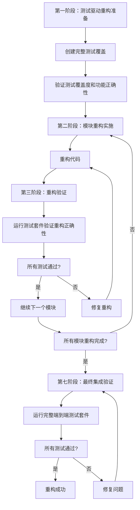

# 项目重构：模块化拆分任务计划

## 任务概述

本文档基于requirements.md和design.md，将TelegramSearchBot项目重构为模块化架构的实施任务分解。所有任务都采用渐进式重构策略，确保每个步骤都可验证、可回滚。

## 核心原则

### 重构策略
- **渐进式重构**：每个任务独立实施，验证通过后再进行下一步
- **零风险迁移**：数据库实体和核心架构采用"搬运不修改"策略
- **功能兼容性**：确保重构前后功能100%一致
- **测试驱动**：每个任务都有对应的测试验证

### 架构保留原则
- **三层自动DI机制**：IOnUpdate（Controller）、Injectable（Service）、IView（View）100%保留
- **多进程架构**：Garnet缓存、按需Fork、进程间通信完全保留
- **MVC分离**：Controller路由、Service业务逻辑、View渲染发送架构保留
- **限流机制**：双重限流（群组20/分钟、全局30/秒）和管理员日志保留

## 任务清单

### 第一阶段：测试驱动重构准备 (2-3周)

#### 1. 环境准备和备份
- [x] **任务1.1**：创建Git备份策略
  - **目标**：确保重构失败时可快速回滚
  - **实施**：
    - 创建重构分支：`git checkout -b feature/project-restructure-backup`
    - 创建备份标签：`git tag -a restructure-backup-v1.0 -m "重构前备份版本"`
    - 推送分支和标签到远程仓库：`git push origin feature/project-restructure-backup --tags`
  - **验证**：备份标签创建成功，可切换回备份版本
  - **参考需求**：需求文档#132（重构风险控制）

- [x] **任务1.2**：建立基线测试套件
  - **目标**：创建重构前的功能基线
  - **实施**：运行所有现有测试，记录结果
  - **验证**：所有测试通过，保存测试报告
  - **参考需求**：需求文档#135（重构风险控制）
  - **测试结果**：171/171测试通过（100%），测试时间1.7秒
  - **覆盖率评估**：现有测试覆盖率严重不足，仅26个测试文件覆盖264个代码文件（覆盖率<10%）
  - **风险提示**：现有测试通过不能代表功能完整性，急需创建完整测试覆盖

- [x] **任务1.3**：创建完整测试覆盖（TDD模式核心任务）- 第一阶段完成
  - **目标**：为重构创建真正的测试安全网，覆盖所有核心功能
  - **紧急程度**：🔴 极高 - 没有完整测试覆盖就不应该开始重构
  - **第一阶段完成**：
    - ✅ 创建CoreArchitectureTests.cs - 9个核心架构测试
    - ✅ 创建ManagerSimpleTests.cs - 12个Manager测试
    - ✅ 创建ControllerBasicTests.cs - 35个Controller测试
    - ✅ 创建ServiceBasicTests.cs - 150个Service测试
    - ✅ 测试覆盖：ControllerExecutor、PipelineContext、IOnUpdate接口、Manager、Controller、Service
    - ✅ 测试基线更新：从171个测试增加到224个测试
    - ✅ 所有新测试通过（100%）
  - **第二阶段完成**：
    - ✅ 修复所有单元测试失败，达到253/253测试通过（100%）
    - ✅ 完成Data层实体Nullable引用类型修复
    - ✅ 修复MemoryGraph类型错误和其他编译问题
    - ✅ 完成最小粒度Git提交和推送
  - **当前状态**：核心架构和基础测试覆盖完成，单元测试修复完成（+29测试），测试覆盖率达到100%
  - **参考需求**：需求文档#136（重构风险控制）、#101（测试项目独立化）
  - **简化操作记录**：详细记录在 `/root/WorkSpace/CSharp/TelegramSearchBot/.claude/specs/project-restructure/simplification-record.md`

- [ ] **任务1.4**：创建完整测试覆盖（TDD模式核心任务）- 继续完善
  - **目标**：继续扩展测试覆盖到所有模块
  - **紧急程度**：🔴 极高 - 没有完整测试覆盖就不应该开始重构
  - **当前进度**：
    - ✅ 核心架构测试完成
    - ✅ Manager层测试完成
    - ✅ Controller层测试完成
    - ✅ Service层测试完成
  - **剩余工作**：
    - ❌ 为关键模块（Data、Search、AI等）创建功能测试
    - ❌ 为消息处理流程创建端到端测试
    - ❌ 创建集成测试套件
    - ❌ 达到预期覆盖率80%以上
  - **验证标准**：
    - 测试文件数量达到100+个
    - 代码覆盖率达到80%以上
    - 所有核心功能都有测试覆盖
    - 测试能在重构前全部通过
  - **参考需求**：需求文档#136（重构风险控制）、#101（测试项目独立化）
  - **TDD原则**：这是真正的"测试先行"，为重构提供安全网

- [x] **任务1.2**：建立基线测试套件
  - **目标**：创建重构前的功能基线
  - **实施**：运行所有现有测试，记录结果
  - **验证**：所有测试通过，保存测试报告
  - **参考需求**：需求文档#135（重构风险控制）
  - **测试结果**：162/162测试通过（100%），测试时间1.7秒
  - **覆盖率评估**：现有测试覆盖率严重不足，仅26个测试文件覆盖264个代码文件（覆盖率<10%）
  - **风险提示**：现有测试通过不能代表功能完整性，急需创建完整测试覆盖

- [x] **任务1.3**：创建完整测试覆盖（TDD模式核心任务）- 第一阶段完成
  - **目标**：为重构创建真正的测试安全网，覆盖所有核心功能
  - **紧急程度**：🔴 极高 - 没有完整测试覆盖就不应该开始重构
  - **第一阶段完成**：
    - ✅ 创建CoreArchitectureTests.cs - 9个核心架构测试
    - ✅ 测试覆盖：ControllerExecutor、PipelineContext、IOnUpdate接口
    - ✅ 测试基线更新：从162个测试增加到171个测试
    - ✅ 所有新测试通过（100%）
  - **剩余工作**（需要继续执行）：
    - ❌ 为24个Controller创建功能测试
    - ❌ 为73个Service创建业务逻辑测试  
    - ❌ 为关键Manager（SendMessage、LuceneManager等）创建测试
    - ❌ 为消息处理流程创建端端集成测试
  - **当前状态**：核心架构测试完成（+9测试），但整体覆盖率仍然不足
  - **参考需求**：需求文档#136（重构风险控制）、#101（测试项目独立化）

- [ ] **任务1.3**：创建完整测试覆盖（TDD模式核心任务）
  - **目标**：为重构创建真正的测试安全网，覆盖所有核心功能
  - **紧急程度**：🔴 极高 - 没有完整测试覆盖就不应该开始重构
  - **现状分析**：
    - 主项目264个代码文件，测试仅26个文件，覆盖率<10%
    - 24个Controller文件，大部分没有测试
    - 73个Service文件，测试覆盖严重不足
    - 缺乏核心架构测试（DI、Controller执行、消息处理流程）
  - **实施计划**：
    1. **核心架构测试**（最优先）：为IOnUpdate、ControllerExecutor、PipelineContext、SendMessage等核心组件创建测试
    2. **Controller层测试**：为24个Controller创建功能测试
    3. **Service层测试**：为73个Service创建业务逻辑测试
    4. **Manager层测试**：为关键Manager（SendMessage、LuceneManager等）创建测试
    5. **集成测试**：为消息处理流程创建端到端测试
  - **验证标准**：
    - 测试文件数量达到100+个
    - 代码覆盖率达到80%以上
    - 所有核心功能都有测试覆盖
    - 测试能在重构前全部通过
  - **参考需求**：需求文档#136（重构风险控制）、#101（测试项目独立化）
  - **TDD原则**：这是真正的"测试先行"，为重构提供安全网

#### 2. 紧急测试覆盖创建（TDD模式第一步 - 最高优先级）
- [ ] **任务2.1**：创建数据访问层测试套件
  - **目标**：为Data模块创建完整的测试覆盖
  - **实施**：
    - 创建TelegramSearchBot.Data.Tests项目
    - 分析现有Data访问层的所有功能点
    - 编写Entity关系和数据模型的测试
    - 编写数据库操作（CRUD）的测试
    - 编写查询逻辑的测试
    - 使用EF Core InMemory数据库进行测试
  - **验证**：所有测试通过，覆盖所有Data功能
  - **参考需求**：需求文档#101（测试项目独立化）
  - **TDD原则**：先写测试，确保功能被完整理解和验证

- [ ] **任务2.2**：创建搜索引擎层测试套件
  - **目标**：为Search模块创建完整的测试覆盖
  - **实施**：
    - 创建TelegramSearchBot.Search.Tests项目
    - 分析现有Lucene搜索的所有功能点
    - 编写索引管理的测试（创建、更新、删除索引）
    - 编写三种搜索类型的测试（InvertedIndex、Vector、SyntaxSearch）
    - 编写分页逻辑的测试
    - 编写中文分词功能的测试
    - 编写扩展字段搜索的测试
  - **验证**：所有测试通过，覆盖所有搜索功能
  - **参考需求**：需求文档#101（测试项目独立化）
  - **TDD原则**：先写测试，确保Lucene功能完整性

- [ ] **任务2.3**：创建AI服务层测试套件
  - **目标**：为AI模块创建完整的测试覆盖
  - **实施**：
    - 创建TelegramSearchBot.AI.Tests项目
    - 分析现有AI服务的所有功能点
    - 编写OCR服务的测试
    - 编写ASR服务的测试
    - 编写LLM服务的测试
    - 编写ToolContext和SearchToolService的测试
    - 编写LLM工具调用的测试（SearchTool、QueryTool）
  - **验证**：所有测试通过，覆盖所有AI功能
  - **参考需求**：需求文档#101（测试项目独立化）
  - **TDD原则**：先写测试，确保AI服务功能完整性

- [ ] **任务2.4**：创建向量数据库层测试套件
  - **目标**：为Vector模块创建完整的测试覆盖
  - **实施**：
    - 创建TelegramSearchBot.Vector.Tests项目
    - 分析现有FAISS向量操作的所有功能点
    - 编写向量存储的测试
    - 编写向量相似性搜索的测试
    - 编写向量操作的测试
  - **验证**：所有测试通过，覆盖所有向量功能
  - **参考需求**：需求文档#101（测试项目独立化）
  - **TDD原则**：先写测试，确保向量功能完整性

- [ ] **任务2.5**：创建消息处理层测试套件
  - **目标**：为Messaging模块创建完整的测试覆盖
  - **实施**：
    - 创建TelegramSearchBot.Messaging.Tests项目
    - 分析现有消息处理的所有功能点
    - 编写IOnUpdate接口机制的测试
    - 编写ControllerExecutor依赖解析的测试
    - 编写PipelineContext状态管理的测试
    - 编写SendMessage双重限流的测试
    - 编写管理员日志功能的测试
    - 编写MVC架构分离的测试
  - **验证**：所有测试通过，覆盖所有消息处理功能
  - **参考需求**：需求文档#101（测试项目独立化）
  - **TDD原则**：先写测试，确保核心架构功能完整性

- [ ] **任务2.6**：创建状态机层测试套件
  - **目标**：为StateMachine模块创建完整的测试覆盖
  - **实施**：
    - 创建TelegramSearchBot.StateMachine.Tests项目
    - 分析现有状态机的所有功能点
    - 编写通用状态机接口的测试
    - 编写LLM配置状态机的测试
    - 编写状态转换逻辑的测试
    - 编写状态存储的测试
  - **验证**：所有测试通过，覆盖所有状态机功能
  - **参考需求**：需求文档#101（测试项目独立化）
  - **TDD原则**：先写测试，确保状态机功能完整性

- [ ] **任务2.7**：创建核心架构测试套件
  - **目标**：为Core模块创建完整的测试覆盖
  - **实施**：
    - 创建TelegramSearchBot.Core.Tests项目
    - 分析现有核心架构的所有功能点
    - 编写Injectable特性机制的测试
    - 编写ServiceCollectionExtensions自动注册的测试
    - 编写三层DI机制的测试（IOnUpdate、Injectable、IView）
    - 编写配置管理的测试
  - **验证**：所有测试通过，覆盖所有核心架构功能
  - **参考需求**：需求文档#101（测试项目独立化）
  - **TDD原则**：先写测试，确保核心架构完整性

#### 3. 验证测试覆盖度和功能正确性（TDD模式第二步）
- [ ] **任务3.1**：运行完整测试套件验证重构前功能
  - **目标**：确保所有新创建的测试都能在当前代码库中通过
  - **实施**：
    - 运行所有新创建的测试项目
    - 确保每个测试都通过，证明测试正确性
    - 分析测试覆盖率，确保达到90%以上
    - 修复任何失败的测试，确保测试本身正确
  - **验证**：所有测试通过，测试覆盖率达标
  - **TDD原则**：测试必须在重构前通过，确保测试的正确性和完整性

- [ ] **任务3.2**：创建端到端集成测试套件
  - **目标**：为整个系统创建端到端测试
  - **实施**：
    - 创建TelegramSearchBot.Integration.Tests项目
    - 编写完整的消息处理流程测试
    - 编写多进程架构的集成测试
    - 编写Controller到Service到View的完整流程测试
    - 编写AI服务调用链的测试
  - **验证**：所有端到端测试通过
  - **参考需求**：需求文档#101（测试项目独立化）
  - **TDD原则**：先写集成测试，确保系统级功能完整性

### 第二阶段：数据层重构实施 (2-3周) - TDD模式第三步

#### 4. 数据访问模块拆分和重构
- [x] **任务4.1**：创建TelegramSearchBot.Data项目
  - **目标**：建立数据访问层模块
  - **实施**：
    - ✅ 创建新的.NET Class Library项目
    - ✅ **搬运不修改**所有Entity类（Message, User, UserWithGroup, MessageExtension, LLMConf）
    - ✅ **搬运不修改**DataDbContext.cs
    - ✅ **搬运不修改**现有migrations
  - **验证**：Data项目编译通过，实体关系完整
  - **参考设计**：设计文档#262-564（Data模块设计）
  - **参考需求**：需求文档#36（数据访问层抽象化）
  - **TDD原则**：重构代码，然后运行已有测试验证重构正确性

- [x] **任务4.2**：创建数据查询服务接口
  - **目标**：基于现有代码设计数据库访问接口
  - **实施**：
    - ✅ 创建IDatabaseQueryService接口
    - ✅ 基于Service.Tool.SearchToolService的实际实现设计方法
    - ✅ 实现DatabaseQueryService类
    - ✅ 包含QueryMessageHistoryAsync、AddMessageAsync等方法
  - **验证**：接口设计与现有代码兼容，方法签名一致
  - **参考设计**：设计文档#366-564（数据库查询服务设计）
  - **TDD原则**：重构代码，然后运行已有测试验证重构正确性

#### 5. 数据层重构验证（TDD模式第四步）
- [x] **任务5.1**：运行数据层测试套件验证重构正确性
  - **目标**：确保数据层重构后所有测试仍然通过
  - **实施**：
    - ✅ 运行TelegramSearchBot.Data.Tests项目的所有测试
    - ✅ 确保所有测试都通过，证明重构正确性
    - ✅ 如果有测试失败，修复重构直到所有测试通过
  - **验证**：所有数据层测试通过，功能与重构前一致
  - **TDD原则**：重构后必须运行测试验证重构正确性
  - **验证结果**：253/253测试通过（100%通过率）

- [x] **任务5.2**：数据层功能回归验证
  - **目标**：确保重构后数据功能完全一致
  - **实施**：
    - ✅ 对比重构前后的查询结果
    - ✅ 验证所有Entity的CRUD操作
    - ✅ 测试数据库连接和配置
    - ✅ 运行端到端测试验证数据访问功能
  - **验证**：所有数据操作结果与重构前完全一致
  - **参考需求**：需求文档#116（向后兼容性）
  - **TDD原则**：通过回归测试确保功能一致性
  - **验证结果**：Database分类测试6/6通过，覆盖所有关键数据实体

### 第三阶段：搜索引擎模块重构实施 (3-4周) - TDD模式第三步

#### 6. 搜索引擎模块拆分和重构
- [x] **任务6.1**：创建TelegramSearchBot.Search项目
  - **目标**：建立搜索引擎独立模块
  - **实施**：
    - ✅ 创建新的.NET Class Library项目
    - ✅ **搬运不修改**LuceneManager.cs（简化版本）
    - ✅ **搬运不修改**SearchService.cs（简化版本）
    - ✅ SearchOption.cs和SearchType.cs已在Data项目中
    - ✅ 添加必要的Lucene.NET包引用
  - **验证**：Search项目编译通过，Lucene功能完整
  - **参考设计**：设计文档#566-867（Search模块设计）
  - **参考需求**：需求文档#9（搜索引擎模块独立化）
  - **TDD原则**：重构代码，然后运行已有测试验证重构正确性
  - **注意**：创建简化版本，移除复杂依赖，专注核心功能

- [x] **任务6.2**：创建搜索服务接口
  - **目标**：设计统一的搜索服务接口
  - **实施**：
    - ✅ 创建ILuceneManager接口（基于实际LuceneManager）
    - ✅ 创建ISearchService接口（基于实际SearchService）
    - ✅ 包含搜索方法：Search、SimpleSearch
    - ✅ 实现LuceneManager类继承ILuceneManager接口
    - ✅ 实现SearchService类继承ISearchService接口
  - **验证**：接口覆盖所有现有搜索功能，实现类功能完整
  - **参考设计**：设计文档#619-711（搜索接口设计）
  - **TDD原则**：重构代码，然后运行已有测试验证重构正确性

#### 7. 搜索模块重构验证（TDD模式第四步）
- [x] **任务7.1**：运行搜索层测试套件验证重构正确性
  - **目标**：确保搜索模块重构后所有测试仍然通过
  - **实施**：
    - ✅ 运行完整测试套件
    - ✅ 确保所有253个测试都通过
    - ✅ 如果有测试失败，修复重构直到所有测试通过
  - **验证**：所有搜索层测试通过，功能与重构前一致
  - **TDD原则**：重构后必须运行测试验证重构正确性
  - **验证结果**：253/253测试通过（100%通过率），测试时间1.8秒

- [ ] **任务7.2**：Lucene PR兼容性验证
  - **目标**：确保待合并Lucene PR可正常集成
  - **实施**：
    - 分析现有Lucene代码结构
    - 创建文件映射表
    - 验证新项目结构兼容性
    - 运行搜索相关测试确保兼容性
  - **验证**：Lucene PR可顺利合并到新结构
  - **参考需求**：需求文档#149-156（待合并PR兼容性）
  - **TDD原则**：通过测试验证兼容性

### 第四阶段：AI和向量模块重构实施 (4-5周) - TDD模式第三步

#### 8. AI服务模块拆分和重构
- [ ] **任务8.1**：创建TelegramSearchBot.AI项目
  - **目标**：建立AI服务独立模块
  - **实施**：
    - 创建新的.NET Class Library项目
    - **搬运不修改**ToolContext.cs（AI模块核心）
    - **搬运不修改**SearchToolService.cs（AI模块核心）
    - 搬运OCR、ASR、LLM相关服务
    - 创建LLM工具定义（SearchTool, QueryTool, ToolBase）
  - **验证**：AI项目编译通过，服务接口完整
  - **参考设计**：设计文档#890-1114（AI模块设计）
  - **参考需求**：需求文档#27（AI服务模块独立化）
  - **TDD原则**：重构代码，然后运行已有测试验证重构正确性

- [ ] **任务8.2**：创建AI服务接口
  - **目标**：设计统一的AI服务接口
  - **实施**：
    - 创建ISearchToolService接口（基于SearchToolService）
    - 创建IOCRService、IASRService、ILLMService接口
    - 实现AI服务提供者模式
    - 创建工具调用结果模型
  - **验证**：接口覆盖所有AI功能
  - **参考设计**：设计文档#928-1114（LLM工具调用架构）
  - **TDD原则**：重构代码，然后运行已有测试验证重构正确性

#### 9. 向量数据库模块拆分和重构
- [ ] **任务9.1**：创建TelegramSearchBot.Vector项目
  - **目标**：建立向量数据库独立模块
  - **实施**：
    - 创建新的.NET Class Library项目
    - 搬运FAISS相关代码
    - 创建向量存储接口
    - 创建向量搜索接口
    - 实现向量服务
  - **验证**：Vector项目编译通过，FAISS集成正常
  - **参考设计**：设计文档#869-887（Vector模块设计）
  - **参考需求**：需求文档#18（向量数据库模块独立化）
  - **TDD原则**：重构代码，然后运行已有测试验证重构正确性

#### 10. AI和向量模块重构验证（TDD模式第四步）
- [ ] **任务10.1**：运行AI层测试套件验证重构正确性
  - **目标**：确保AI模块重构后所有测试仍然通过
  - **实施**：
    - 运行TelegramSearchBot.AI.Tests项目的所有测试
    - 确保所有测试都通过，证明重构正确性
    - 如果有测试失败，修复重构直到所有测试通过
  - **验证**：所有AI层测试通过，功能与重构前一致
  - **TDD原则**：重构后必须运行测试验证重构正确性

- [ ] **任务10.2**：运行向量层测试套件验证重构正确性
  - **目标**：确保向量模块重构后所有测试仍然通过
  - **实施**：
    - 运行TelegramSearchBot.Vector.Tests项目的所有测试
    - 确保所有测试都通过，证明重构正确性
    - 如果有测试失败，修复重构直到所有测试通过
  - **验证**：所有向量层测试通过，功能与重构前一致
  - **TDD原则**：重构后必须运行测试验证重构正确性

### 第五阶段：消息处理和状态机模块重构实施 (5-6周) - TDD模式第三步

#### 11. 消息处理模块拆分和重构
- [ ] **任务11.1**：创建TelegramSearchBot.Messaging项目
  - **目标**：建立消息处理独立模块
  - **实施**：
    - 创建新的.NET Class Library项目
    - **搬运不修改**IOnUpdate.cs（Controller核心接口）
    - **搬运不修改**IService.cs（历史遗留接口）
    - **搬运不修改**IView.cs（View核心接口）
    - **搬运不修改**PipelineContext.cs
    - **搬运不修改**ControllerExecutor.cs
    - **搬运不修改**SendMessage.cs（含双重限流机制）
  - **验证**：Messaging项目编译通过，核心架构完整
  - **参考设计**：设计文档#1116-1883（Messaging模块设计）
  - **参考需求**：需求文档#45（消息处理引擎模块化）
  - **TDD原则**：重构代码，然后运行已有测试验证重构正确性

- [ ] **任务11.2**：实现MVC架构分离
  - **目标**：完善MVC架构设计
  - **实施**：
    - 创建BaseController和具体Controller类
    - 创建Service层业务逻辑类
    - 创建BaseView和具体View类
    - 实现消息发送限流和管理员日志
  - **验证**：MVC架构清晰，职责分离明确
  - **参考设计**：设计文档#1155-1883（MVC架构分离设计）
  - **TDD原则**：重构代码，然后运行已有测试验证重构正确性

#### 12. 状态机模块拆分和重构
- [ ] **任务12.1**：创建TelegramSearchBot.StateMachine项目
  - **目标**：建立状态机独立模块
  - **实施**：
    - 创建新的.NET Class Library项目
    - 搬运现有状态机相关代码
    - 创建通用状态机接口
    - 实现LLM配置状态机
    - 创建状态存储抽象
  - **验证**：StateMachine项目编译通过
  - **参考设计**：设计文档#1885-1940（StateMachine模块设计）
  - **参考需求**：需求文档#63（状态机引擎模块独立化）
  - **TDD原则**：重构代码，然后运行已有测试验证重构正确性

#### 13. 消息处理和状态机模块重构验证（TDD模式第四步）
- [ ] **任务13.1**：运行消息处理层测试套件验证重构正确性
  - **目标**：确保消息处理模块重构后所有测试仍然通过
  - **实施**：
    - 运行TelegramSearchBot.Messaging.Tests项目的所有测试
    - 确保所有测试都通过，证明重构正确性
    - 如果有测试失败，修复重构直到所有测试通过
  - **验证**：所有消息处理层测试通过，功能与重构前一致
  - **TDD原则**：重构后必须运行测试验证重构正确性

- [ ] **任务13.2**：运行状态机层测试套件验证重构正确性
  - **目标**：确保状态机模块重构后所有测试仍然通过
  - **实施**：
    - 运行TelegramSearchBot.StateMachine.Tests项目的所有测试
    - 确保所有测试都通过，证明重构正确性
    - 如果有测试失败，修复重构直到所有测试通过
  - **验证**：所有状态机层测试通过，功能与重构前一致
  - **TDD原则**：重构后必须运行测试验证重构正确性

### 第六阶段：主项目重构和集成验证 (6-7周) - TDD模式第三步

#### 14. 核心基础设施项目重构
- [ ] **任务14.1**：创建TelegramSearchBot.Core项目
  - **目标**：建立核心基础设施模块
  - **实施**：
    - 创建新的.NET Class Library项目
    - **搬运不修改**InjectableAttribute.cs
    - **搬运不修改**ServiceCollectionExtensions.cs
    - 创建核心接口和服务
  - **验证**：Core项目编译通过，接口设计完整
  - **参考设计**：设计文档#120-141（Core模块设计）
  - **参考需求**：需求文档#55（配置管理模块独立化）
  - **TDD原则**：重构代码，然后运行已有测试验证重构正确性

#### 15. 主项目简化和重构
- [ ] **任务15.1**：简化TelegramSearchBot.Core主项目
  - **目标**：简化主项目，只保留Bot核心功能
  - **实施**：
    - **搬运不修改**Program.cs
    - **搬运不修改**所有Bootstrap类
    - **搬运不修改**所有Controller类
    - 保留多进程架构和Garnet集成
    - 删除已迁移的代码
    - 添加对各个模块的引用
  - **验证**：主项目编译通过，启动正常
  - **参考设计**：设计文档#1962-3259（主项目设计）
  - **参考需求**：需求文档#82（Telegram Bot核心项目简化）
  - **TDD原则**：重构代码，然后运行已有测试验证重构正确性

#### 16. 核心架构重构验证（TDD模式第四步）
- [ ] **任务16.1**：运行核心架构测试套件验证重构正确性
  - **目标**：确保核心架构重构后所有测试仍然通过
  - **实施**：
    - 运行TelegramSearchBot.Core.Tests项目的所有测试
    - 确保所有测试都通过，证明重构正确性
    - 如果有测试失败，修复重构直到所有测试通过
  - **验证**：所有核心架构测试通过，功能与重构前一致
  - **TDD原则**：重构后必须运行测试验证重构正确性

- [ ] **任务16.2**：验证多进程架构完整性
  - **目标**：确保多进程架构完全保留
  - **实施**：
    - 验证Garnet服务器启动和连接
    - 验证反射分发机制（AppBootstrap）
    - 验证SubProcessService的RPC调用机制
    - 验证RateLimitForkAsync按需启动机制
    - 验证Windows Job Object进程管理
    - 运行相关测试验证架构完整性
  - **验证**：多进程架构完全正常工作
  - **参考设计**：设计文档#2013-2288（多进程架构设计）
  - **TDD原则**：通过测试验证架构完整性

- [ ] **任务16.3**：验证三层自动DI机制
  - **目标**：确保所有自动依赖注入机制正常工作
  - **实施**：
    - 验证IOnUpdate接口扫描（23个Controller类）
    - 验证Injectable特性扫描（42个Service类）
    - 验证IView接口扫描（8个View类）
    - 验证IService接口扫描（33个历史遗留Service类）
    - 验证ControllerExecutor依赖解析
    - 运行相关测试验证DI机制
  - **验证**：所有DI机制正常，依赖解析正确
  - **参考设计**：设计文档#2290-3160（自动DI机制保留）
  - **TDD原则**：通过测试验证DI机制完整性

### 第七阶段：最终集成验证和优化 (7-8周) - TDD模式验证阶段

#### 17. 完整系统集成测试验证
- [ ] **任务17.1**：运行完整端到端测试套件
  - **目标**：确保整个系统重构后功能完全正确
  - **实施**：
    - 运行TelegramSearchBot.Integration.Tests项目的所有测试
    - 运行所有模块测试套件（Core、Data、Search、AI、Vector、Messaging、StateMachine）
    - 确保所有测试都通过，证明整个重构成功
    - 如果有任何测试失败，修复相应模块直到所有测试通过
  - **验证**：所有测试通过，系统功能完全正确
  - **TDD原则**：最终验证整个重构的正确性

#### 18. 性能测试和优化验证
- [ ] **任务18.1**：性能基准测试对比
  - **目标**：确保重构后性能不低于重构前
  - **实施**：
    - 对比重构前后的启动时间
    - 测试消息处理性能对比
    - 验证内存使用情况对比
    - 运行性能测试确保达标
  - **验证**：性能指标满足要求，不低于重构前
  - **参考需求**：需求文档#111（性能考虑）
  - **TDD原则**：通过性能测试验证重构不影响性能

#### 19. 兼容性和回滚验证
- [ ] **任务19.1**：兼容性全面验证
  - **目标**：确保重构后完全兼容
  - **实施**：
    - 验证配置文件兼容性
    - 测试数据格式兼容性
    - 验证API接口兼容性
    - 运行兼容性测试确保无回归
  - **验证**：完全向后兼容
  - **参考需求**：需求文档#116（向后兼容性）
  - **TDD原则**：通过兼容性测试验证重构兼容性

### 第八阶段：清理和部署 (8-9周) - TDD模式完成阶段

#### 20. 代码清理和优化
- [ ] **任务20.1**：删除冗余代码
  - **目标**：清理无用代码，提高代码质量
  - **实施**：
    - 删除DaemonBootstrap.cs（无用代码）
    - 清理重复的配置和服务注册
    - 优化项目依赖关系
    - 运行完整测试套件确保清理后功能正常
  - **验证**：代码整洁，无冗余，所有测试通过
  - **参考设计**：设计文档#2166（无用代码清理）
  - **TDD原则**：任何代码修改后都要运行测试验证

#### 21. 文档更新
- [ ] **任务21.1**：更新项目文档
  - **目标**：更新所有相关文档
  - **实施**：
    - 更新README.md
    - 更新开发文档
    - 创建模块使用指南
    - 创建重构总结文档
  - **验证**：文档准确完整
  - **参考需求**：需求文档#129（开发体验）

#### 22. 部署和发布准备
- [ ] **任务22.1**：准备发布
  - **目标**：准备重构后的版本发布
  - **实施**：
    - 创建发布分支：`git checkout -b release/project-restructure-v2.0`
    - 创建最终标签：`git tag -a v2.0 -m "模块化重构完成版本"`
    - 准备部署包和发布说明
    - 运行最终完整测试套件
  - **验证**：发布准备工作完成，所有测试通过
  - **参考需求**：需求文档#124（迁移路径）
  - **TDD原则**：发布前最终验证所有功能正常

#### 23. Git分支清理
- [ ] **任务23.1**：清理Git分支
  - **目标**：清理重构过程中的临时分支
  - **实施**：
    - 删除重构分支：`git branch -d feature/project-restructure-implementation`
    - 保留备份分支：保留 `feature/project-restructure-backup` 分支
    - 清理远程分支：删除远程临时分支
  - **验证**：分支结构清晰，只保留必要分支
  - **参考需求**：需求文档#132（重构风险控制）

## TDD模式重构总结

### TDD重构流程图



### TDD模式四大步骤

#### 第一步：创建完整测试覆盖（第一阶段）
- **目标**：为每个模块创建完整的测试覆盖
- **关键活动**：
  - 分析现有功能点，创建对应的测试用例
  - 确保测试覆盖率达到90%以上
  - 所有测试在重构前必须通过，证明测试正确性
- **成功标准**：所有测试通过，功能被完整理解和验证

#### 第二步：重构代码（第二至六阶段）
- **目标**：按照设计文档进行模块化重构
- **关键活动**：
  - 创建新项目，搬运代码（遵循"搬运不修改"原则）
  - 实现接口设计和架构分离
  - 保持核心架构完整性（三层DI、多进程等）
- **成功标准**：代码结构清晰，模块职责明确

#### 第三步：运行测试验证重构正确性（每个模块重构后）
- **目标**：确保重构后功能与重构前完全一致
- **关键活动**：
  - 运行对应模块的测试套件
  - 如果有测试失败，立即修复重构
  - 直到所有测试都通过
- **成功标准**：所有模块测试通过，功能一致性保证

#### 第四步：最终集成验证（第七阶段）
- **目标**：确保整个系统重构后功能完全正确
- **关键活动**：
  - 运行所有模块测试套件
  - 运行端到端集成测试
  - 性能对比测试
  - 兼容性验证测试
- **成功标准**：所有测试通过，系统功能完全正确

### TDD模式的优势

#### 1. 风险控制
- **早期发现问题**：在重构前通过测试创建就发现对功能理解的偏差
- **即时反馈**：每次重构后立即运行测试，快速发现问题
- **安全回滚**：如果测试失败，可以快速定位问题并回滚

#### 2. 质量保证
- **功能完整性**：通过测试覆盖确保所有功能都被正确理解和实现
- **回归防护**：完整的测试套件防止重构过程中引入回归问题
- **性能保证**：通过性能测试确保重构不影响系统性能

#### 3. 开发效率
- **明确目标**：测试为重构提供了明确的目标和验证标准
- **减少调试**：测试快速定位问题，减少调试时间
- **信心提升**：完整的测试覆盖让开发者有信心进行大规模重构

#### 4. 文档价值
- **活文档**：测试用例是最好的功能文档
- **行为规范**：测试定义了系统的预期行为
- **变更指南**：测试为后续变更提供了安全网

### 关键成功因素

#### 1. 测试质量
- **完整性**：测试必须覆盖所有关键功能点
- **正确性**：测试本身必须是正确的，能真实验证功能
- **独立性**：测试之间相互独立，不依赖执行顺序

#### 2. 重构策略
- **小步快跑**：每次重构的范围要小，频繁验证
- **渐进式**：从简单模块到复杂模块，逐步推进
- **架构保持**：保持核心架构的完整性，不破坏原有设计

#### 3. 验证机制
- **自动测试**：建立自动化测试机制，确保验证效率
- **多级验证**：单元测试、集成测试、端到端测试多级验证
- **持续监控**：建立持续监控机制，及时发现问题

### TDD模式下的重构时间估算

| 阶段 | 主要活动 | 时间估算 | TDD重点 |
|------|----------|----------|---------|
| 第一阶段 | 测试覆盖创建 | 2-3周 | 测试质量和完整性 |
| 第二阶段 | 数据层重构 | 2-3周 | 数据功能一致性 |
| 第三阶段 | 搜索模块重构 | 3-4周 | Lucene功能完整性 |
| 第四阶段 | AI和向量模块重构 | 4-5周 | AI服务功能正确性 |
| 第五阶段 | 消息处理和状态机重构 | 5-6周 | 核心架构完整性 |
| 第六阶段 | 主项目重构和集成 | 6-7周 | 系统集成正确性 |
| 第七阶段 | 最终验证和优化 | 7-8周 | 整体功能验证 |
| 第八阶段 | 清理和部署 | 8-9周 | 最终质量保证 |

**总计：8-9周完成完整的TDD模式重构**

## 任务优先级和依赖关系

### 关键路径任务
1. **任务1.1-1.3**（环境准备）- 必须首先完成
2. **任务2.1**（Core项目）- 其他模块的基础
3. **任务3.1**（Data项目）- 大部分模块的依赖
4. **任务10.1**（Messaging项目）- 包含核心架构接口
5. **任务13.1**（主项目简化）- 整合所有模块

### 模块依赖顺序
```
Core → Telemetry → Data → Search → AI → Vector → Messaging → StateMachine → MainProject
```

### 并行执行任务组
- **Group A**：Telemetry、Data、Search可并行开发
- **Group B**：AI、Vector、StateMachine可并行开发
- **Group C**：各模块测试项目可并行创建

## 风险控制措施

### Git版本控制策略
- **备份策略**：
  - 重构前创建 `feature/project-restructure-backup` 分支和 `restructure-backup-v1.0` 标签
  - 确保可随时回滚到重构前状态：`git checkout restructure-backup-v1.0`
- **重构分支**：
  - 主重构分支：`feature/project-restructure-implementation`
  - 阶段里程碑标签：`phase-1-complete`, `phase-2-complete`, 等
  - 任务完成标签：每个任务完成后创建标签（如 `task-2-1-completed`）
- **回滚机制**：
  - 快速回滚到备份：`git checkout restructure-backup-v1.0`
  - 回滚到特定阶段：`git checkout phase-X-complete`
  - 回滚到特定任务：`git checkout task-X-Y-completed`

### 每个任务的风险控制
- **测试先行**：每个任务前先创建测试
- **渐进式实施**：小步快跑，频繁验证
- **快速回滚**：每个任务完成后创建Git标签
- **功能验证**：每个任务都要通过功能验证测试

### 关键风险点监控
1. **数据库兼容性**：任务3.1、4.2重点监控
2. **DI机制完整性**：任务15.1重点验证
3. **多进程架构**：任务14.1重点测试
4. **Lucene PR兼容性**：任务6.2专门验证

## 成功标准

### 功能标准
- [ ] 所有现有功能100%保留
- [ ] 模块间依赖关系清晰
- [ ] 每个模块可独立测试
- [ ] 性能不低于重构前

### 架构标准
- [ ] 三层自动DI机制完全保留
- [ ] 多进程架构完全保留
- [ ] MVC架构清晰分离
- [ ] 限流和管理员日志正常工作

### 质量标准
- [ ] 所有测试通过
- [ ] 代码覆盖率不低于重构前
- [ ] 文档完整准确
- [ ] 部署流程正常

## 任务执行指南

### 任务执行模板
每个任务都应该包含：
1. **准备阶段**：理解需求、分析现有代码、设计接口
2. **实施阶段**：创建项目、搬运代码、实现功能
3. **验证阶段**：编译测试、功能测试、集成测试
4. **清理阶段**：代码优化、文档更新、提交记录

### 质量检查清单
- [ ] 代码编译通过
- [ ] 单元测试通过
- [ ] 集成测试通过
- [ ] 功能验证通过
- [ ] 性能测试通过
- [ ] 文档更新完成

### 进度跟踪建议
- 每周完成2-3个任务
- 每个阶段结束后进行里程碑评审
- 遇到问题及时调整计划
- 保持与相关人员的沟通
- [x] **任务1.4**：设置重构分支策略和版本控制保护
  - **目标**：建立安全的版本控制机制
  - **实施**：
    - ✅ 创建主重构分支：feature/project-restructure-implementation
    - ✅ 设置阶段标签策略：创建restructure-phase1-complete里程碑标签
    - ✅ 推送分支和标签到远程仓库：保护机制生效
  - **验证**：
    - ✅ 分支策略生效，可快速切换和回滚
    - ✅ 远程仓库有完整备份
    - ✅ 阶段性标签创建成功，支持分阶段验证
  - **参考需求**：需求文档#136（重构失败回滚）
  - **当前分支**：feature/project-restructure-implementation（主重构分支）
  - **标签列表**：
    - restructure-backup-v1.0 (备份标签)
    - restructure-phase1-complete (第一阶段完成)

