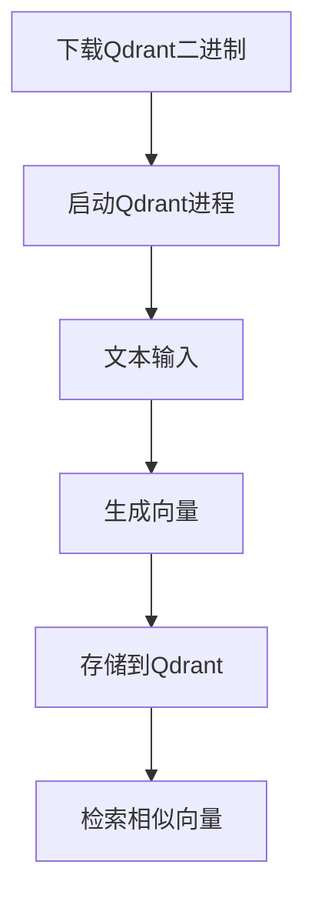
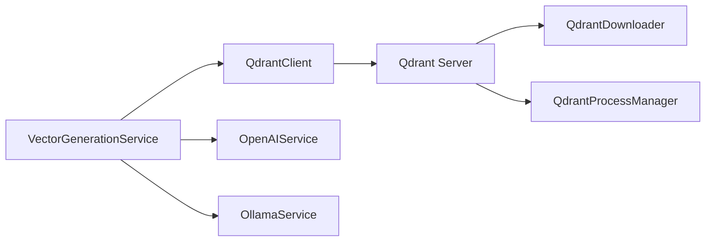

# Qdrant 集成计划

## 架构决策记录(ADR)

### 决策背景
- 需要高效存储和检索文本向量
- 现有OpenAI/Ollama生成的向量需要持久化存储
- 需要支持相似性搜索功能

### 决策内容
- 选择Qdrant作为向量数据库
- 使用Qdrant.Client.Grpc进行集成
- 通过VectorGenerationService封装向量操作
- 实现自动下载和管理Qdrant二进制进程

### 替代方案考虑
1. Milvus
   - 优点：功能丰富
   - 缺点：部署复杂
2. Pinecone
   - 优点：托管服务
   - 缺点：成本高
3. FAISS
   - 优点：本地运行
   - 缺点：无持久化

### 决策影响
- 需要维护Qdrant服务
- 增加系统复杂度
- 提供高效的向量检索能力
- 实现自动化的Qdrant进程管理

## 集成步骤分解

1. ✅ 实现Qdrant二进制下载服务(QdrantDownloader)
2. ✅ 实现Qdrant进程管理服务(QdrantProcessManager)
3. 初始化Qdrant客户端
4. 创建向量集合(Collection)
5. 实现向量生成服务
6. 实现向量存储接口
7. 实现相似性搜索功能

## 依赖关系图

## 风险评估

| 风险 | 可能性 | 影响 | 缓解措施 |
|------|--------|------|----------|
| Qdrant服务不可用 | 中 | 高 | ✅ 实现进程监控和自动重启 |
| 向量生成性能问题 | 高 | 中 | 优化批处理，添加缓存 |
| 数据一致性风险 | 低 | 高 | 实现数据校验机制 |
| 存储容量不足 | 中 | 高 | 监控存储使用，定期清理 |
| 二进制下载失败 | 中 | 高 | ✅ 实现SHA256校验和重试机制 |
| 进程管理异常 | 中 | 高 | ✅ 实现进程状态监控和日志记录 |