# TelegramSearchBot AI相关Controller依赖分析

---

## 说明

本文件系统梳理了TelegramSearchBot项目中AI相关Controller（ASR/OCR/LLM/QR）的依赖关系，便于后续架构拆分、重构与维护。内容包括依赖结构化描述、Mermaid依赖图、关键代码片段及文件定位。

---

## 依赖关系总览

```mermaid
graph TD
  AutoASRController --> IAutoASRService
  AutoASRController --> MessageService
  AutoASRController --> MessageExtensionService
  AutoASRController --> ISendMessageService
  AutoASRController --> DownloadAudioController
  AutoASRController --> DownloadVideoController
  AutoASRController --> MessageController

  AltPhotoController --> IGeneralLLMService
  AltPhotoController --> MessageService
  AltPhotoController --> ITelegramBotClient
  AltPhotoController --> SendMessage
  AltPhotoController --> ISendMessageService
  AltPhotoController --> MessageExtensionService
  AltPhotoController --> DownloadPhotoController
  AltPhotoController --> MessageController

  GeneralLLMController --> OpenAIService
  GeneralLLMController --> ITelegramBotClient
  GeneralLLMController --> MessageService
  GeneralLLMController --> AdminService
  GeneralLLMController --> ISendMessageService
  GeneralLLMController --> IGeneralLLMService

  AutoOCRController --> IPaddleOCRService
  AutoOCRController --> MessageService
  AutoOCRController --> ITelegramBotClient
  AutoOCRController --> SendMessage
  AutoOCRController --> ISendMessageService
  AutoOCRController --> MessageExtensionService
  AutoOCRController --> DownloadPhotoController
  AutoOCRController --> MessageController

  AutoQRController --> AutoQRService
  AutoQRController --> MessageService
  AutoQRController --> IMediator
  AutoQRController --> ISendMessageService
  AutoQRController --> MessageExtensionService
  AutoQRController --> DownloadPhotoController
  AutoQRController --> MessageController
```



---

## 详细依赖列表

### 1. AutoASRController [`TelegramSearchBot/Controller/AI/ASR/AutoASRController.cs`](TelegramSearchBot/Controller/AI/ASR/AutoASRController.cs:21)

#### 依赖项

| 依赖类型 | 名称 | 说明/原因 | 关键代码片段 | 文件定位 |
|---|---|---|---|---|
| Service接口 | IAutoASRService | 调用ASR主流程 | `private readonly IAutoASRService autoASRService;` | 23 |
| Service | MessageService | 消息数据存储 | `private readonly MessageService messageService;` | 24 |
| Service | MessageExtensionService | 消息扩展属性存储 | `private readonly MessageExtensionService MessageExtensionService;` | 26 |
| Service接口 | ISendMessageService | 发送消息/文档 | `public ISendMessageService SendMessageService { get; set; }` | 29 |
| Controller | DownloadAudioController/DownloadVideoController | 依赖音视频下载 | `public List<Type> Dependencies => new List<Type>() { typeof(DownloadAudioController), typeof(DownloadVideoController), typeof(MessageController) };` | 28 |
| Controller | MessageController | 依赖消息存储 | 同上 | 28 |

#### 关键依赖代码片段

```csharp
public AutoASRController(
    IAutoASRService autoASRService,
    MessageService messageService,
    ILogger<AutoASRController> logger,
    ISendMessageService SendMessageService,
    MessageExtensionService messageExtensionService
)
{
    this.autoASRService = autoASRService;
    this.messageService = messageService;
    this.logger = logger;
    this.SendMessageService = SendMessageService;
    MessageExtensionService = messageExtensionService;
}
```
[`TelegramSearchBot/Controller/AI/ASR/AutoASRController.cs:30-43`](TelegramSearchBot/Controller/AI/ASR/AutoASRController.cs:30)

---

### 2. AltPhotoController [`TelegramSearchBot/Controller/AI/LLM/AltPhotoController.cs`](TelegramSearchBot/Controller/AI/LLM/AltPhotoController.cs:24)

#### 依赖项

| 依赖类型 | 名称 | 说明/原因 | 关键代码片段 | 文件定位 |
|---|---|---|---|---|
| Service接口 | IGeneralLLMService | 图像分析LLM能力 | `private readonly IGeneralLLMService generalLLMService;` | 26 |
| Service | MessageService | 消息数据存储 | `private readonly MessageService messageService;` | 27 |
| Service | ITelegramBotClient | 机器人API | `private readonly ITelegramBotClient botClient;` | 28 |
| Service | SendMessage | 低层消息发送 | `private readonly SendMessage Send;` | 29 |
| Service接口 | ISendMessageService | 发送消息 | `private readonly ISendMessageService SendMessageService;` | 31 |
| Service | MessageExtensionService | 消息扩展属性 | `private readonly MessageExtensionService MessageExtensionService;` | 32 |
| Controller | DownloadPhotoController/MessageController | 依赖图片下载与消息存储 | `public List<Type> Dependencies => new List<Type>() { typeof(DownloadPhotoController), typeof(MessageController) };` | 25 |

#### 关键依赖代码片段

```csharp
public AltPhotoController(
    ITelegramBotClient botClient,
    IGeneralLLMService generalLLMService,
    SendMessage Send,
    MessageService messageService,
    ILogger<AutoOCRController> logger,
    ISendMessageService sendMessageService,
    MessageExtensionService messageExtensionService
)
{
    this.generalLLMService = generalLLMService;
    this.messageService = messageService;
    this.botClient = botClient;
    this.Send = Send;
    this.logger = logger;
    SendMessageService = sendMessageService;
    MessageExtensionService = messageExtensionService;
}
```
[`TelegramSearchBot/Controller/AI/LLM/AltPhotoController.cs:33-49`](TelegramSearchBot/Controller/AI/LLM/AltPhotoController.cs:33)

---

### 3. GeneralLLMController [`TelegramSearchBot/Controller/AI/LLM/GeneralLLMController.cs`](TelegramSearchBot/Controller/AI/LLM/GeneralLLMController.cs:21)

#### 依赖项

| 依赖类型 | 名称 | 说明/原因 | 关键代码片段 | 文件定位 |
|---|---|---|---|---|
| Service | OpenAIService | OpenAI模型调用 | `private readonly OpenAIService service;` | 24 |
| Service | ITelegramBotClient | 机器人API | `public ITelegramBotClient botClient { get; set; }` | 27 |
| Service | MessageService | 消息数据存储 | `public MessageService messageService { get; set; }` | 28 |
| Service | AdminService | 管理员权限校验 | `public AdminService adminService { get; set; }` | 29 |
| Service接口 | ISendMessageService | 发送消息 | `public ISendMessageService SendMessageService { get; set; }` | 30 |
| Service接口 | IGeneralLLMService | LLM通用服务 | `public IGeneralLLMService GeneralLLMService { get; set; }` | 31 |

#### 关键依赖代码片段

```csharp
public GeneralLLMController(
    MessageService messageService,
    ITelegramBotClient botClient,
    OpenAIService openaiService,
    SendMessage Send,
    ILogger<GeneralLLMController> logger,
    AdminService adminService,
    ISendMessageService SendMessageService,
    IGeneralLLMService generalLLMService
)
{
    this.logger = logger;
    this.botClient = botClient;
    service = openaiService;
    this.Send = Send;
    this.messageService = messageService;
    this.adminService = adminService;
    this.SendMessageService = SendMessageService;
    GeneralLLMService = generalLLMService;
}
```
[`TelegramSearchBot/Controller/AI/LLM/GeneralLLMController.cs:32-51`](TelegramSearchBot/Controller/AI/LLM/GeneralLLMController.cs:32)

---

### 4. AutoOCRController [`TelegramSearchBot/Controller/AI/OCR/AutoOCRController.cs`](TelegramSearchBot/Controller/AI/OCR/AutoOCRController.cs:25)

#### 依赖项

| 依赖类型 | 名称 | 说明/原因 | 关键代码片段 | 文件定位 |
|---|---|---|---|---|
| Service接口 | IPaddleOCRService | OCR主流程 | `private readonly IPaddleOCRService paddleOCRService;` | 27 |
| Service | MessageService | 消息数据存储 | `private readonly MessageService messageService;` | 28 |
| Service | ITelegramBotClient | 机器人API | `private readonly ITelegramBotClient botClient;` | 29 |
| Service | SendMessage | 低层消息发送 | `private readonly SendMessage Send;` | 30 |
| Service接口 | ISendMessageService | 发送消息 | `private readonly ISendMessageService SendMessageService;` | 32 |
| Service | MessageExtensionService | 消息扩展属性 | `private readonly MessageExtensionService MessageExtensionService;` | 33 |
| Controller | DownloadPhotoController/MessageController | 依赖图片下载与消息存储 | `public List<Type> Dependencies => new List<Type>() { typeof(DownloadPhotoController), typeof(MessageController) };` | 53 |

#### 关键依赖代码片段

```csharp
public AutoOCRController(
    ITelegramBotClient botClient,
    IPaddleOCRService paddleOCRService,
    SendMessage Send,
    MessageService messageService,
    ILogger<AutoOCRController> logger,
    ISendMessageService sendMessageService,
    MessageExtensionService messageExtensionService
)
{
    this.paddleOCRService = paddleOCRService;
    this.messageService = messageService;
    this.botClient = botClient;
    this.Send = Send;
    this.logger = logger;
    SendMessageService = sendMessageService;
    MessageExtensionService = messageExtensionService;
}
```
[`TelegramSearchBot/Controller/AI/OCR/AutoOCRController.cs:34-51`](TelegramSearchBot/Controller/AI/OCR/AutoOCRController.cs:34)

---

### 5. AutoQRController [`TelegramSearchBot/Controller/AI/QR/AutoQRController.cs`](TelegramSearchBot/Controller/AI/QR/AutoQRController.cs:26)

#### 依赖项

| 依赖类型 | 名称 | 说明/原因 | 关键代码片段 | 文件定位 |
|---|---|---|---|---|
| Service | AutoQRService | QR识别主流程 | `private readonly AutoQRService _autoQRService;` | 28 |
| Service | MessageService | 消息数据存储 | `private readonly MessageService _messageService;` | 29 |
| Service | IMediator | 事件通知 | `private readonly IMediator _mediator;` | 31 |
| Service接口 | ISendMessageService | 发送消息 | `private readonly ISendMessageService _sendMessageService;` | 32 |
| Service | MessageExtensionService | 消息扩展属性 | `private readonly MessageExtensionService MessageExtensionService;` | 33 |
| Controller | DownloadPhotoController/MessageController | 依赖图片下载与消息存储 | `public List<Type> Dependencies => new List<Type>() { typeof(DownloadPhotoController), typeof(MessageController) };` | 35 |

#### 关键依赖代码片段

```csharp
public AutoQRController(
    ILogger<AutoQRController> logger,
    AutoQRService autoQRService,
    MessageService messageService,
    IMediator mediator,
    ISendMessageService sendMessageService,
    MessageExtensionService messageExtensionService
)
{
    _autoQRService = autoQRService;
    _messageService = messageService;
    _logger = logger;
    _mediator = mediator;
    _sendMessageService = sendMessageService;
    MessageExtensionService = messageExtensionService;
}
```
[`TelegramSearchBot/Controller/AI/QR/AutoQRController.cs:37-52`](TelegramSearchBot/Controller/AI/QR/AutoQRController.cs:37)

---

## 结语

本依赖分析文档可作为后续AI相关模块解耦、重构、服务拆分的重要参考资料。所有依赖均已标注类型、用途、关键代码及精确文件定位，便于追溯与维护。