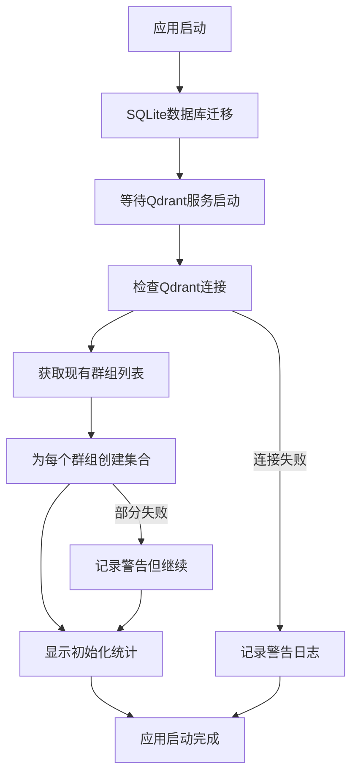

# 向量数据库自动初始化功能

## 功能概述

为了解决向量存储系统缺少自动数据库检查的问题，我们新增了完善的向量数据库初始化和管理功能。

## 主要特性

### 1. 自动初始化
- ✅ **应用启动检查**：程序启动时自动检查和初始化向量数据库
- ✅ **SQLite数据库迁移**：自动应用Entity Framework迁移
- ✅ **Qdrant集合创建**：为现有群组自动创建必要的向量集合
- ✅ **错误处理**：初始化失败不会阻止应用启动

### 2. 集合管理
向量存储采用双集合策略：

#### 单消息向量集合
- **命名格式**: `{GroupId}` (例如: `123456789`)
- **用途**: 存储单条消息的向量数据
- **兼容性**: 保持与原有系统的兼容

#### 对话段向量集合
- **命名格式**: `conv_segment_{GroupId}` (例如: `conv_segment_123456789`)
- **用途**: 存储对话段的向量数据
- **优势**: 提供更好的语义搜索体验

### 3. 管理命令
为管理员提供了便捷的管理命令：

#### `/vector_status` 或 `/向量状态`
显示向量数据库的详细状态信息：
```
向量数据库状态报告

🔍 健康状态: ✅ 正常
📊 总集合数量: 15
💬 单消息集合: 7
🗣️ 对话段集合: 7
📂 其他集合: 1
```

#### `/vector_init` 或 `/向量初始化`
手动触发向量数据库初始化：
- 检查Qdrant服务连接
- 为所有群组创建缺失的向量集合
- 显示初始化结果统计

#### `/vector_health` 或 `/向量健康检查`
快速检查向量数据库连接状态：
- ✅ 向量数据库连接正常
- ❌ 向量数据库连接异常，请检查Qdrant服务状态

## 技术实现

### 核心服务

#### VectorDatabaseInitializationService
**功能**：
- 向量数据库连接检查
- 集合存在性验证和创建
- 健康状态监控
- 统计信息收集

**关键方法**：
```csharp
// 完整初始化
await vectorInitService.InitializeAsync();

// 健康检查
bool isHealthy = await vectorInitService.HealthCheckAsync();

// 获取统计信息
var stats = await vectorInitService.GetStatsAsync();
```

#### VectorDatabaseController
**功能**：
- 管理员命令处理
- 状态查询和显示
- 手动维护操作

### 启动流程



## 配置说明

### 依赖注入
确保以下服务已注册：
```csharp
services.AddSingleton<VectorDatabaseInitializationService>();
services.AddTransient<VectorDatabaseController>();
```

### Qdrant配置
确保Qdrant服务配置正确：
```csharp
// 在 Env.cs 中配置
public static int QdrantHttpPort { get; set; } = 6333;
public static int QdrantGrpcPort { get; set; } = 6334;
public static string QdrantApiKey { get; set; } = Guid.NewGuid().ToString();
```

## 故障排除

### 常见问题

#### 1. "Qdrant服务连接失败"
**原因**：Qdrant服务未启动或配置错误
**解决方案**：
- 检查QdrantProcessManager是否正常工作
- 验证端口配置是否正确
- 查看Qdrant进程日志

#### 2. "权限不足"
**原因**：非管理员用户尝试执行管理命令
**解决方案**：
- 确保用户在管理员群组中
- 检查AdminService配置

#### 3. "部分集合创建失败"
**原因**：群组数据异常或权限问题
**解决方案**：
- 查看详细错误日志
- 手动删除异常数据
- 重新运行初始化

### 日志分析

关键日志信息：
```
[INFO] 开始初始化向量数据库...
[INFO] Qdrant服务连接正常，当前集合数量: 10
[INFO] 发现 5 个群组需要检查向量集合
[INFO] 创建群组 123456789 的单消息向量集合: 123456789
[INFO] 创建群组 123456789 的对话段向量集合: conv_segment_123456789
[INFO] 向量数据库初始化完成
[INFO] 向量数据库统计 - 总集合数: 10, 单消息集合: 5, 对话段集合: 5, 其他集合: 0
```

## 性能考虑

### 启动时间
- 初始化过程增加约5-10秒启动时间
- 大量群组时可能需要更长时间
- 失败时不影响应用正常启动

### 资源使用
- 每个群组需要2个向量集合
- 集合创建是轻量级操作
- 不会预先加载向量数据

## 最佳实践

### 1. 定期健康检查
```bash
# 可以通过cron任务定期检查
curl -X GET "http://localhost:6333/collections"
```

### 2. 监控日志
- 关注向量数据库相关的ERROR和WARNING日志
- 监控集合创建成功率
- 跟踪初始化性能

### 3. 备份策略
- Qdrant数据目录: `${WorkDir}/qdrant_data`
- SQLite数据库: `${WorkDir}/Data.sqlite`
- 配置文件: `${WorkDir}/Config.json`

## 总结

新增的向量数据库自动初始化功能彻底解决了"忘记自动检查数据库是否存在"的问题，通过：

1. **应用启动时的自动检查和初始化**
2. **完善的错误处理和日志记录**
3. **便捷的管理命令和状态监控**
4. **健康检查和故障恢复机制**

确保向量搜索功能在任何环境下都能稳定可靠地工作。 