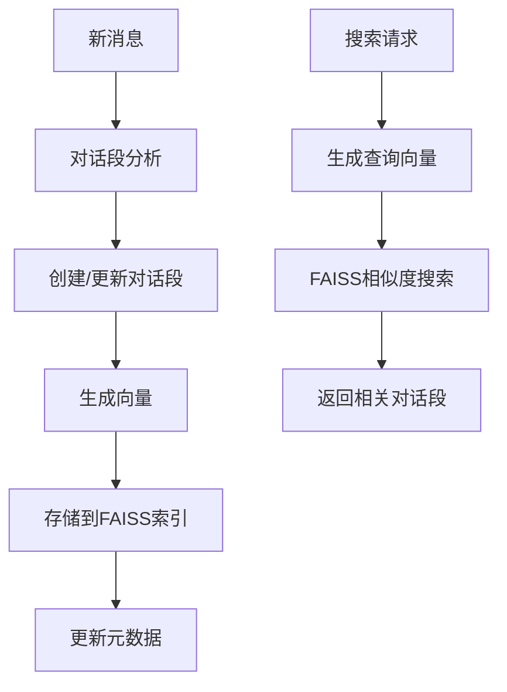

# FAISS向量数据库初始化指南

本文档介绍如何初始化和管理基于FAISS的向量搜索系统。

## 概述

TelegramSearchBot现在使用**FAISS (Facebook AI Similarity Search)**作为向量搜索引擎，提供：

- ✅ **零额外服务依赖**：无需启动外部向量数据库服务
- ✅ **对话段向量化**：基于完整对话上下文生成向量
- ✅ **自动索引管理**：自动创建和维护FAISS索引文件
- ✅ **高效相似度搜索**：使用FAISS进行快速向量检索

## 初始化流程

### 自动初始化
系统启动时会自动：
1. 创建FAISS索引目录
2. 检查现有对话段数据
3. 为未向量化的对话段生成向量
4. 创建和保存FAISS索引文件

### 手动初始化
使用管理员命令进行手动初始化：

```
/向量初始化
```

该命令会：
- 检查FAISS服务状态
- 为所有群组创建对话段
- 生成向量并建立索引
- 显示初始化进度和结果

## 管理命令

### 向量服务状态检查
```
/向量状态
```
显示：
- FAISS服务健康状态
- 各群组的向量化进度
- 索引文件信息

### 群组向量初始化
```
/向量初始化 [群组ID]
```
为指定群组初始化向量：
- 创建对话段
- 生成向量
- 建立FAISS索引

## 技术架构

### 数据流程


### 存储结构
- **SQLite数据库**：存储对话段元数据和向量索引信息
- **FAISS索引文件**：存储实际向量数据，按群组分别保存
- **索引目录**：`${WorkDir}/faiss_indexes/`

## 配置说明

### FAISS配置
系统使用以下FAISS配置：
- **索引类型**：Flat (精确搜索)
- **距离度量**：L2距离
- **向量维度**：1024维
- **索引文件格式**：`{GroupId}_ConversationSegment.faiss`

### 性能优化
- **批量处理**：每批处理10个对话段
- **内存管理**：按需加载索引文件
- **并发控制**：使用锁机制防止冲突

## 故障排除

### 常见问题

#### 1. "FAISS服务健康检查失败"
**原因**：FAISS库初始化失败
**解决方案**：
- 检查FaissNet包是否正确安装
- 确认系统支持FAISS运行环境
- 重启应用程序

#### 2. "向量生成失败"
**原因**：LLM服务不可用
**解决方案**：
- 检查Ollama/OpenAI服务状态
- 验证模型配置
- 查看LLM服务日志

#### 3. "索引文件损坏"
**原因**：FAISS索引文件损坏
**解决方案**：
- 删除损坏的索引文件
- 重新运行向量初始化
- 检查磁盘空间

### 日志监控
关键日志信息：
```
[INFO] FAISS向量服务初始化，索引目录: /path/to/faiss_indexes
[INFO] 对话段向量化完成，索引位置: 123
[INFO] 群组 12345 向量化完成，成功: 100/100
```

### 性能监控
监控指标：
- 向量生成速度
- 索引文件大小
- 搜索响应时间
- 内存使用情况

## 数据目录

### 目录结构
```
${WorkDir}/
├── Data.sqlite              # 主数据库
├── faiss_indexes/           # FAISS索引目录
│   ├── 12345_ConversationSegment.faiss
│   ├── 67890_ConversationSegment.faiss
│   └── ...
└── logs/                    # 日志文件
```

### 备份建议
- **数据库备份**：定期备份SQLite数据库
- **索引备份**：备份FAISS索引文件
- **增量备份**：只备份新增的索引文件

## 迁移指南

### 从其他向量数据库迁移
如果之前使用其他向量数据库：
1. 停止旧的向量服务
2. 清理旧的向量数据
3. 运行FAISS向量初始化
4. 验证搜索功能

### 数据一致性检查
```
/向量状态
```
检查：
- 对话段数量与向量数量是否一致
- 索引文件是否完整
- 元数据是否正确 