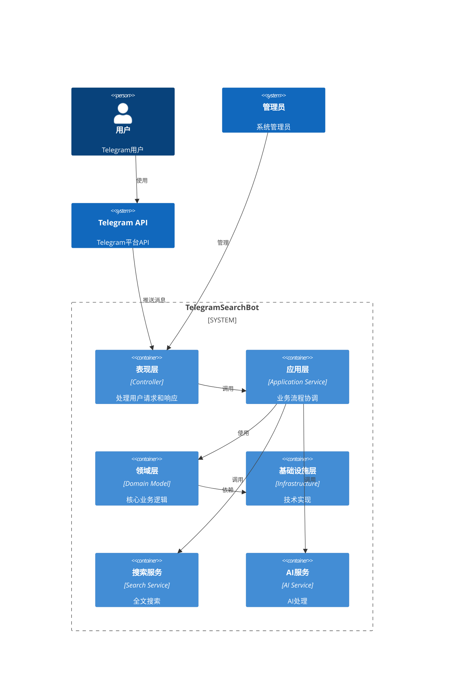

# TelegramSearchBot DDD架构设计文档

## 执行摘要

本文档为TelegramSearchBot项目设计完整的领域驱动设计（DDD）架构，解决当前项目中存在的循环依赖问题，建立清晰的分层架构，确保系统的可维护性、可扩展性和可测试性。

## 架构概述

### 当前问题分析

1. **循环依赖问题**：
   - Domain层存在Repository实现，违反DDD原则
   - Application层与Infrastructure层存在双向依赖
   - Controller直接依赖具体实现而非抽象接口

2. **架构混乱**：
   - Repository模式实现不统一
   - 缺乏明确的CQRS模式
   - 依赖注入配置分散且不一致

3. **类型冲突**：
   - 存在多个同名的Service实现
   - 命名空间混乱，职责不清晰

### 目标架构



## 分层架构设计

### 1. 表现层 (Presentation Layer)

**职责**：处理HTTP请求，验证输入，返回响应

**组件结构**：
```
TelegramSearchBot/
├── Controller/
│   ├── Api/                    # REST API控制器
│   │   ├── MessageController.cs
│   │   ├── SearchController.cs
│   │   └── AdminController.cs
│   ├── Bot/                    # Telegram Bot控制器
│   │   ├── AI/
│   │   │   ├── LLM/
│   │   │   ├── OCR/
│   │   │   └── ASR/
│   │   ├── Download/
│   │   └── Manage/
│   └── Dto/                    # 数据传输对象
│       ├── Requests/
│       └── Responses/
├── Middleware/                 # 中间件
└── Filters/                   # 过滤器
```

**设计原则**：
- 控制器只依赖Application Service接口
- 使用DTO进行数据传输
- 统一的异常处理
- 输入验证和授权

### 2. 应用层 (Application Layer)

**职责**：协调领域对象，实现用例，处理事务

**组件结构**：
```
TelegramSearchBot.Application/
├── Features/
│   ├── Messages/
│   │   ├── Commands/          # 命令
│   │   ├── Queries/           # 查询
│   │   ├── DTOs/              # 数据传输对象
│   │   └── MessageApplicationService.cs
│   ├── Search/
│   │   ├── Commands/
│   │   ├── Queries/
│   │   └── SearchApplicationService.cs
│   └── AI/
│       ├── Commands/
│       ├── Queries/
│       └── AIApplicationService.cs
├── Abstractions/              # 抽象接口
├── Exceptions/                # 异常定义
├── Mappings/                  # 对象映射
└── Extensions/                # 扩展方法
```

**设计原则**：
- 使用CQRS模式分离读写操作
- 基于MediatR实现命令查询分离
- 应用服务协调领域对象
- 不包含业务规则，只负责流程协调

### 3. 领域层 (Domain Layer)

**职责**：包含核心业务逻辑和领域模型

**组件结构**：
```
TelegramSearchBot.Domain/
├── Message/                   # 消息聚合
│   ├── MessageAggregate.cs    # 聚合根
│   ├── ValueObjects/          # 值对象
│   │   ├── MessageId.cs
│   │   ├── MessageContent.cs
│   │   └── MessageMetadata.cs
│   ├── Events/                # 领域事件
│   ├── Exceptions/            # 领域异常
│   └── Repositories/          # 仓储接口
│       ├── IMessageRepository.cs
│       └── IMessageSearchRepository.cs
├── User/                      # 用户聚合
├── Group/                     # 群组聚合
└── Shared/                    # 共享组件
    ├── Interfaces/
    └── Exceptions/
```

**设计原则**：
- 纯粹的领域逻辑，不依赖外部框架
- 聚合根设计，确保数据一致性
- 仓储模式抽象数据访问
- 领域事件驱动业务流程

### 4. 基础设施层 (Infrastructure Layer)

**职责**：提供技术实现细节

**组件结构**：
```
TelegramSearchBot.Infrastructure/
├── Data/                      # 数据访问
│   ├── Repositories/          # 仓储实现
│   │   ├── MessageRepository.cs
│   │   └── UserRepository.cs
│   ├── Context/               # 数据库上下文
│   └── Migrations/            # 数据库迁移
├── Search/                    # 搜索实现
│   ├── Lucene/
│   └── Faiss/
├── AI/                        # AI服务实现
│   ├── OCR/
│   ├── ASR/
│   └── LLM/
├── Cache/                     # 缓存实现
├── External/                  # 外部服务
└── Configuration/             # 配置管理
```

**设计原则**：
- 实现Domain层定义的接口
- 依赖倒置，不依赖上层
- 技术细节封装
- 可插拔的组件设计

## 核心设计模式

### 1. Repository模式重构

**原本实现问题**：
- Repository实现在Domain层，违反DDD原则
- 直接依赖DbContext，造成耦合

**简化实现**：
```csharp
// Domain层 - 只定义接口
namespace TelegramSearchBot.Domain.Message.Repositories
{
    public interface IMessageRepository
    {
        Task<MessageAggregate> GetByIdAsync(MessageId id);
        Task<MessageAggregate> AddAsync(MessageAggregate aggregate);
        Task UpdateAsync(MessageAggregate aggregate);
        Task DeleteAsync(MessageId id);
    }
}

// Infrastructure层 - 具体实现
namespace TelegramSearchBot.Infrastructure.Data.Repositories
{
    public class MessageRepository : IMessageRepository
    {
        private readonly AppDbContext _context;
        
        public MessageRepository(AppDbContext context)
        {
            _context = context;
        }
        
        public async Task<MessageAggregate> AddAsync(MessageAggregate aggregate)
        {
            // 简化实现：映射到实体并保存
            var entity = MapToEntity(aggregate);
            await _context.Messages.AddAsync(entity);
            await _context.SaveChangesAsync();
            return aggregate;
        }
        
        // 其他实现方法...
    }
}
```

### 2. CQRS架构实现

**命令处理**：
```csharp
// Commands
public record CreateMessageCommand(CreateMessageDto MessageDto) : IRequest<long>;

public class CreateMessageCommandHandler : IRequestHandler<CreateMessageCommand, long>
{
    private readonly IMessageRepository _repository;
    private readonly IMediator _mediator;
    
    public CreateMessageCommandHandler(IMessageRepository repository, IMediator mediator)
    {
        _repository = repository;
        _mediator = mediator;
    }
    
    public async Task<long> Handle(CreateMessageCommand request, CancellationToken cancellationToken)
    {
        var aggregate = MessageAggregate.Create(/* 参数 */);
        await _repository.AddAsync(aggregate);
        
        // 发布领域事件
        foreach (var domainEvent in aggregate.DomainEvents)
        {
            await _mediator.Publish(domainEvent, cancellationToken);
        }
        aggregate.ClearDomainEvents();
        
        return aggregate.Id.TelegramMessageId;
    }
}
```

**查询处理**：
```csharp
// Queries
public record GetMessagesQuery(long GroupId, int Page = 1, int PageSize = 20) 
    : IRequest<PagedList<MessageDto>>;

public class GetMessagesQueryHandler : IRequestHandler<GetMessagesQuery, PagedList<MessageDto>>
{
    private readonly IMessageReadRepository _repository;
    
    public GetMessagesQueryHandler(IMessageReadRepository repository)
    {
        _repository = repository;
    }
    
    public async Task<PagedList<MessageDto>> Handle(GetMessagesQuery request, CancellationToken cancellationToken)
    {
        var messages = await _repository.GetByGroupIdAsync(
            request.GroupId, request.Page, request.PageSize);
        
        return new PagedList<MessageDto>(messages);
    }
}
```

### 3. 依赖注入配置

**统一DI配置**：
```csharp
namespace TelegramSearchBot.Infrastructure.Extensions
{
    public static class ServiceCollectionExtensions
    {
        public static IServiceCollection AddTelegramSearchBotServices(
            this IServiceCollection services, string connectionString)
        {
            // Domain层服务
            services.AddDomainServices();
            
            // Application层服务
            services.AddApplicationServices();
            
            // Infrastructure层服务
            services.AddInfrastructureServices(connectionString);
            
            // 搜索服务
            services.AddSearchServices();
            
            // AI服务
            services.AddAIServices();
            
            return services;
        }
        
        public static IServiceCollection AddDomainServices(this IServiceCollection services)
        {
            // 注册领域服务
            services.AddScoped<IMessageService, MessageService>();
            
            return services;
        }
        
        public static IServiceCollection AddApplicationServices(this IServiceCollection services)
        {
            // 注册MediatR
            services.AddMediatR(cfg => {
                cfg.RegisterServicesFromAssembly(typeof(ApplicationServiceRegistration).Assembly);
            });
            
            // 注册应用服务
            services.AddScoped<IMessageApplicationService, MessageApplicationService>();
            services.AddScoped<ISearchApplicationService, SearchApplicationService>();
            
            // 注册行为管道
            services.AddTransient(typeof(IPipelineBehavior<,>), typeof(ValidationBehavior<,>));
            services.AddTransient(typeof(IPipelineBehavior<,>), typeof(TransactionBehavior<,>));
            
            return services;
        }
        
        public static IServiceCollection AddInfrastructureServices(
            this IServiceCollection services, string connectionString)
        {
            // 数据库
            services.AddDbContext<AppDbContext>(options =>
                options.UseSqlite(connectionString));
            
            // 仓储实现
            services.AddScoped<IMessageRepository, MessageRepository>();
            services.AddScoped<IMessageReadRepository, MessageReadRepository>();
            
            return services;
        }
    }
}
```

## 技术栈决策

### 核心技术栈
| 技术组件 | 选择 | 理由 |
|---------|------|------|
| **运行时** | .NET 9.0 | 最新稳定版本，性能优化 |
| **架构模式** | DDD + CQRS | 清晰的分层架构，读写分离 |
| **ORM** | Entity Framework Core 9.0 | 成熟稳定，良好的迁移支持 |
| **MediatR** | MediatR 12.0 | 轻量级中介者模式，支持CQRS |
| **数据库** | SQLite | 轻量级，适合嵌入式应用 |
| **搜索** | Lucene.NET + FAISS | 全文搜索 + 向量搜索 |
| **缓存** | Redis | 高性能内存数据库 |
| **日志** | Serilog | 结构化日志，多输出支持 |

### 架构决策记录 (ADR)

#### ADR-001: 采用DDD分层架构
**状态**: 已接受
**决策**: 采用严格的DDD分层架构
**理由**: 
- 解决循环依赖问题
- 提高代码可维护性
- 支持单元测试
- 便于后续扩展

**后果**:
- 需要重构现有代码
- 增加了开发复杂度
- 提高了代码质量

#### ADR-002: 实现CQRS模式
**状态**: 已接受
**决策**: 在应用层实现CQRS模式
**理由**:
- 读写操作分离
- 优化查询性能
- 简化复杂业务逻辑

#### ADR-003: 使用MediatR作为中介者
**状态**: 已接受
**决策**: 使用MediatR实现命令查询分离
**理由**:
- 轻量级解决方案
- 良好的社区支持
- 与.NET生态系统集成良好

## 数据架构

### 领域模型设计

**Message聚合根**：
```csharp
public class MessageAggregate : IAggregateRoot
{
    public MessageId Id { get; private set; }
    public MessageContent Content { get; private set; }
    public MessageMetadata Metadata { get; private set; }
    
    private List<IDomainEvent> _domainEvents = new();
    public IReadOnlyCollection<IDomainEvent> DomainEvents => _domainEvents.AsReadOnly();
    
    public static MessageAggregate Create(
        long chatId, long messageId, string content, long fromUserId, DateTime timestamp)
    {
        return new MessageAggregate(
            new MessageId(chatId, messageId),
            new MessageContent(content),
            new MessageMetadata(fromUserId, timestamp));
    }
    
    public void UpdateContent(MessageContent newContent)
    {
        Content = newContent;
        _domainEvents.Add(new MessageUpdatedEvent(Id));
    }
    
    public void ClearDomainEvents() => _domainEvents.Clear();
}
```

### 数据库架构

**主要表结构**：
```sql
-- 消息表
CREATE TABLE Messages (
    Id INTEGER PRIMARY KEY AUTOINCREMENT,
    ChatId BIGINT NOT NULL,
    MessageId BIGINT NOT NULL,
    Content TEXT NOT NULL,
    FromUserId BIGINT NOT NULL,
    Timestamp DATETIME NOT NULL,
    ReplyToMessageId BIGINT,
    ReplyToUserId BIGINT,
    CreatedAt DATETIME DEFAULT CURRENT_TIMESTAMP,
    UpdatedAt DATETIME DEFAULT CURRENT_TIMESTAMP,
    
    UNIQUE(ChatId, MessageId)
);

-- 消息扩展表
CREATE TABLE MessageExtensions (
    Id INTEGER PRIMARY KEY AUTOINCREMENT,
    MessageId BIGINT NOT NULL,
    ExtensionType TEXT NOT NULL,
    ExtensionData TEXT NOT NULL,
    CreatedAt DATETIME DEFAULT CURRENT_TIMESTAMP,
    
    FOREIGN KEY (MessageId) REFERENCES Messages(MessageId)
);

-- 用户表
CREATE TABLE Users (
    Id INTEGER PRIMARY KEY AUTOINCREMENT,
    UserId BIGINT NOT NULL UNIQUE,
    Username TEXT,
    FirstName TEXT,
    LastName TEXT,
    CreatedAt DATETIME DEFAULT CURRENT_TIMESTAMP
);
```

## 安全架构

### 认证与授权
- **认证**: Telegram Bot Token
- **授权**: 基于用户ID和群组ID的权限控制
- **管理功能**: 基于AdminId的管理员权限

### 安全措施
- [x] HTTPS通信
- [x] 输入验证和清理
- [x] SQL注入防护（EF Core参数化查询）
- [x] 敏感数据加密
- [x] 访问控制和权限验证
- [x] 日志审计
- [x] 异常处理不暴露敏感信息

## 部署架构

### 容器化部署
```dockerfile
FROM mcr.microsoft.com/dotnet/aspnet:9.0 AS base
WORKDIR /app
EXPOSE 80
EXPOSE 443

FROM mcr.microsoft.com/dotnet/sdk:9.0 AS build
WORKDIR /src
COPY ["TelegramSearchBot.csproj", "."]
RUN dotnet restore "TelegramSearchBot.csproj"
COPY . .
WORKDIR "/src"
RUN dotnet build "TelegramSearchBot.csproj" -c Release -o /app/build

FROM build AS publish
RUN dotnet publish "TelegramSearchBot.csproj" -c Release -o /app/publish

FROM base AS final
WORKDIR /app
COPY --from=publish /app/publish .
ENTRYPOINT ["dotnet", "TelegramSearchBot.dll"]
```

### 环境配置
- **开发环境**: 本地SQLite + 内存缓存
- **测试环境**: 内存数据库 + 模拟服务
- **生产环境**: SQLite + Redis + 外部AI服务

## 监控与可观测性

### 日志架构
```csharp
Log.Logger = new LoggerConfiguration()
    .MinimumLevel.Information()
    .WriteTo.Console()
    .WriteTo.File("logs/log-.txt", rollingInterval: RollingInterval.Day)
    .WriteTo.OpenTelemetry(options => {
        options.Endpoint = "http://localhost:4318";
        options.Protocol = OtlpProtocol.HttpProtobuf;
    })
    .CreateLogger();
```

### 指标监控
- 应用性能指标（APM）
- 数据库查询性能
- AI服务调用延迟
- 搜索引擎性能

## 迁移策略

### 第一阶段：基础设施重构
1. 创建Infrastructure项目
2. 移动Repository实现
3. 解决DbContext依赖问题
4. 配置依赖注入

### 第二阶段：应用层重构
1. 创建Application项目
2. 实现CQRS模式
3. 创建Application Service
4. 集成MediatR

### 第三阶段：领域层完善
1. 完善领域模型
2. 实现领域事件
3. 创建值对象
4. 定义聚合根

### 第四阶段：表现层重构
1. 重构Controller
2. 实现统一异常处理
3. 添加输入验证
4. 优化API响应

## 风险评估

### 高风险项
1. **大规模重构**: 可能引入新的bug
2. **架构变更**: 团队需要学习新的架构模式
3. **依赖复杂性**: 需要仔细管理依赖关系

### 缓解措施
1. **分阶段实施**: 每个阶段都进行充分测试
2. **保持向后兼容**: 逐步迁移，确保功能不中断
3. **完善测试覆盖**: 单元测试 + 集成测试
4. **代码审查**: 所有变更都需要审查

## 总结

本DDD架构设计解决了当前项目中的循环依赖问题，建立了清晰的分层架构，提高了代码的可维护性和可测试性。通过采用CQRS模式、Repository模式和依赖注入，实现了松耦合的架构设计。

**关键改进**：
- 解决循环依赖问题
- 建立清晰的分层架构
- 实现读写分离
- 提高代码可测试性
- 支持水平扩展

**下一步行动**：
1. 按照迁移策略逐步实施
2. 完善单元测试和集成测试
3. 建立持续集成流程
4. 团队培训和文档完善