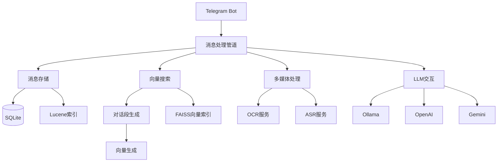

# TelegramSearchBot
自用群聊消息搜索机器人


## 功能列表
1. 群聊消息存储并支持中文分词搜索 (Lucene)
2. **向量搜索功能 (FAISS)**: 基于对话段的语义搜索，无需额外服务依赖
3. 群聊消息中多媒体内容自动处理:
   - 图片自动下载并OCR存储 (PaddleOCR)
   - 图片自动二维码识别(WeChatQR)
   - 语音/视频自动语音识别 (Whisper)
   - 发送图片附带`打印`指令时自动OCR回复
4. 大语言模型集成:
   - Ollama本地模型
   - OpenAI API
   - Gemini API
   - 可配置多模型通道管理
5. 高级功能:
   - 短链接映射服务
   - 消息扩展存储
   - 记忆图谱功能
   - 私有Bot API支持
   - 群组黑名单/设置管理

详细功能说明请参考: [Docs/Bot_Commands_User_Guide.md](Docs/Bot_Commands_User_Guide.md)

## 安装与配置

### 支持平台
- ✅ **Windows** - 原生支持，推荐使用 ClickOnce 安装包
- ✅ **Linux** - 完全支持，需要手动安装依赖和编译

### Linux 系统要求

#### 操作系统
- Ubuntu 20.04+ 或 Debian 11+
- 其他 Linux 发行版（可能需要调整依赖包名称）

#### .NET 运行时
- .NET 9.0 运行时或 SDK

#### 系统依赖包
```bash
# 更新包管理器
sudo apt update

# 安装基础依赖
sudo apt install -y libgomp1 libdnnl2 intel-mkl-full libomp-dev
```

#### 快速开始（Linux）
1. 克隆仓库
```bash
git clone https://github.com/ModerRAS/TelegramSearchBot.git
cd TelegramSearchBot
```

2. 安装依赖
```bash
# 安装系统依赖
sudo apt install -y libgomp1 libdnnl2 intel-mkl-full libomp-dev

# 恢复 .NET 依赖
dotnet restore TelegramSearchBot.sln
```

3. 构建项目
```bash
dotnet build TelegramSearchBot.sln --configuration Release
```

4. 运行验证
```bash
./scripts/verify_linux_deployment.sh
```

5. 运行测试
```bash
./scripts/run_paddle_tests.sh
```

6. 配置并运行
```bash
# 首次运行生成配置文件
./scripts/run_linux.sh

# 编辑配置文件
nano ~/.config/TelegramSearchBot/Config.json
```

### Windows 快速开始
1. 下载[最新版本](https://clickonce.miaostay.com/TelegramSearchBot/Publish.html)
2. 首次运行会自动生成配置目录
3. 编辑`AppData/Local/TelegramSearchBot/Config.json`:

```json
{
  "BaseUrl": "https://api.telegram.org",
  "BotToken": "your-bot-token",
  "AdminId": 123456789,
  "EnableAutoOCR": false,
  "EnableAutoASR": false,
  "IsLocalAPI": false,
  "SameServer": false,
  "TaskDelayTimeout": 1000,
  "OllamaModelName": "qwen2.5:72b-instruct-q2_K",
  "EnableVideoASR": false,
  "EnableOpenAI": false,
  "OpenAIModelName": "gpt-4o",
  "OLTPAuth": "",
  "OLTPAuthUrl": "",
  "OLTPName": ""
}
```

### 配置说明
- **必填项**:
  - `BotToken`: 从@BotFather获取的Telegram机器人token
  - `AdminId`: 管理员Telegram用户ID(必须为数字)

- **AI相关**:
  - `OllamaModelName`: 本地模型名称(默认"qwen2.5:72b-instruct-q2_K")
  - `EnableOpenAI`: 是否启用OpenAI(默认false)
  - `OpenAIModelName`: OpenAI模型名称(默认"gpt-4o")

- **日志推送**:
  - `OLTPAuth`: OLTP日志推送认证密钥
  - `OLTPAuthUrl`: OLTP日志推送URL
  - `OLTPName`: OLTP日志推送名称

完整配置参考: [Env.cs](TelegramSearchBot/Env.cs)

## 向量搜索功能
基于FAISS的向量搜索系统，提供强大的语义搜索能力：
- ✅ **零额外服务依赖** - 不需要外部向量数据库
- ✅ **对话段语义理解** - 基于完整对话上下文而非单条消息
- ✅ **自动向量化** - 消息自动分组为对话段并生成向量
- ✅ **高效检索** - 使用FAISS进行快速相似度搜索

详细文档: [TelegramSearchBot/README_FaissVectorSearch.md](TelegramSearchBot/README_FaissVectorSearch.md)

## 使用方法

### 基本操作流程
1. 去找BotFather创建一个Bot
2. 设置Bot的Group Privacy为disabled
3. 将该Bot加入群聊
4. 输入`搜索 + 空格 + 搜索关键字`，如`搜索 食用方法`

### 搜索类型
- **倒排索引搜索**: `搜索 关键词` - 传统关键词搜索
- **向量搜索**: `/vector 问题描述` - 语义搜索，理解问题含义

### AI交互
- @机器人 + 问题: 使用配置的LLM回复

完整命令列表: [Docs/Bot_Commands_User_Guide.md](Docs/Bot_Commands_User_Guide.md)

## 系统架构


详细架构设计: [Docs/Existing_Codebase_Overview.md](Docs/Existing_Codebase_Overview.md)

## License
这里曾经是一个FOSSA Status的，但是因为经常报错烦了，遂删之。
