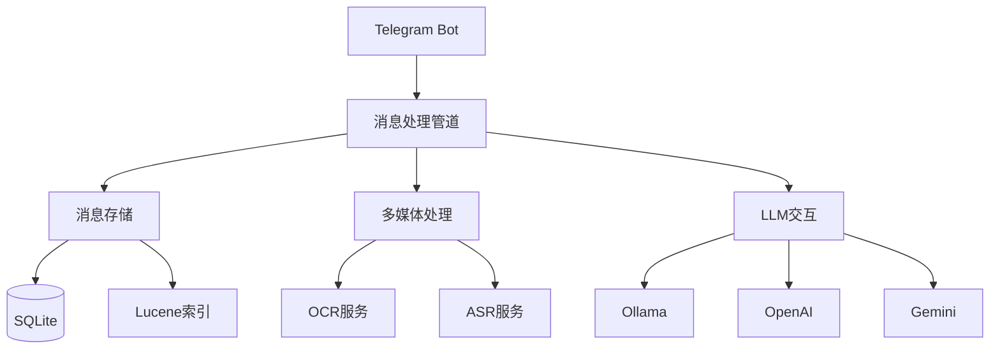

# TelegramSearchBot
自用群聊消息搜索机器人


## 功能列表
1. 群聊消息存储并支持中文分词搜索 (Lucene)
2. 群聊消息中多媒体内容自动处理:
   - 图片自动下载并OCR存储 (PaddleOCR)
   - 图片自动二维码识别(WeChatQR)
   - 语音/视频自动语音识别 (Whisper)
   - 发送图片附带`打印`指令时自动OCR回复
3. 大语言模型集成:
   - Ollama本地模型
   - OpenAI API
   - Gemini API
   - 可配置多模型通道管理
4. 高级功能:
   - 短链接映射服务
   - 消息扩展存储
   - 记忆图谱功能
   - 私有Bot API支持
   - 群组黑名单/设置管理

详细功能说明请参考: [Docs/Bot_Commands_User_Guide.md](Docs/Bot_Commands_User_Guide.md)

## 安装与配置

### 快速开始
1. 下载[最新版本](https://clickonce.miaostay.com/TelegramSearchBot/Publish.html)
2. 首次运行会自动生成配置目录
3. 编辑`AppData/Local/TelegramSearchBot/Config.json`:

```json
{
  "BaseUrl": "http://127.0.0.1:8081",
  "BotToken": "your-bot-token",
  "AdminId": "your-user-id",
  "EnableAutoOCR": true,
  "EnableAutoASR": true,
  "IsLocalAPI": true,
  "SameServer": true,
  "TaskDelayTimeout": 1000,
  "OllamaHost": "http://127.0.0.1:11434",
  "OpenAIKey": "your-openai-key",
  "GeminiKey": "your-gemini-key"
}
```

完整配置选项参考: [Env.cs](TelegramSearchBot/Env.cs)

## 使用方法

### 基本操作流程
1. 去找BotFather创建一个Bot
2. 设置Bot的Group Privacy为disabled
3. 将该Bot加入群聊
4. 输入`搜索 + 空格 + 搜索关键字`，如`搜索 食用方法`

### 基础搜索
- 群聊中: `搜索 关键词` - 返回该群聊中符合关键字的选项
- 私聊中: 返回该Bot所在的所有群聊中发送者在的群的所有符合关键字的选项

### AI交互
- @机器人 + 问题: 使用配置的LLM回复

完整命令列表: [Docs/Bot_Commands_User_Guide.md](Docs/Bot_Commands_User_Guide.md)

## 系统架构


详细架构设计: [Docs/Existing_Codebase_Overview.md](Docs/Existing_Codebase_Overview.md)

## License
这里曾经是一个FOSSA Status的，但是因为经常报错烦了，遂删之。