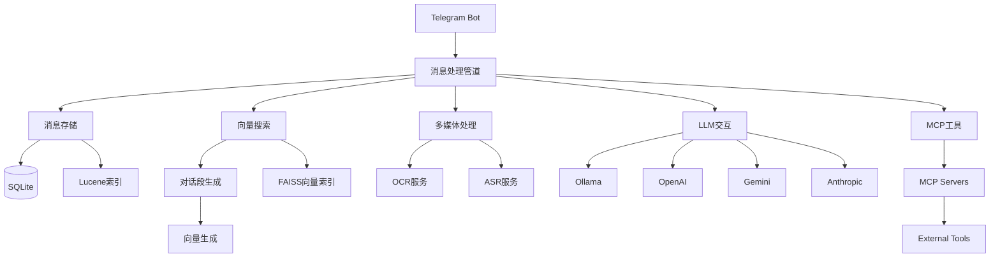

# TelegramSearchBot
自用群聊消息搜索机器人


## 功能列表
1. 群聊消息存储并支持中文分词搜索 (Lucene.NET)
2. **向量搜索功能 (FAISS)**: 基于对话段的语义搜索，无需额外服务依赖
3. 群聊消息中多媒体内容自动处理:
   - 图片自动下载并OCR存储 (PaddleOCR)
   - 图片自动二维码识别(WeChatQR)
   - 语音/视频自动语音识别 (Whisper)
   - 发送图片附带`打印`指令时自动OCR回复
4. 大语言模型集成:
   - Ollama本地模型
   - OpenAI API (GPT-4o, GPT-4o-mini等)
   - Google Gemini API
   - Anthropic Claude API
   - 可配置多模型通道管理
   - **MCP (Model Context Protocol) 工具支持**
5. 高级功能:
   - 短链接映射服务
   - 消息扩展存储
   - 记忆图谱功能
   - **内置Telegram Bot API服务支持（2GB大文件/50MB云端）**
   - 群组黑名单/设置管理
   - Sequential Thinking 思考链支持
   - Brave 搜索集成

详细功能说明请参考: [Docs/Bot_Commands_User_Guide.md](Docs/Bot_Commands_User_Guide.md)

## 安装与配置

### 快速开始
1. 下载[最新版本](https://clickonce.miaostay.com/TelegramSearchBot/Publish.html)
2. 首次运行会自动生成配置目录
3. 编辑`AppData/Local/TelegramSearchBot/Config.json`:

```json
{
  "BaseUrl": "https://api.telegram.org",
  "BotToken": "your-bot-token",
  "AdminId": 123456789,
  "EnableAutoOCR": false,
  "EnableAutoASR": false,
  "IsLocalAPI": false,
  "EnableLocalBotAPI": false,
  "TelegramBotApiId": "",
  "TelegramBotApiHash": "",
  "LocalBotApiPort": 8081,
  "SameServer": false,
  "TaskDelayTimeout": 1000,
  "OllamaModelName": "qwen2.5:72b-instruct-q2_K",
  "EnableVideoASR": false,
  "EnableOpenAI": false,
  "OpenAIModelName": "gpt-4o",
  "EnableLLMAgentProcess": false,
  "AgentHeartbeatIntervalSeconds": 10,
  "AgentHeartbeatTimeoutSeconds": 60,
  "AgentChunkPollingIntervalMilliseconds": 200,
  "AgentIdleTimeoutMinutes": 15,
  "MaxConcurrentAgents": 8,
  "AgentTaskTimeoutSeconds": 300,
  "AgentShutdownGracePeriodSeconds": 15,
  "AgentMaxRecoveryAttempts": 2,
  "AgentQueueBacklogWarningThreshold": 20,
  "AgentProcessMemoryLimitMb": 256,
  "MaxToolCycles": 25,
  "OLTPAuth": "",
  "OLTPAuthUrl": "",
  "OLTPName": "",
  "BraveApiKey": "",
  "EnableAccounting": false
}
```

### 配置说明
- **必填项**:
  - `BotToken`: 从@BotFather获取的Telegram机器人token
  - `AdminId`: 管理员Telegram用户ID(必须为数字)

- **本地Bot API服务**:
  - `EnableLocalBotAPI`: 是否启用内置Telegram Bot API服务(默认false)
  - `TelegramBotApiId`: Telegram Bot API的API ID（从my.telegram.org获取）
  - `TelegramBotApiHash`: Telegram Bot API的API Hash（从my.telegram.org获取）
  - `LocalBotApiPort`: 本地Bot API服务端口(默认8081)
  - **优势**: 启用后可发送最大2GB文件（vs 云端50MB限制）

- **AI相关**:
  - `OllamaModelName`: 本地模型名称(默认"qwen2.5:72b-instruct-q2_K")
  - `EnableOpenAI`: 是否启用OpenAI(默认false)
  - `OpenAIModelName`: OpenAI模型名称(默认"gpt-4o")
  - `EnableLLMAgentProcess`: 是否启用独立 LLM Agent 进程模式(默认false)
  - `AgentHeartbeatIntervalSeconds`: Agent 心跳上报间隔(默认10秒)
  - `AgentHeartbeatTimeoutSeconds`: 主进程判定 Agent 失活的超时时间(默认60秒)
  - `AgentChunkPollingIntervalMilliseconds`: 主进程轮询流式输出块的间隔(默认200毫秒)
  - `AgentIdleTimeoutMinutes`: Agent 空闲超时时间(默认15分钟)
  - `MaxConcurrentAgents`: 同时允许的 Agent 进程数上限(默认8)
  - `AgentTaskTimeoutSeconds`: 单个 Agent 任务无进展时的超时时间(默认300秒)
  - `AgentShutdownGracePeriodSeconds`: Agent 收到停机请求后的优雅退出等待时间(默认15秒)
  - `AgentMaxRecoveryAttempts`: Agent 崩溃或超时后的最大恢复重试次数(默认2)
  - `AgentQueueBacklogWarningThreshold`: Agent 任务队列告警阈值(默认20)
  - `AgentProcessMemoryLimitMb`: Agent 进程工作集上限(默认256MB)
  - `MaxToolCycles`: LLM工具调用最大迭代次数(默认25)，防止无限循环

启用 `EnableLLMAgentProcess=true` 后，主进程会负责任务排队、Telegram 发消息和流式转发；独立 Agent 进程负责执行 LLM 循环、本地工具和故障恢复。主进程会在 Agent 心跳超时、任务超时或配置切换时执行恢复、重试、死信投递和优雅停机。

- **日志推送**:
  - `OLTPAuth`: OLTP日志推送认证密钥
  - `OLTPAuthUrl`: OLTP日志推送URL
  - `OLTPName`: OLTP日志推送名称

完整配置参考: [Env.cs](TelegramSearchBot.Common/Env.cs)

## 向量搜索功能
基于FAISS的向量搜索系统，提供强大的语义搜索能力：
- ✅ **零额外服务依赖** - 不需要外部向量数据库
- ✅ **对话段语义理解** - 基于完整对话上下文而非单条消息
- ✅ **自动向量化** - 消息自动分组为对话段并生成向量
- ✅ **高效检索** - 使用FAISS进行快速相似度搜索
- ✅ **LLM迭代限制** - 防止无限工具调用循环（默认25次）

详细文档: [Docs/README_FaissVectorSearch.md](Docs/README_FaissVectorSearch.md)

## MCP (Model Context Protocol) 支持
通过MCP协议扩展机器人能力，支持外部工具服务器：
- ✅ **内置工具**: 发送文件、搜索、URL处理等24+内置工具
- ✅ **外部MCP服务器**: 可动态添加第三方MCP服务器
- ✅ **管理员管理**: 通过指令管理MCP服务器（`新建渠道`等）

详细文档: [Docs/README_MCP.md](Docs/README_MCP.md)

## 使用方法

### 基本操作流程
1. 去找BotFather创建一个Bot
2. 设置Bot的Group Privacy为disabled
3. 将该Bot加入群聊
4. 输入`搜索 + 空格 + 搜索关键字`，如`搜索 食用方法`

### 搜索类型
- **倒排索引搜索**: `搜索 关键词` - 传统关键词搜索
- **向量搜索**: `/vector 问题描述` - 语义搜索，理解问题含义

### AI交互
- @机器人 + 问题: 使用配置的LLM回复

完整命令列表: [Docs/Bot_Commands_User_Guide.md](Docs/Bot_Commands_User_Guide.md)

## 系统架构

```mermaid
graph TD
    A[Telegram Bot] --> B[消息处理管道]
    B --> C[消息存储]
    B --> D[多媒体处理]
    B --> E[LLM交互]
    B --> F[向量搜索]
    B --> Q[MCP工具]
    C --> G[(SQLite)]
    C --> H[Lucene索引]
    F --> I[对话段生成]
    F --> J[FAISS向量索引]
    I --> K[向量生成]
    D --> L[OCR服务]
    D --> M[ASR服务]
    E --> N[Ollama]
    E --> O[OpenAI]
    E --> P[Gemini]
    E --> PA[Anthropic]
    Q --> R[MCP Servers]
    R --> S[External Tools]
```

详细架构设计: [Docs/Architecture_Overview.md](Docs/Architecture_Overview.md)

## 技术栈
- **运行时**: .NET 10.0
- **数据库**: SQLite + EF Core 10.0
- **搜索**: Lucene.NET (全文) + FAISS (向量)
- **AI**: Ollama, OpenAI, Gemini, Anthropic

## 构建与运行
```bash
# 构建
dotnet build TelegramSearchBot.sln --configuration Release

# 运行
dotnet run --project TelegramSearchBot

# 发布
dotnet publish -r win-x64 --self-contained
```

详细文档: [Docs/Build_and_Test_Guide.md](Docs/Build_and_Test_Guide.md)

## License
这里曾经是一个FOSSA Status的，但是因为经常报错烦了，遂删之。
