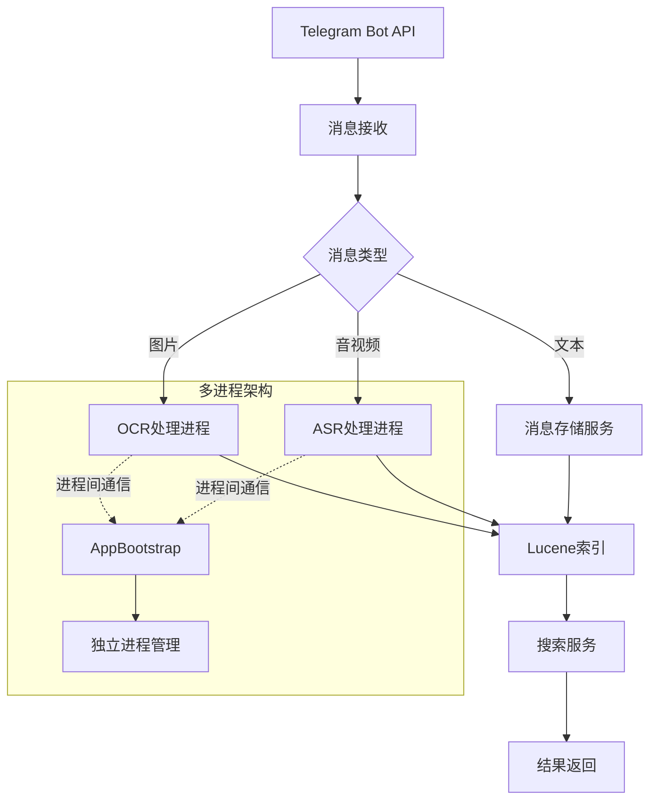

# 系统架构模式

## 核心架构

- 基于事件的异步处理架构
- 模块化设计，核心功能分离为独立服务
- 多进程架构解决内存泄漏问题：
  - OCR/ASR等高内存消耗操作在独立进程执行
  - 通过AppBootstrap协调进程启动和通信
  - 主进程通过IPC与工作进程交互
- 插件式架构支持功能扩展

## 设计模式
- 单一职责原则：
  - 各控制器专注于特定功能
  - 服务层分离业务逻辑
  - Helper类职责划分：
    - BiliHelper：Bilibili特定功能（URL解析、内容解析）
    - MessageFormatHelper：通用消息格式化（Markdown转换、文本处理）
    - 消除重复代码，保持单一职责
- 观察者模式：
  - 消息处理流水线
- 策略模式：
  - 可插拔的OCR/ASR处理器
  - 多LLM提供商支持

## 关键实现路径
1. 消息接收流程：
   - Telegram消息 → 消息解析 → 类型判断 → 对应处理器

2. 搜索流程：
   - 用户查询 → Lucene搜索 → 结果排序 → 格式化返回

3. AI处理流程：
   - 媒体消息 → OCR/ASR处理 → 文本存储 → 可选LLM处理

## 组件关系
- 核心组件：
  - 消息接收器：处理原始Telegram消息
  - 存储服务：LiteDB持久化
  - 搜索服务：Lucene全文检索
  - AI服务：OCR/ASR/LLM处理
  - Helper类：通用工具方法集合
- 数据流：
  - 消息 → 存储 → 索引 → 搜索
  - 媒体 → AI处理 → 文本 → 存储
  - 服务 → Helper类：工具方法调用

## 模块划分
- 控制器层：消息入口点
- 服务层：核心业务逻辑
- 管理器层：第三方集成
- 数据层：存储和检索
- AI层：智能处理
